# 1 сезон


Материал может содержать неточности и ошибки, а также быть субъективным, поскольку отражает восприятие автора. Если вы хотите внести какие-либо правки, пожалуйста, обратитесь в дискорд канал📝[«обращения»](https://discord.com/channels/956981761802375228/1245232823510503428).


На момент создания проект DreamFox представлял собой приватный ванильный сервер Minecraft с элементами RolePlay.

## Продолжительность

Публично первый сезон открылся 1 апреля 2022 года на версии Minecraft 1.18+. По факту сервер начал работу за три дня до публичного открытия и был доступен только админам. Сезон длился около двух с половиной месяцев(76 дней). Закончился сезон под выход новой версии Minecraft 1.19.

## Объединения

За время первого сезона устоялись несколько объединений: Гильдия Искателей, город Стоунград, город ТаумТаун и Люди Мира. Вероятно, существовали и другие объединения, но они либо быстро распадались, либо были незначительны и малоизвестны.

### Гильдия Искателей

Среднее по размеру и достаточно крупное по населённости объединение. Представляло собой организацию, занимающуюся поиском интересных мест, данжей, их исследованием и продажей добычи. К концу сезона в гильдии состояло 5-7 человек.

Главой гильдии был lichespeaches, Xenone\_Xe\_ был заместителем.

Штаб гильдии располагался рядом со спавном в небольшом замке. Объединение имело ферму железа и ферму опыта на пауках.

### Город Стоунград

Крупнейшее по размеру и населённости объединение. Представляло собой большой средневековый город в Фахверк стиле на равнинах. К концу сезона в городе состояли 10 человек. Герб Стоунграда - жёлтое солнце на лаймовом фоне.&#x20;

Главой гильдии - Мэром - был Trelony, вместе с этим он был единственным строителем. Прочее строительство со стороны жителей города было нежелательным. Из всего города "чужими постройками" были Беседка UwU, дом игрока Xenone\_Xe\_ и дом игроков Deopes'а и Sweet Tea, лесопилка и дома Waldemarin'а.  Каждый житель Стоунграда в скорейшие сроки получал небольшой личный дом.&#x20;

Объединение имело ферму криперов и ферму золота, однако пользы от них было немного. Интересной особенностью Стоунграда было внедрение в город жителей-мобов. Они заселялись в специальные дома, внедрённые в город наравне с домами игроков. Такими домами были каменоломня, столярная мастерская, пирс, кузня, библиотека, дом-теплица. Городской склад распологался в замке, с которого и начался Стоунград. В поселении было множество интерактивных мест: в таверне играли в дурака, в библиотеке читали книги, в конюшне держали лошадей, в отеле были бесплатные номера для каждого, в храме рассказывали о религии города, в городском лесу прогуливались и отдыхали.&#x20;

<figure>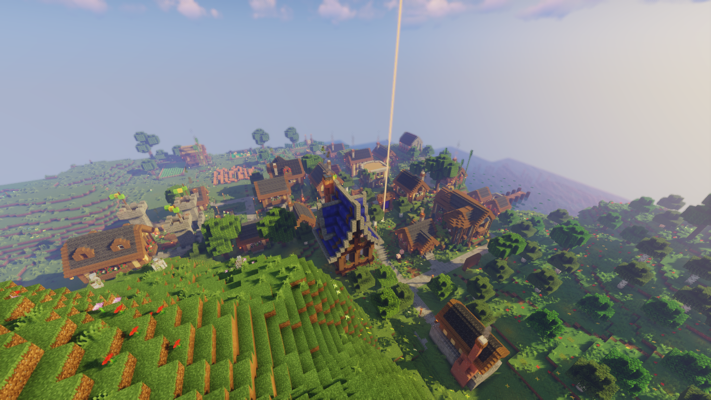<figcaption>
<em>Законченный Стоунград</em>
</figcaption></figure> <figure>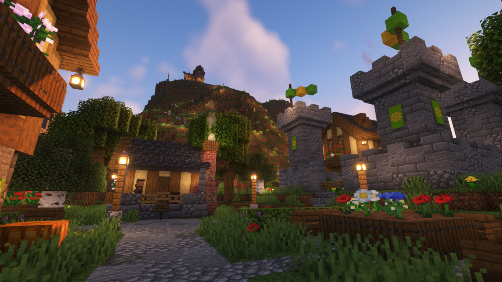<figcaption>
<em>Местность при Цитадели</em>
</figcaption></figure>

<figure><figcaption>
<em>Беседка UwU</em>
</figcaption></figure> <figure><figcaption>
<em>2 этаж библиотеки</em>
</figcaption></figure> <figure>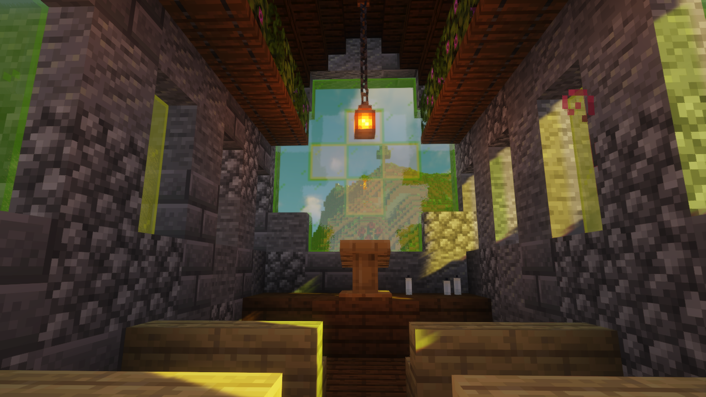<figcaption>
<em>Храм изнутри</em>
</figcaption></figure>

<figure><figcaption>
<em>Клиника Стоунграда</em>
</figcaption></figure> <figure>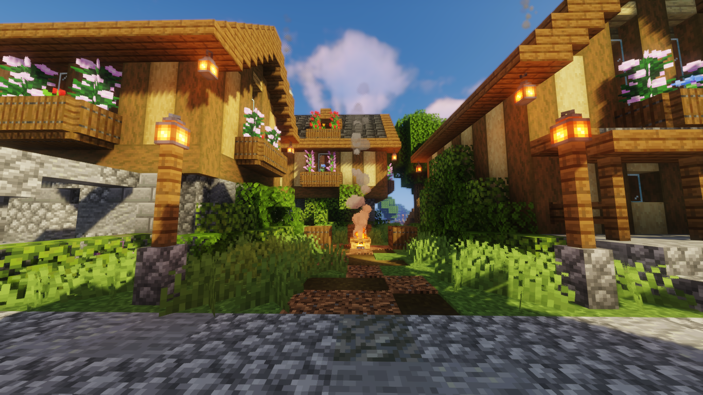<figcaption>
<em>Закоулок</em>
</figcaption></figure>

### Город ТаймТаун

Крупное по размеру и среднее по населённости объединение, появившееся примерно в середине сезона. Представляло собой современный городок на равнине у моря. К конце сезона в городе жило 5 человек.

Главами гильдии были игроки rex2207 и forest\_men. Они же в занимались постройкой домов. Внутреннем оформлением в основном занимался nightmoss2424.

Объединение имело ферму мобов, однако пользы от неё было немного. Интересной особенностью ТаймТауна было то, что прототипами построек стали наборы Lego. В городе были банк, пожарная часть, мебельный магазин, библиотека, детективное агенство, французский ресторан, кафе и зоомагазин. Из развлечений город предлагал небольшой "бросянка run" и гонки на лодках по льду.

<figure>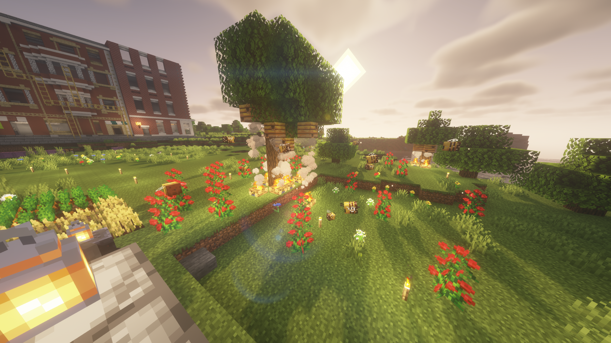<figcaption>
<em>Совсем ранний ТаймТаун</em>
</figcaption></figure> <figure><figcaption>
<em>Ранний ТаймТаун</em>
</figcaption></figure>

<figure>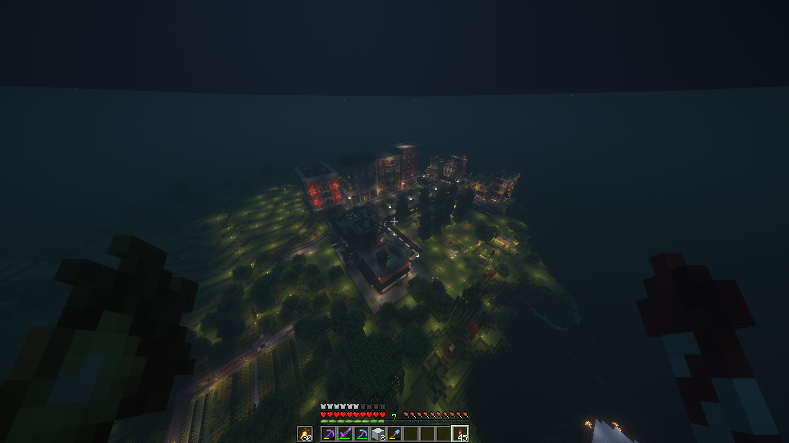<figcaption>
<em>ТаймТаун в конце</em>
</figcaption></figure>

### Люди Мира

Небольшое по размеру и населённости объединение. Представляло собой кочевую группу. В ней состояли 2 человека - kys1t и srica.

У объединения не было точного места обитания, главным в жизни Людей Мира были их лошади. Они с ними жили, ели и путешествовали. Также Людей Мира интересовало золото, они ценили его и торговали только им. Объединение называло себя честными торговцами с лучшими ценами. Люди Мира вели активную торговлю со Стоунградом.

<figure>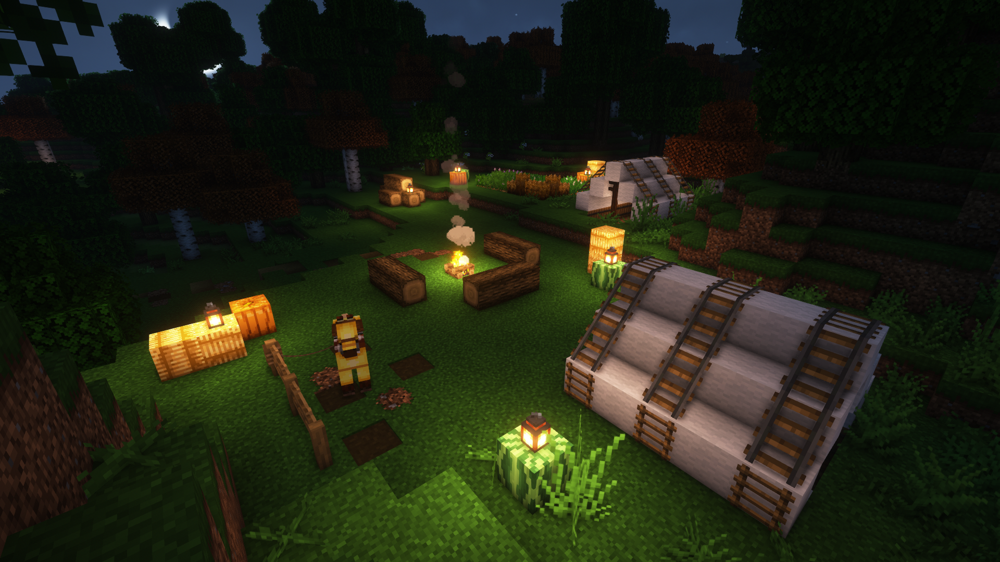<figcaption>
<em>Стоянка Людей Мира близ Стоунграда</em>
</figcaption></figure> <figure>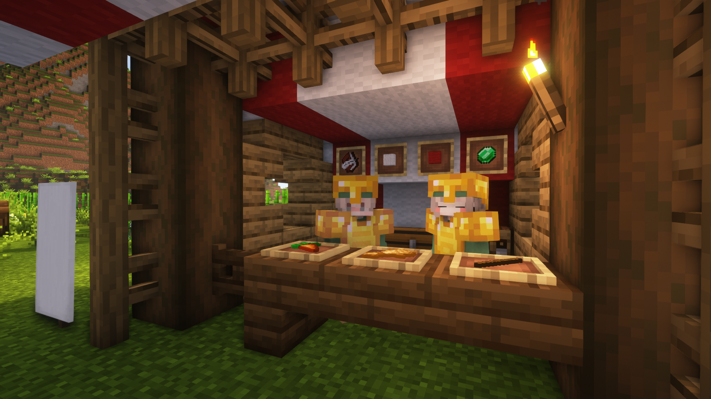<figcaption>
<em>Лавка Людей Мира в Стоунграде</em>
</figcaption></figure>

<figure>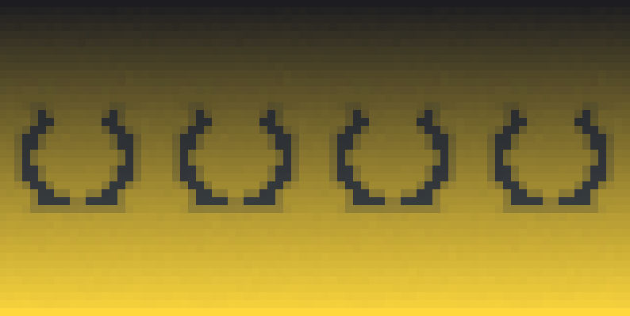<figcaption>
<em>Флаг Людей Мира</em>
</figcaption></figure>

## События

За период первого сезона произошло не слишком много ивентов. Выделялось одно большое и массовое событие, остальные были мелкими и малозначимы.

### Стоунградские учения

Предпосылкой к организации ивента были периодически появляющиеся таблички с угрозами в Стоунграде и Гильдии Искателей.

<figure><figcaption>
<em>Табличка в доме мэра Стоунграда</em>
</figcaption></figure> <figure><figcaption>
<em>Табличка перед Цитаделью Стоунграда</em>
</figcaption></figure>

Так гильдии создали союз на почве общего врага. Вскоре Стоунград организовал учения - ивент, представляющий собой PvP сражения и соревнования по стрельбе. Не с первого раза ивент удалось провести 8 мая 2022 года в 17:00 по МСК. Участие мог принять каждый. В конце все насладились закусками и фейерверками.&#x20;

<figure><figcaption>
<em>Соревнования по стрельбе</em>
</figcaption></figure> <figure><figcaption>
<em>PvP сражения</em>
</figcaption></figure>

<figure>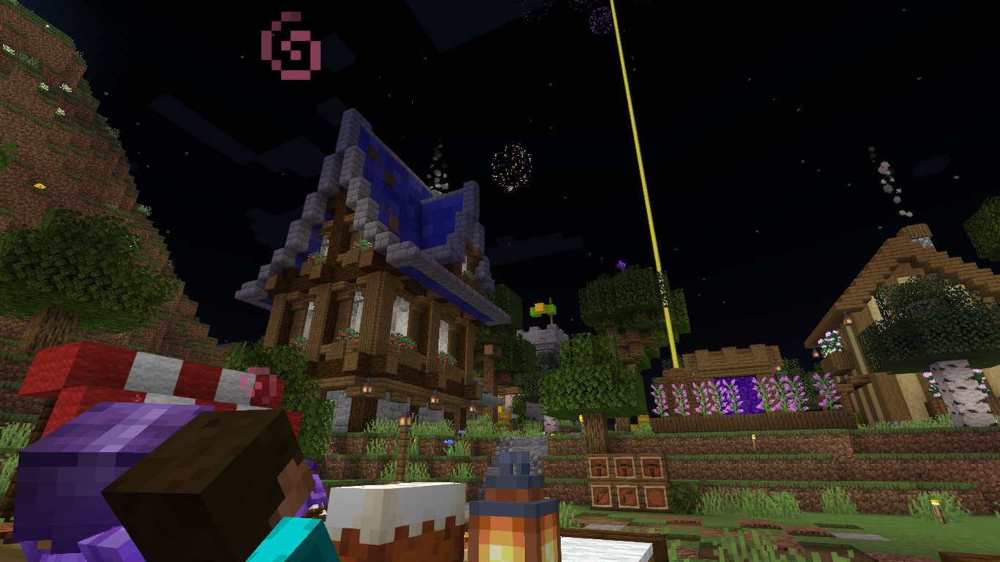<figcaption>
<em>Фейерверки после учений</em>
</figcaption></figure> <figure>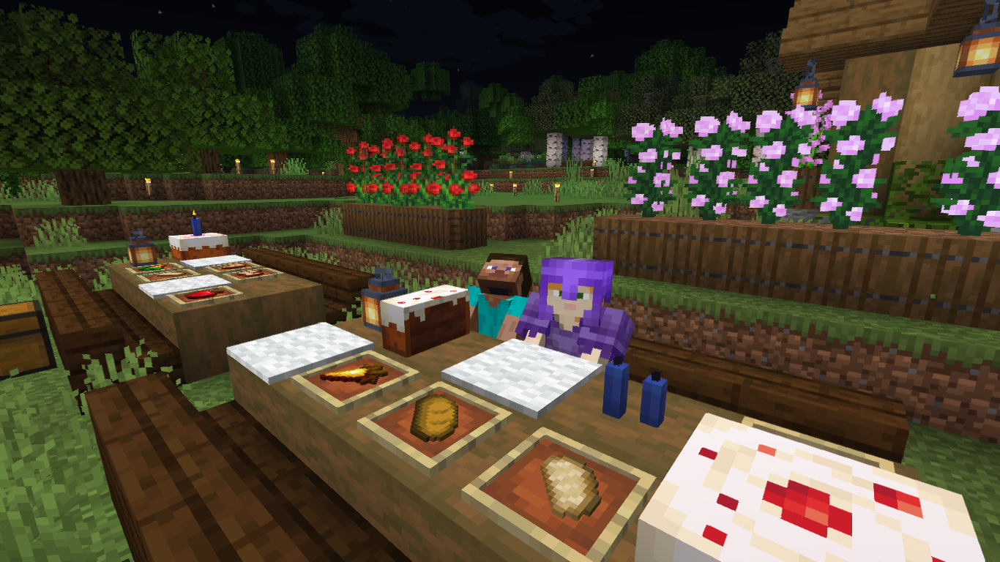<figcaption>
<em>Закуски для участников</em>
</figcaption></figure>

### Мини-ивент по постройкам

В тот же день 8 мая 2022 года утром в новостях вышло объявление о конкурсе построек. Для участия нужно было скинуть скриншоты в соответствующий канал с пометкой "ивент". Участие в ивенте приняли Trelony, Xenone\_Xe и SirSliva. На момент написания истории голосы распределены так:

* Trelony - 15
* Xenone\_Xe\_ - 4
* SirSliva - 12

<figure><figcaption>
<em>Постройка Trelony</em>
</figcaption></figure> <figure><figcaption>
<em>Постройка Xenone_Xe_</em>
</figcaption></figure> <figure>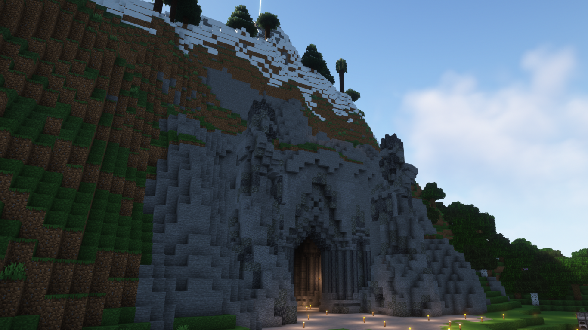<figcaption>
<em>Постройка SirSliva</em>
</figcaption></figure>

## Ссылка для скачивания

Ссылка оказалась повреждена и была утеряна...
