# 2 сезон


Материал может содержать неточности и ошибки, а также быть субъективным, поскольку отражает восприятие автора. Если вы хотите внести какие-либо правки, пожалуйста, обратитесь в дискорд канал📝[«обращения»](https://discord.com/channels/956981761802375228/1245232823510503428).


На момент начала второго сезона проект DreamFox представлял собой приватный ванильный сервер Minecraft с элементами RolePlay.

## Продолжительность

Второй сезон открылся 15 июня 2022 года на версии Minecraft 1.19. Сезон длился почти год и закрылся в конце мая 2023 года по причине усталости игроков и скорого выхода новой версии.

## Объединения

За время второго сезона устоялись несколько объединений: город Грибливуд, Великий Сёгунат империи Z и форт "Синичий приют". Вероятно, существовали и другие объединения, но они оказались незаметны.

### Город Грибливуд

Крупнейшее по размеру и населённости объединение. Представляло собой большой магический город, состоящий из различных тематических зон. К концу сезона в гильдии состояло около 20 человек.

Главой гильдии был rex2207. Сначала город строили rex2207, forest\_men и heleren, однако последние два чаще занимались развитием своего магазина и повышением благосостояния, на почве этого возникали конфликты. Глава города rex2207 неизменно занимался строительством на протяжении всего сезона. Местами помогали игроки Waldemarrin, Trelony, MrDpagoIII и другие.

Изначально Грибливуд начинал своё строительство в ином месте, но после \_\_\_TopTuk\_\_ передал rex2207 грибной остров, что стал новым местом строительства города.

#### Районы грибливуда

* Грибная зона - большая зона с большим количеством домов в виде грибов. Она была построена первой. К концу сезона в ней были адский портал, карта города, пиццерия, дом MrDragoIII, дом rex2207, городской склад, бар Subo\_Gucci, дом forest\_men, дом heleren, небольшие покупные домики, рынок с жителями и другое. В центре зоны был огромный карьер-пещера, через который в первые дни был проложен мост.

<figure><figcaption>
Рынок с жителями
</figcaption></figure>

<figure>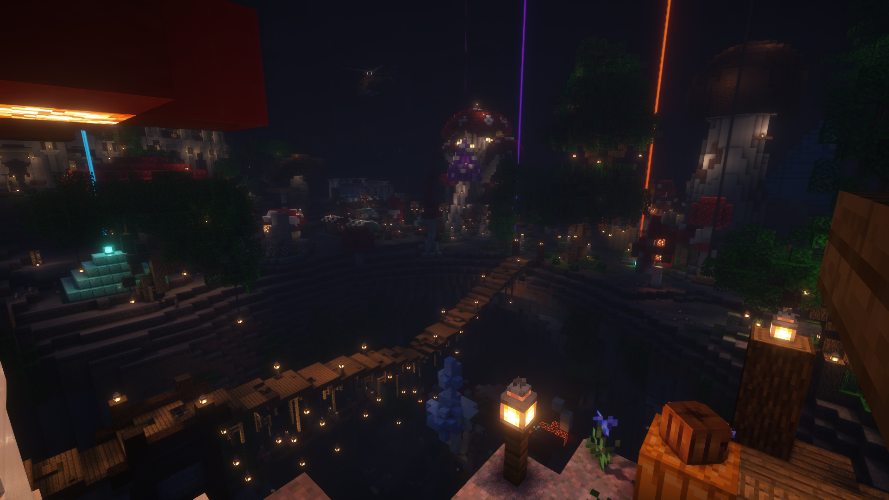<figcaption>
<em>Общий вид на грибную зону ночью</em>
</figcaption></figure>

<figure>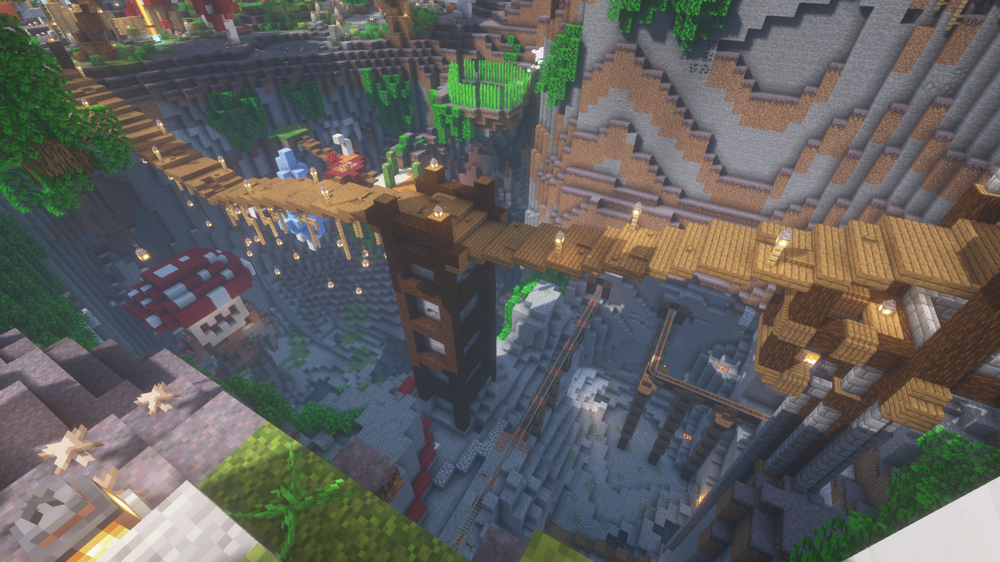<figcaption>
<em>Карьер-пещера</em>
</figcaption></figure> <figure>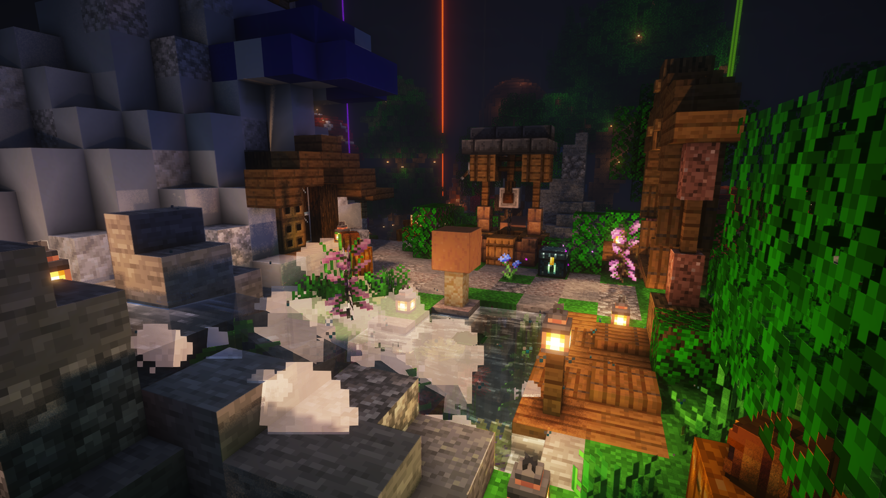<figcaption>
<em>Задний дворик дома Рекса</em>
</figcaption></figure> <figure>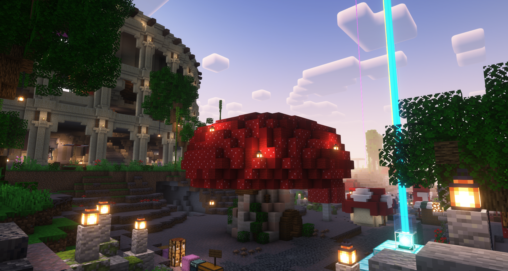<figcaption>
<em>Дом Драгоша</em>
</figcaption></figure>

* Зона Колизея - зона, по размеру сравнимая с грибной. Озеленённая часть острова. Почти полностью она была занята колизеем - одной из наикрупнейшей постройкой Грибливуда. Колизей был окружён круговой парковой дорожкой. Диаметр Колизея был в ширину острова, зона колизея с двух сторон касалась океана. Колизей был построен rex2207 и forest\_men. Ближе к концу сезона к этой зоне можно отнести Термы - древнеримские общественные бани, Термы находились в грибной зоне, но по стилю относились к зоне Колизея. Термы были построены Trelony.

<figure>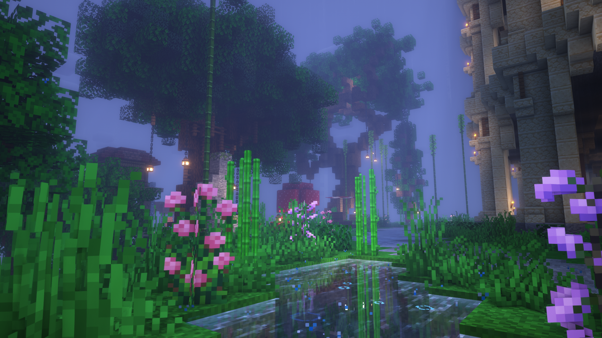<figcaption>
<em>Парк вокруг колизея</em>
</figcaption></figure> <figure><figcaption>
<em>Колизей ночью</em>
</figcaption></figure> <figure>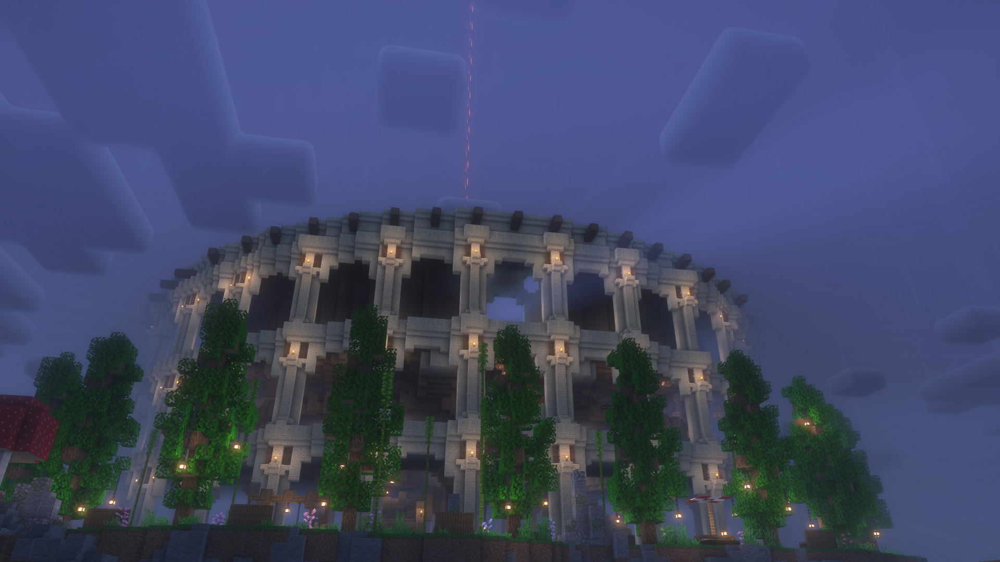<figcaption>
<em>Колизей днём</em>
</figcaption></figure>

<figure><figcaption>
<em>Термы</em>
</figcaption></figure>

* Зона горы - относительно небольшая зона. Озеленённая часть острова. Зона горы представляла собой большую полую рукотворную гору, внутри был зал для собраний.&#x20;

<figure><figcaption>
<em>Зал собраний внутри горы</em>
</figcaption></figure>

<figure>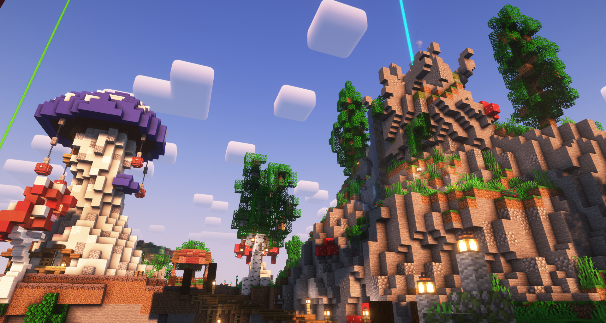<figcaption>
<em>Гора</em>
</figcaption></figure>

* Пиратская зона - относительно небольшая зона, чуть больше зоны горы. Представляет собой небольшое поселение на берегу океана. Озеленённая часть острова. Пиратская зона включала в себя таверну, частный дом, пару пустых магазинчиков, водонапорную башню, маяк, старые руины, обломки кораблей, причалы, погрузочные краны, простой кораблик и воссозданную Чёрную Жемчужину. Большая часть пиратской зоны была сделана Trelony, однако rex2207 также помогал, построив обломки корабля на скалах и Чёрную Жемчужину.

<figure>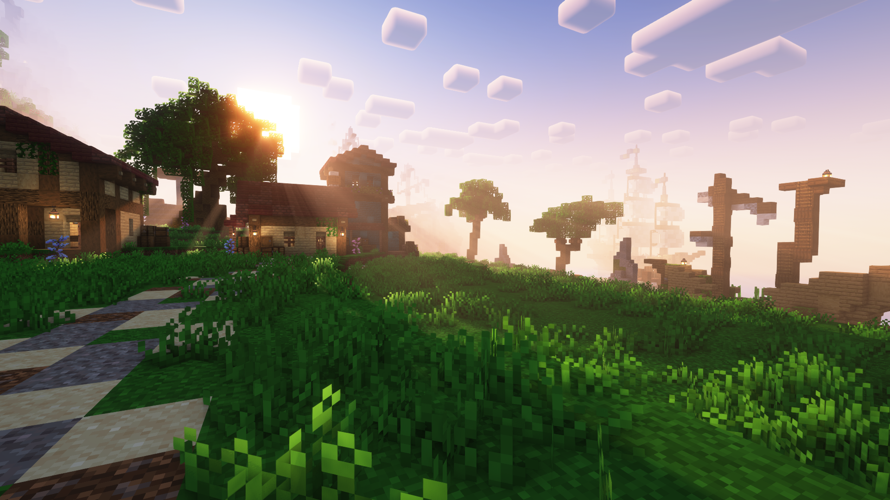<figcaption>
<em>Общий вид на пирасткое поселение</em>
</figcaption></figure> <figure><figcaption>
<em>Порт с кранами и Чёрная Жемчужина</em>
</figcaption></figure>

<figure>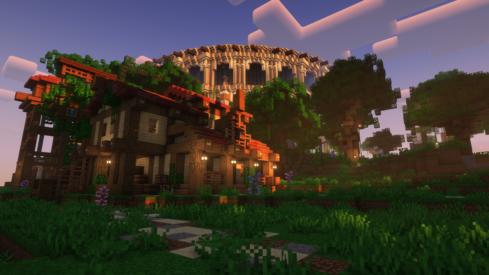<figcaption>
<em>Таверна</em>
</figcaption></figure> <figure><figcaption>
<em>Водонапорная башня и маяк</em>
</figcaption></figure> <figure>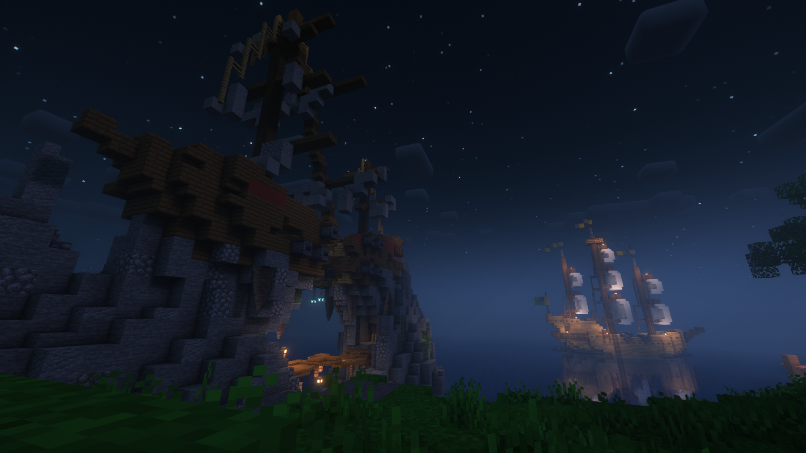<figcaption>
<em>Обломки корабля на складах и простенький корабль</em>
</figcaption></figure>

* Зона аттракционов - средняя по размеру зона. Зона аттракционов включала в себя американские гонки, карусель, цирк и место для игры в "Бункер". Карусель и цирк представляли собой декоративную функцию, однако всё ещё можно было покататься на американских горках, или, порой, сыграть в "Бункер".

<figure>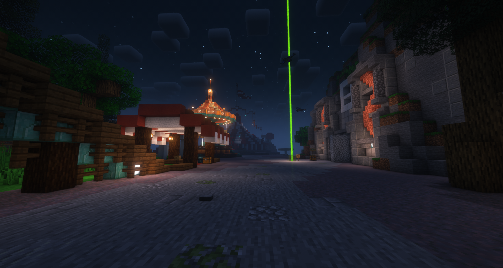<figcaption>
<em>Общий вид на зону аттракционов</em>
</figcaption></figure> <figure>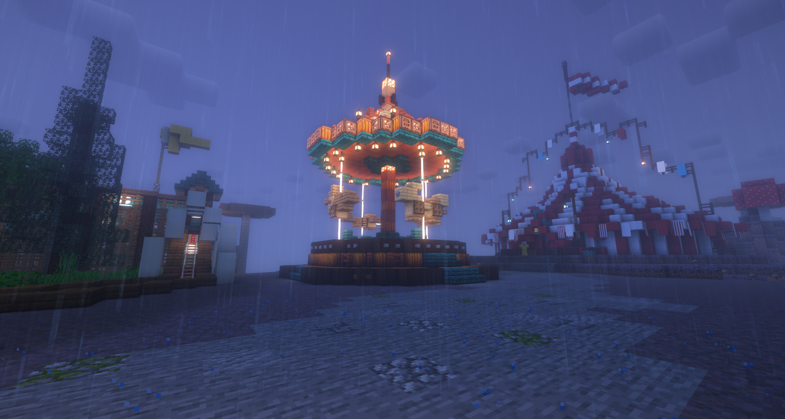<figcaption>
<em>Карусель и цирк</em>
</figcaption></figure> <figure>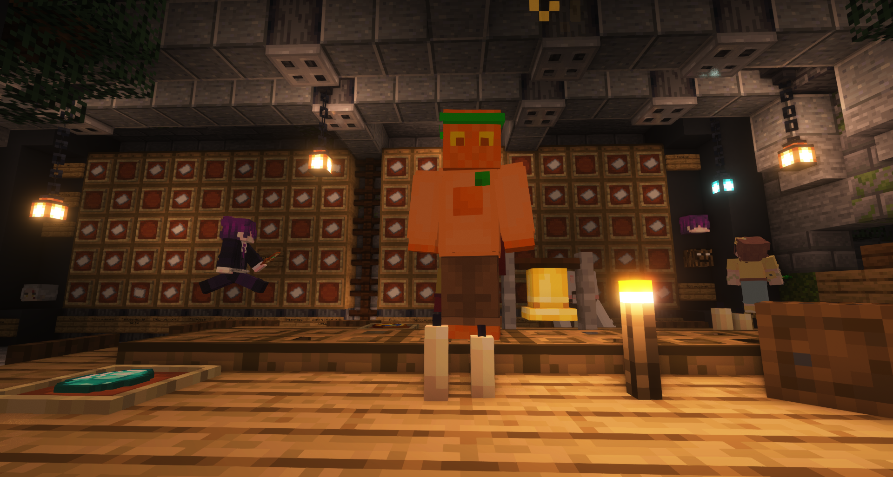<figcaption>
<em>Игра "Бункер"</em>
</figcaption></figure>

* Зона набережной - маленькая зона. Зона набережной представляла собой маленькую каменную набережную с местами для отдыха.
* Летающий остров miniking1000 - летающий остров, построенный miniking и служивший последнему домом

<figure>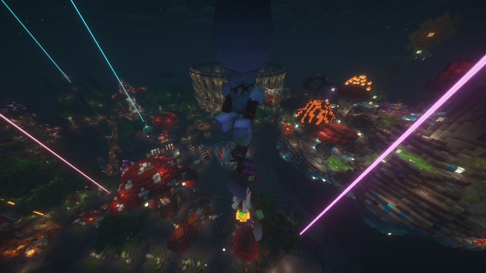<figcaption>
<em>Летающий остров Миникинга справа</em>
</figcaption></figure>

* Летающий остров Orange - летающий остров, построенный miniking и проданный Orange.

<figure>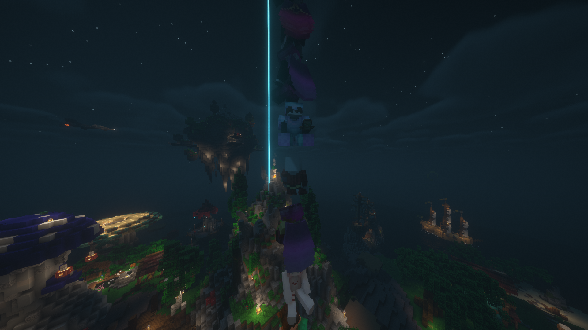<figcaption>
<em>Летающий остров Оранжа на заднем плане</em>
</figcaption></figure>

В конце стоит отметить природное оформление острова. Все постройки окружены прекрасными рукотворными деревьями и хорошо вписаны в ландшафт.

<figure><figcaption>
<em>Рукотворные деревья</em>
</figcaption></figure>

### Форт "Синичий приют"

Среднее по размеру и небольшое по населённости объединение. Представляло собой сеть построек на вертикальной скале, соединённых подвесными путями с портовой частью.

Поселение было основано тремя игроками - Trelony, Sard23Fun и Xenone\_Xe\_, однако в будущем стройкой занимался в основном только Xenone\_Xe\_.

Форт "Синичий приют" включал в себя кузницу, храм, ресто-бар, таверну, склад, несколько жилых домов и магазинчик всякого ничего.\
Всё вышеперечисленное было построенно Xenone\_Xe\_. Sard23Fun построил начальный домик наверху, Trelony спустя полгода построил кораблик.

<figure>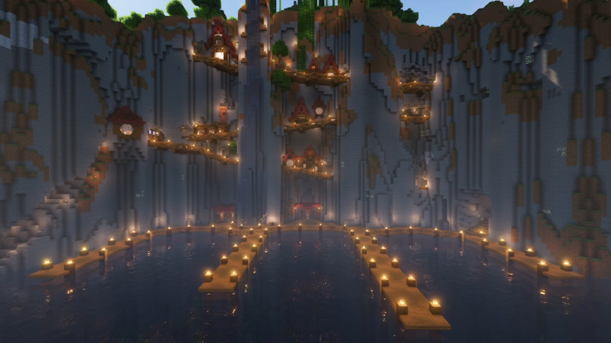<figcaption>
<em>Форт "Синичий Приют"</em>
</figcaption></figure>

### Великий Сёгунат империи Z

Среднее по размеру и населённости объединение. Представляло собой небольшое поселение в японо-китайском стиле. К концу сезона в нём состояло 5 человек.

Главой гильдии - Сёгуном - был ZeTShow, Excepts был заместителем.\
Главным строителем был ZeTShow, Excepts добывал ресурсы.

Поселение имело склад, торговый дом с жителями, магазин на спавне, ферму опыта, большие поля с пшеницей и прочие фермы.

## События

За период второго сезона произошло большое количество ивентов.

### Открытие Края

8 июля 2022 года в 21:00 по МСК был открыт мир Края и был проведён мини-ивент по убиству дракона. Событие интересно тем, что по нему был сделан [видео-ролик](https://youtu.be/4b-xQMCtucI) на официальный канал DreamFox.

### Гладиаторские бои

29 августа 2022 года в 15:00 по МСК в Грибливуде в Колизее состоялись Гладиаторские бои. Игроки записывались на ивент через книгу. Позже перед каждым боем игроки выбирали один из трёх классов - лучник, мечник и викинк. После выбора класса игроки выходили на арену и сражались.

<figure>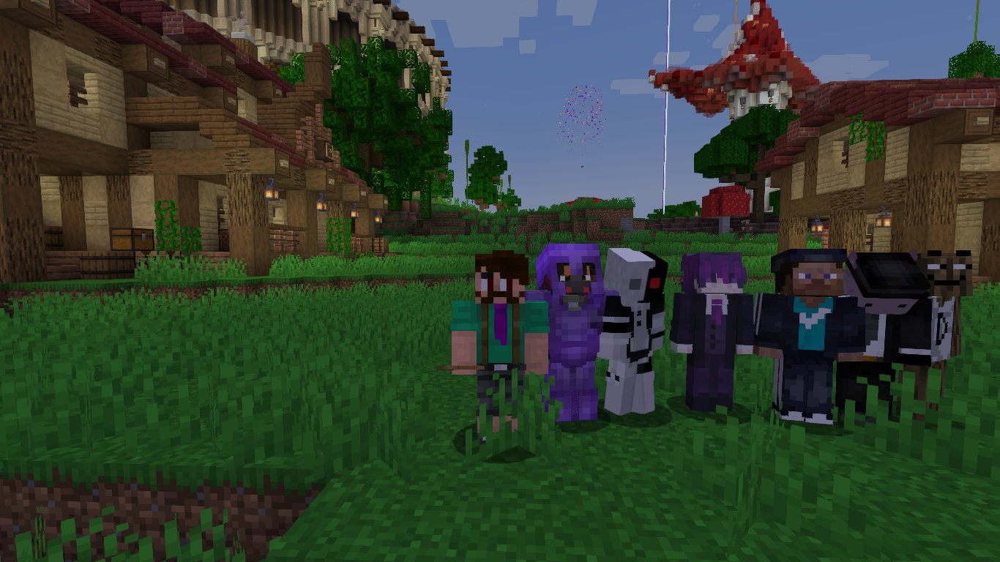<figcaption>
<em>Общее фото после ивента</em>
</figcaption></figure>

<figure>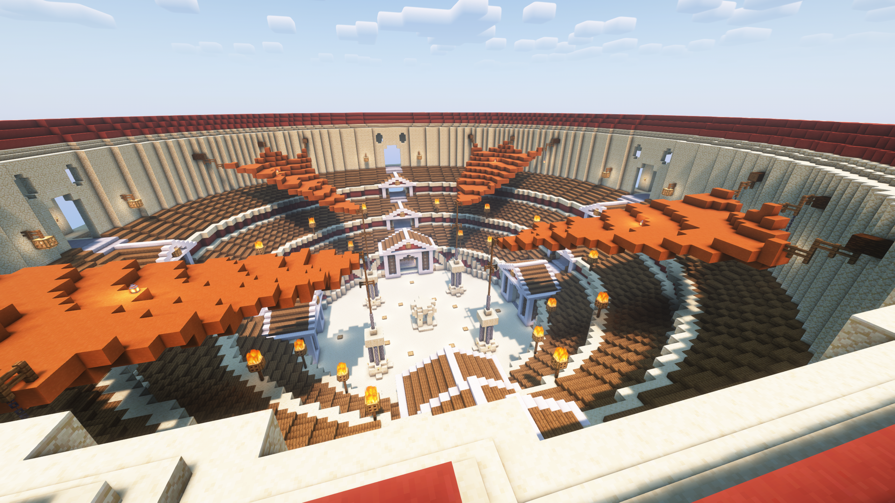<figcaption>
<em>Вид на арену Колизея</em>
</figcaption></figure> <figure>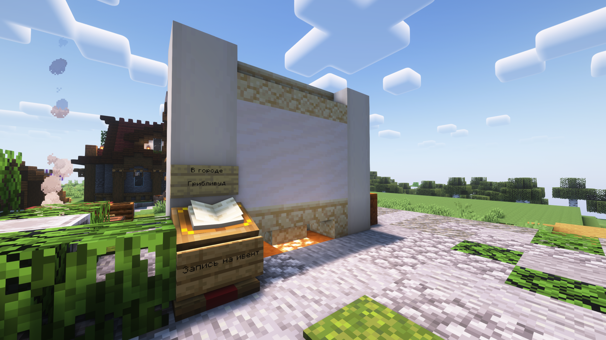<figcaption>
<em>Запись на ивент</em>
</figcaption></figure>

### Бункер

8 октября 2022 года в 17:00 по МСК в Грибливуде состоялся ивент по игре "Бункер". Суть игры в том, что каждому игроку случайно выдаются  характеристики, и все раскрывают свои характеристики по ходу игры, исключая самых бесполезных для выживания людей. В будущем игра "Бункер" проводилась ещё множество раз. По началу игра была сумбурной и неорганизованной. Следующие игры состоялись 18, 30 октября того же года в 17:00 по МСК. Также по этому ивенту был сделан [видео-ролик](https://youtu.be/ga19kuHGftw) на официальный канал DreamFox.

<figure>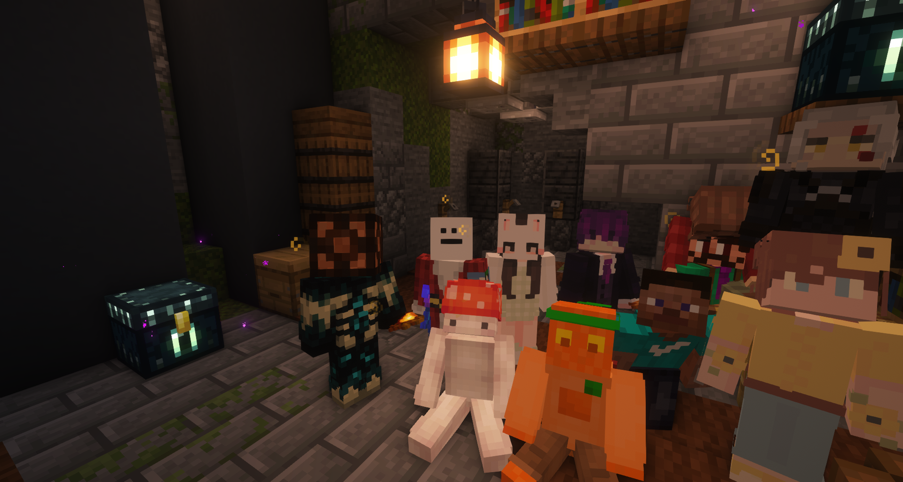<figcaption>
<em>Общее фото после ивента</em>
</figcaption></figure> <figure>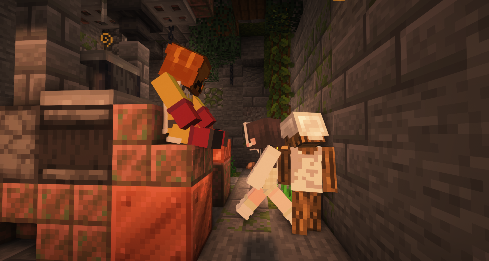<figcaption>
<em>Люди получают характеристики</em>
</figcaption></figure> <figure><figcaption>
<em>Во время игры</em>
</figcaption></figure>

### В поисках голов

30-31 октября 2022 года  проходил мини-ивент "В поисках голов". Для участия нужно было искать "Странные головы", спрятанные в сундуках по спавну. После эти головы можно было использовать для испытания удачи в тыквомате.

<figure>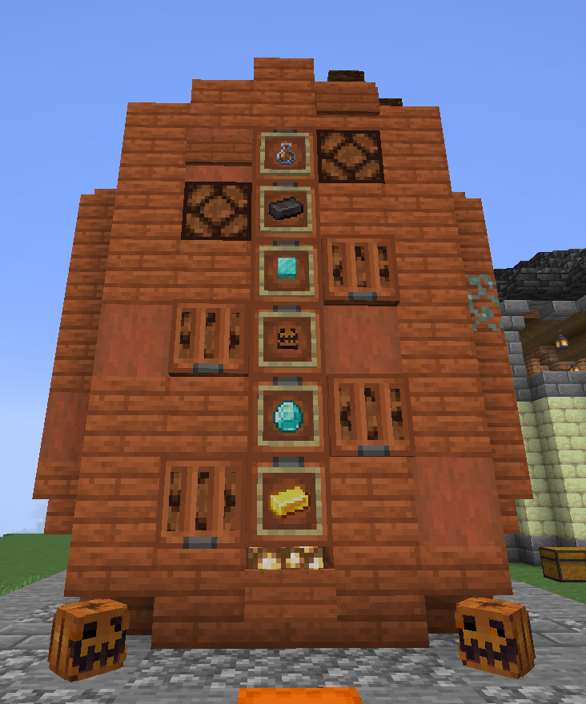<figcaption>
<em>Тыквомат</em>
</figcaption></figure>

### Гонки на лодках

27 ноября 2022 года в 17:00 по МСК состоялись Гонки на лодках. Игроки ехали на лодке по ледяной трасе, соревнуясь друг с другом.

<figure>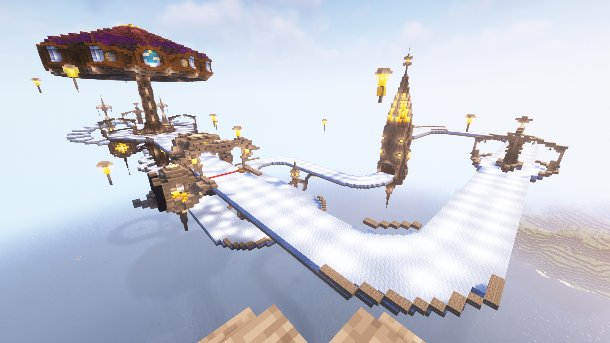<figcaption></figcaption></figure> <figure>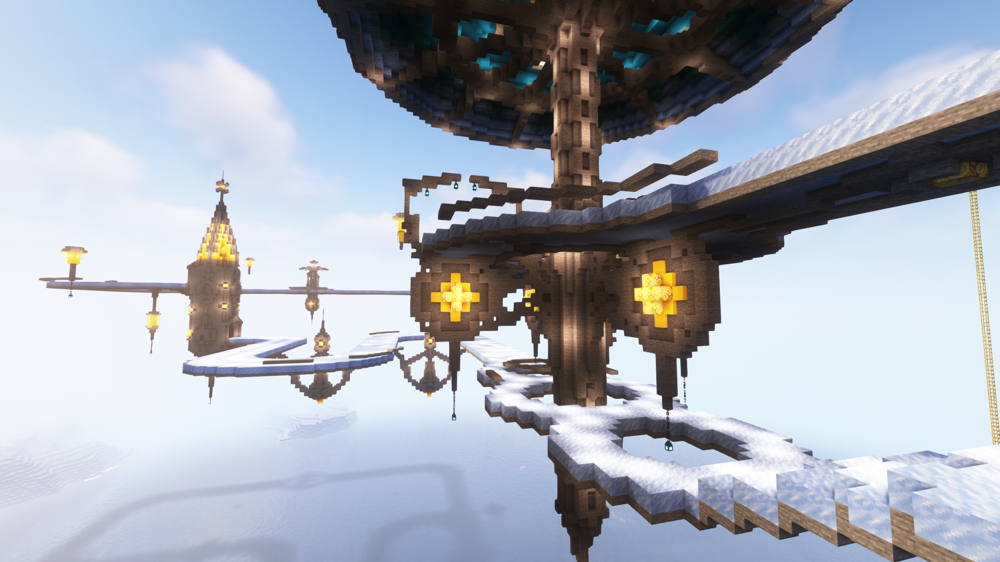<figcaption>
<em>Ледяная трасса</em>
</figcaption></figure> <figure>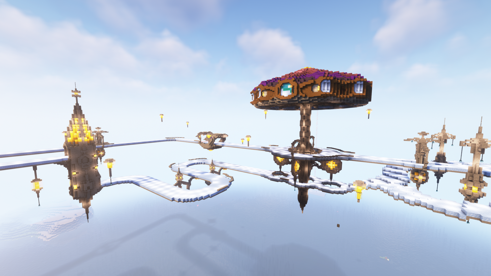<figcaption></figcaption></figure>

### Прятки в особняке приведений

12 февраля 2023 года в 17:00-18:00 по МСК состолись Прятки в особняке приведений. Выбирались 1-2 искателя и они должны были найти всех спрятавшихся людей за определённый период времени. Также по этому ивенту был сделан [видео-ролик](https://youtu.be/PiySjrWw-kI) на официальный канал DreamFox.

<figure><figcaption>
<em>Интерьер Особняка</em>
</figcaption></figure> <figure>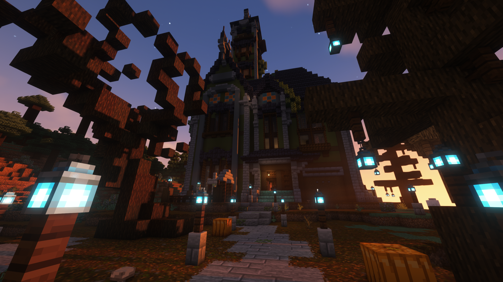<figcaption>
<em>Экстерьер Особняка</em>
</figcaption></figure>

<figure>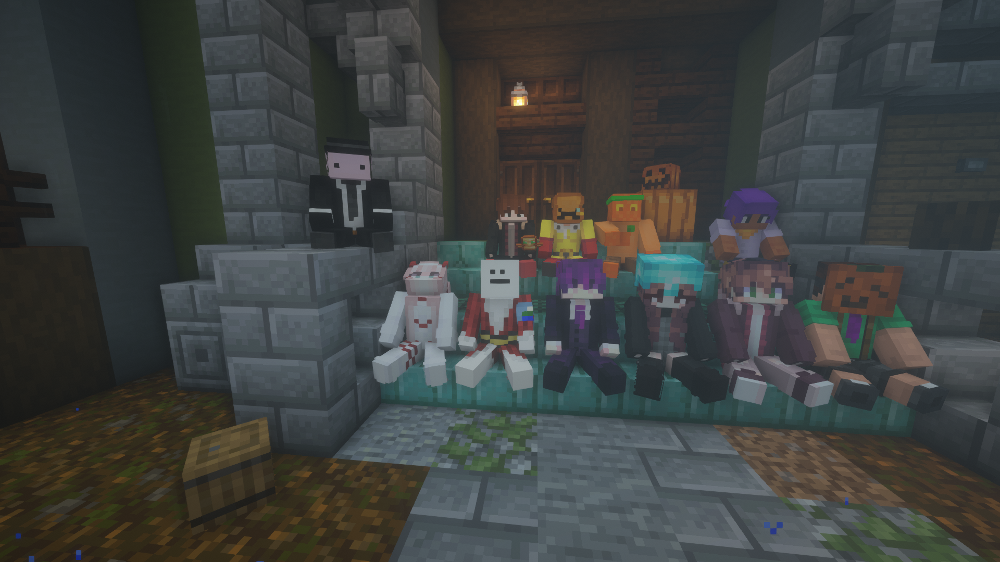<figcaption>
<em>Общее фото после ивента</em>
</figcaption></figure>

### Выборы президента

4 марта 2023 года в 13:40 по МСК состоялись выборы президента сервера. На них выступило несколько кандидатов, в итоге у двух из них - rex2207 и Hlebushek - оказалось равное кол-во голосов, поэтому каждый из них стал полупрезидентом. Будучи президентом rex2207 перестроил спавн, а Hlebushek частично оформил некоторые здания нового спавна изнутри. Также по выборам президента был сделан [видео-ролик](https://youtu.be/Wez8eHQ5-0w) на официальный канал DreamFox.

<figure>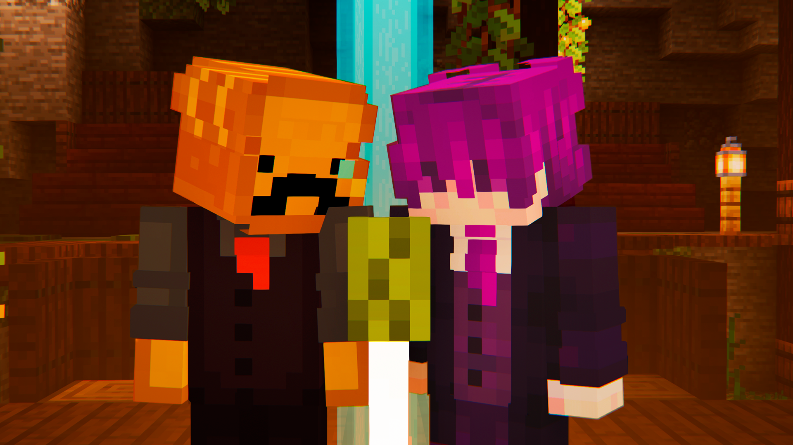<figcaption>
<em>Hlebushek и rex2207 у микрофона</em>
</figcaption></figure>

### Ивент Миникинга

18 марта 2023 года в 15:40 по МСК состоялся ивент, сделанный игроком miniking1000. Участвовать в ивенте могли люди, купившие специальную книжку. Ивент состоялся из нескольких этапов. Победитель получил 64 алмазных блока 

### Ивент Ксенона

4 апреля 2023 года в 20:11 по МСК было опубликован [видео-ролик](https://youtu.be/tfH4lwVfefk) "карта", что ознаменовало начало ивента, сделанного игроком Xenone\_Xe\_. Вначале с помощью карты нужно было найти особенное место, где развивался сюжет. Также в ивенте был спрятан особенный приз, но из-за безразличия игроков он остался ненайденным.

### Съёмки Странных сказок

8 мая 2023 года в 18:00 по МСК состоялся мини-ивент, где собравшиеся разыграли небольшое ролевое представление по сценарию, написанному нейросетью. Качество было на высоте, все отлично повеселились. Также по этому ивенту был сделан [видео-ролик](https://www.youtube.com/watch?v=LJoD8AVUBMg) на официальный канал DreamFox.

### Ивент Рори

Заключительный ивент сервера проведённый под самый конец сезона. В нём участвовало небольшое кол-во человек, однако ивент был очень профессианально подготовлен. Участником нужно было пройти особую полосу препятствий.&#x20;

<figure>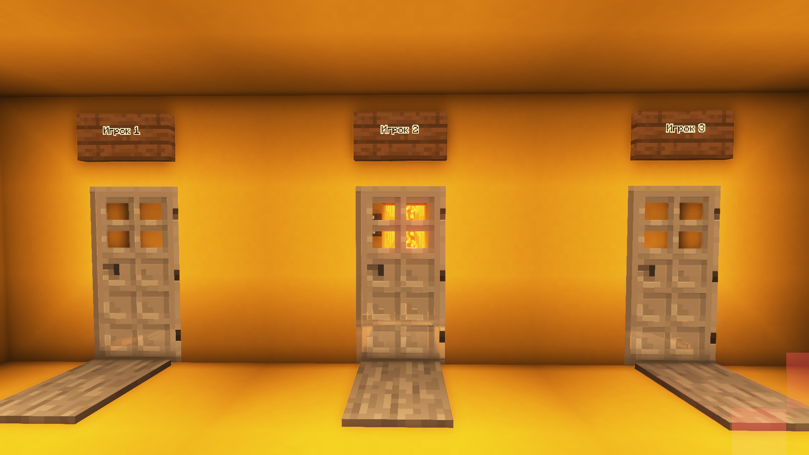<figcaption>
<em>Вход к полосам препятствий</em>
</figcaption></figure> <figure>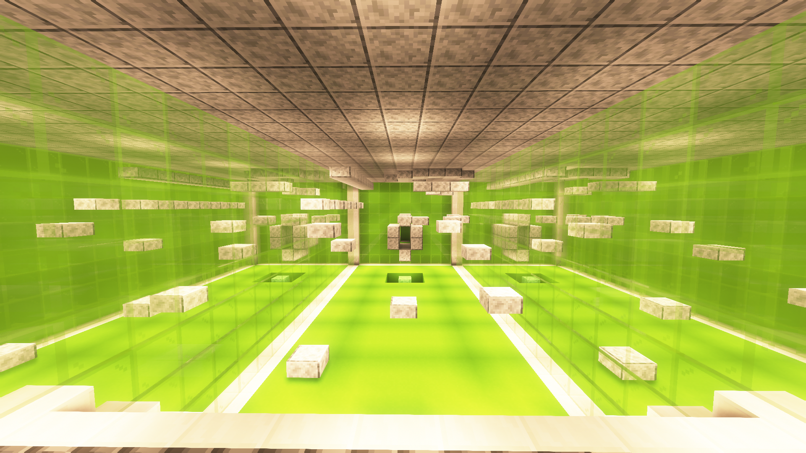<figcaption>
<em>Первый уровень с паркуром</em>
</figcaption></figure> <figure>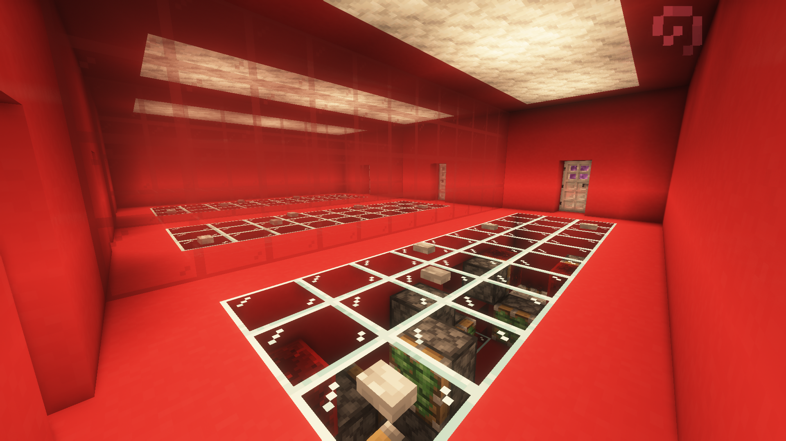<figcaption>
<em>Последний уровень с головоломкой</em>
</figcaption></figure>

### Тетрадь смерти и Бессмертие

Ближе к концу сезона после одного из ивентов игроки получали награды от админов. Два игрока получили особые награды, недоступные в выживании.\
Первый практически бесплатно предмет получил Trelony. Этим предметом была книга "Тетрать смерти" с огромным количеством урона, "ваншотающая" любое существо.\
Второй предмет за 5 стаков алмазных блоков получил rex2207. Этим предметом была настойка из бедрока, дающая бессмертие. Rex2207 не могла убить даже пустота или Тетрать смерти. Однако из-за бессмертия последовали некоторые последствия для всего сервера, такие как метеориты, призраки и другое. Последствия оставались бы до тех пор, пока rex2207 не выпил молоко, тем самым сняв бессмертие, однако вскоре последствия убрали из-за негатива в отношении rex2207. Также по этому событию был сделан [видео-ролик про становление бессмертным](https://youtu.be/u8cYnfp22P4) и несколько видео-роликов про саму настойку из бедрока на официальный канал DreamFox. Первый ролик про настойку [тут](https://youtu.be/KQwUYaQdXmk), а второй [тут](https://youtu.be/u8cYnfp22P4).

### Chat GPT в жителях

Под самый конец сезона был добавлен плагин, добавляющий в жителей встроенный Chat-GPT. С ними можно было вести беседы обо всём и самому предлагать торги. Плагин был сделан miniking1000, спасибо ему за это! На данный момент он отключен из-за технических причин, однако в будущем он обязательно вернётся. Также по этому ивенту был сделан [видео-ролик](https://youtu.be/KT_q84A-Vr0) на официальный канал DreamFox.

## Итог

Второй сезон является самым длительным и богатым на события в истории проекта DreamFox. В него было вложено множество усилий, и он подарил нам, игрокам, множество положительных моментов. К концу сезона сервер потерял ванильность и приблизился к полуванилле - появлялись различные плагины, разнообразившие игру, как Brewery, Chat-GPT в жителях и другие, но это только улучшило сервер, сделало его особенным.&#x20;

## Ссылки для скачивания


_2 сезон_



_Межсезонье_

