# 4 сезон

<figure>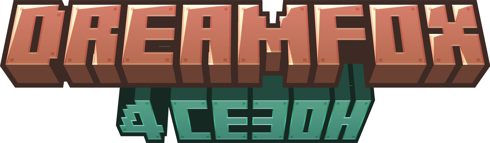<figcaption></figcaption></figure>


Материал может содержать неточности и ошибки, а также быть субъективным, поскольку отражает восприятие автора. Если вы хотите внести какие-либо правки, пожалуйста, обратитесь в дискорд канал📝[«обращения»](https://discord.com/channels/956981761802375228/1245232823510503428).


## Начало сезона

Сезон открыл свои двери для игроков 31 марта 2024 года на версии 1.20.1. Верхний мир был ограничен радиусом в 1000 блоков и постепенно расширялся. С выходом версии 1.21 мир был догружен, и на текущий момент его размер составляет 6000 блоков. У игроков появилась возможность исследовать обновление[ «Дворцы испытаний»](https://ru.minecraft.wiki/w/%D0%9A%D0%B0%D0%BC%D0%B5%D1%80%D1%8B_%D0%B8%D1%81%D0%BF%D1%8B%D1%82%D0%B0%D0%BD%D0%B8%D0%B9).

Начало сезона также примечательно тем, что ровно через день сервер отметил своё [двухлетие](https://discord.com/channels/956981761802375228/956999420258435194/1224219202764804199).

## История

В начале этой истории лежит особенность старта сезона. Почти с самого начала стало ясно, что этот сезон будет не совсем ванильным, что со временем, по желанию игроков, появится что-то похожее на правительство, своя система экономики и, конечно же, когда-нибудь пройдут выборы президента.\
\
Так и случилось. <mark style="color:blue;">10 апреля 2024</mark> года игрок <mark style="color:orange;">JamaliSGT</mark> по собственному желанию был назначен ответственным за спавн и развитие экономики. Позже к строительству спавна подключился ещё один игрок — <mark style="color:orange;">TigranG8403,</mark> который также помогал с экономикой. Именно с этих моментов началось зарождение игрового правительства в этом сезоне.

<figure><figcaption></figcaption></figure>

Строительство спавна продвигалось в неспешном темпе, не все постройки были возведены ответственными за спавн. За всю историю сезона на спавне были построены: колизей[^1], здание банка, церковь[^2], торговые ряды, филиал строительной компании «Хронос»[^3], площадь и здания администрации, две статуи и железнодорожный вокзал. Были проведены дороги, мосты[^4], часть спавна была ограждена рекой, а другая часть — искусственными горами. Внутри города присутствовали зелёные скверы.

<mark style="color:blue;">16 апреля</mark> состоялось открытие мира «Края». Игроков было достаточно, поэтому дракон не стал большой помехой. Во время битвы была попытка украсть яйцо — этим воришкой был <mark style="color:orange;">lichespeaches</mark>, но попытка оказалась неудачной, хоть и забавной.

<figure><figcaption></figcaption></figure>

<figure>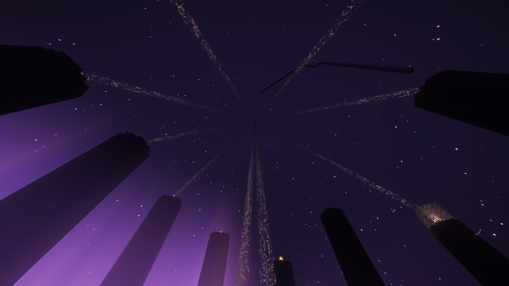<figcaption>
Лестница в небо в попытке украсть яйцо
</figcaption></figure>

После открытия «Края», <mark style="color:blue;">22 апреля</mark>, игроки <mark style="color:orange;">Trelony</mark> и <mark style="color:orange;">Waldemarrin</mark> организовали [«Лососёвый фестиваль»](4-sezon.md#lososyovyi-festival), где была построена специальная хуторская территория. За выловленные предметы и рыбу можно было получить награды. Это был первый на 4 сезоне ивент, организованный игроками.

В это время, с <mark style="color:blue;">21 апреля</mark>, открылся пост на приём заявок на должность [президента сервера](4-sezon.md#zayavka-v-prezidenty), а уже <mark style="color:blue;">30 апреля</mark> прошли выборы. Было 5 кандидатов, которые представили свои программы, ответили на вопросы, а затем состоялись дебаты. Победил и занял пост президента <mark style="color:orange;">Exeets</mark>, став первым и, как мы знаем, единственным президентом 4 сезона. Основная концепция правительства строилась на создании паспортной системы и организации сената.

<figure>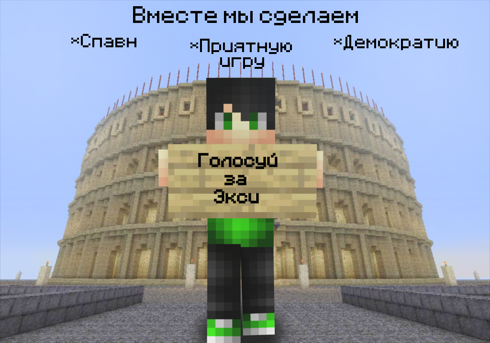<figcaption>
Плакат финалиста <mark style="color:orange;">Exeets</mark>
</figcaption></figure>

<figure><figcaption>
Плакат финалиста <mark style="color:orange;">lekys1t</mark>
</figcaption></figure>

К концу <mark style="color:blue;">апреля</mark> министерство экономики объявило о завершении конкурса на создание валюты сезона. Победили <mark style="color:red;">«Алисы»</mark> с разными номиналами. Дизайн алисов был придуман совместно игроками, а финальный вариант создан <mark style="color:orange;">nikto</mark>, с шаблоном фона от <mark style="color:orange;">lekys1t</mark>.

<figure><figcaption></figcaption></figure>

<mark style="color:blue;">5 мая</mark> президент объявил о начале сбора заявок на пост сенаторов, а уже <mark style="color:blue;">11 мая</mark> стали известны победители: <mark style="color:orange;">Trelony, Tigran, Drendey</mark> и <mark style="color:orange;">Faceit</mark>. К концу месяца было объявлено открытие новых заявок на пост сенатора, но из-за недостаточного количества заявок это решение было отменено. К началу июня большая часть сенаторов сложили свои полномочия, и фактически сената на сервере больше не осталось.

<mark style="color:blue;">24 мая</mark> мир 4 сезона, по результатам голосования, получил название <mark style="color:yellow;">«Мечтолисья­»</mark>, далее будет именоваться именно так.

<mark style="color:blue;">29 мая</mark> прошёл первый ивент на настольные игры под названием [«Настольняшки»](4-sezon.md#nastolnyashki). Азартные игроки и любители настольных игр сошлись в противостояниях в шашках, домино и карточных играх. \
\
В <mark style="color:blue;">мае</mark> игровое правительство попыталось создать систему законов, конституцию, а также провести реорганизацию паспортов, но многие проекты так и не дошли до финальной стадии.

В <mark style="color:blue;">июне</mark> сервер обновился до версии 1.21. Строительство спавна продолжилось, и <mark style="color:yellow;">«Мечтолисье»</mark> жило своей жизнью. Президент по личным причинам отсутствовал, назначив своим заместителем и исполняющим обязанности игрока <mark style="color:orange;">mas2002\_(</mark> <mark style="color:orange;">Tallaris2002).</mark> Вместе с командой, ответственной за спавн, они продолжили его благоустройство и развитие.

<figure>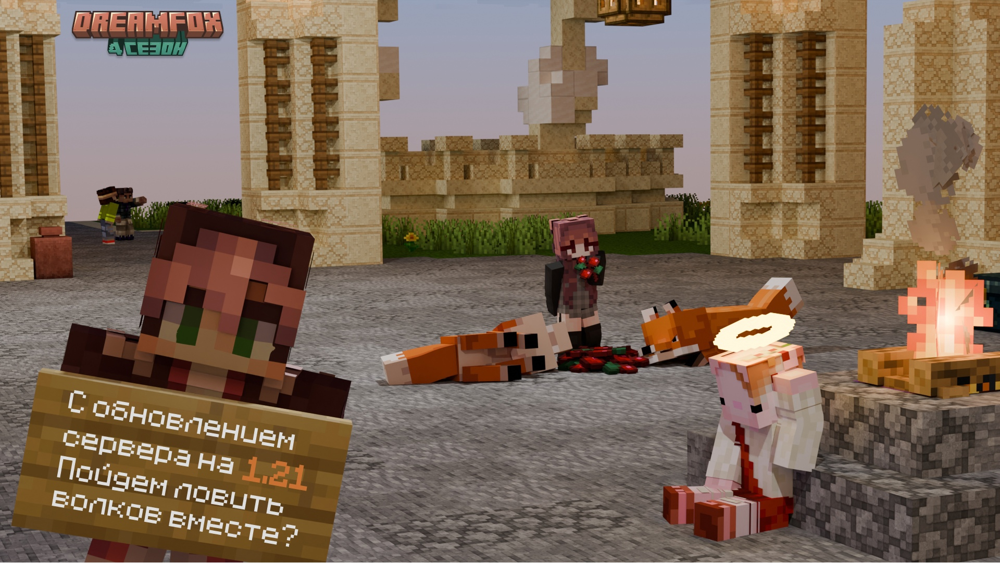<figcaption></figcaption></figure>

В <mark style="color:blue;">июле</mark> был выпущен первый выпуск виртуальной газеты [«Правда Мечтолисья­»](4-sezon.md#pravda-mechtolisya), которая содержала исключительно новости о мире <mark style="color:yellow;">«Мечтолисья­»</mark>. В этом же месяце, <mark style="color:blue;">24 июля</mark>, состоялись разбирательства со стороны администрации в отношении алисов и ответственного за спавн и экономику <mark style="color:orange;">JamaliSGT</mark>. По итогам, игрок покинул мир <mark style="color:yellow;">«Мечтолисья»</mark> навсегда. ~~<mark style="color:red;">«Алисы»</mark>~~ стали под запретом и обменивались на алмазы по курсу 1 алис к 8 алмазам, обмен производился из личного кошелька администрации.

С этого момента стало ясно, что игровое правительство фактически перестало существовать. Появилась группа игроков под названием «Новые лисы», основанная на встречах различных игроков, которые ранее не были причастны к правительству. Целью группы было пересмотреть систему управления и заменить президентскую систему на партийную.

<mark style="color:blue;">21 июля</mark> исполняющий обязанности президента <mark style="color:orange;">mas2002\_</mark> объявил о старте выборной кампании. Согласно Конституции <mark style="color:yellow;">«Мечтолисья­»</mark>, выборы президента должны были состояться 30 июля.

<mark style="color:blue;">24 июля</mark> администрация объявила о полном роспуске игрового правительства и сосредоточении на проведении более масштабных ивентов. Также было запущено голосование "Кто будет продолжать строить спавн?", где победил вариант "Администрация совместно с игроками". С этого дня управление системой и строительство спавна перешло на этот формат.

На этом история игрового правительства <mark style="color:yellow;">«Мечтолисья­»</mark> подошла к концу. Сервер продолжал свою спокойную жизнь, а новые игроки пополняли этот чудесный мир.

<figure>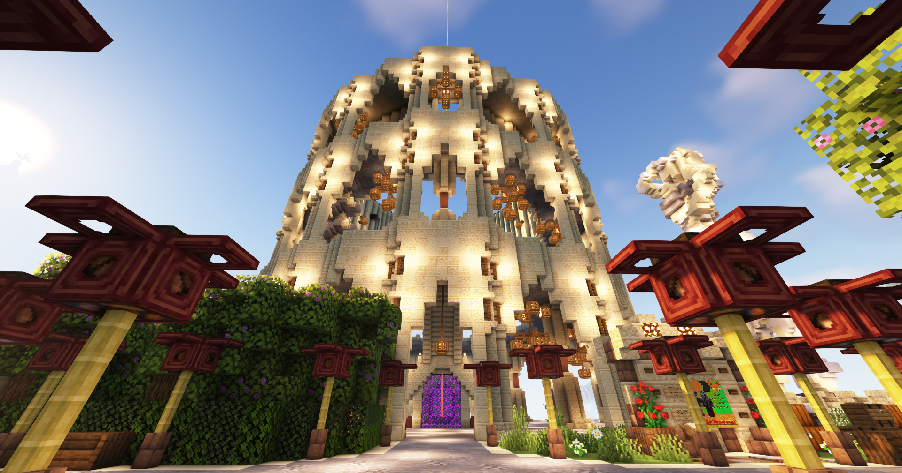<figcaption>
Колезей, главное здание спавна
</figcaption></figure>

***

<mark style="color:blue;">26 июля</mark> состоялась торжественная, хотя и не первая, свадьба на сервере между <mark style="color:orange;">Foxya</mark> и <mark style="color:orange;">Uwka.</mark> Говорят, было много подарков, веселья, а речь священника <mark style="color:orange;">RINCHYRR</mark> была многослойной и великолепной. И, конечно же, какая свадьба без... настольных игр? Любители поиграть в карты остались довольны вдвойне.

<figure><figcaption></figcaption></figure>

<mark style="color:blue;">11 августа</mark> сервер обновился до версии 1.21.1, однако доступ также оставался с версии 1.21. А 18 августа состоялся новый ивент для любителей [настольных игр.](4-sezon.md#nastolnyashki)

<mark style="color:blue;">24 августа</mark> прошёл [самый крупный ивент](4-sezon.md#bitva-v-tronnom-zale) <mark style="color:yellow;">«Мечтолисья­»</mark> — сражение с огромным боссом и его армией. Ранее игроки <mark style="color:orange;">Senzichi</mark> и <mark style="color:orange;">Dast2</mark> разработали и начали строительство огромного тронного зала вместе с помощниками[^5]. Ивент оказался невероятным и уникальным, игрокам понравилась концепция, а сам зал ещё неоднократно использовался в качестве арены для сражений.

<figure>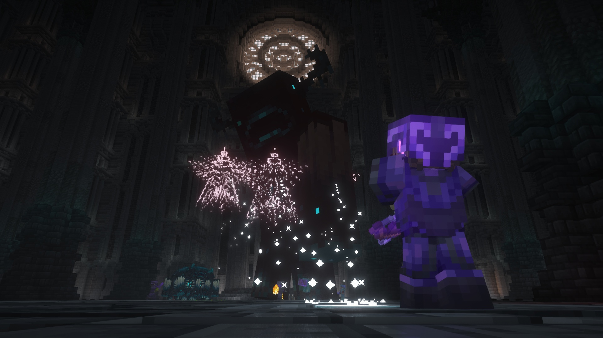<figcaption></figcaption></figure>

<mark style="color:blue;">2 сентября</mark> в тронном зале прошёл [ивент](4-sezon.md#bitva-s-ordoi) на сражение с ордами врагов. Врагов было действительно много, как и игроков, но единственным выжившим остался <mark style="color:orange;">Darcnes45</mark>, сумевший спастись от одновременного нападения 568 мобов. До этого ивента состоялась небольшая, незапланированная атака орды на [нескольких игроков](#user-content-fn-6)[^6]. Мир спокойно выдержал 1204 эндерменов, 7 эндердраконов, 10 древних стражей и 7 иссушителей.

<mark style="color:blue;">5 сентября</mark> прошёл ивент [«Мафия»](4-sezon.md#mafiya), организованный игроком <mark style="color:orange;">toruWith</mark>, а <mark style="color:blue;">6 сентября</mark> состоялся ивент [«Бункер»](4-sezon.md#bunker), организованный игроком <mark style="color:orange;">SHiZi\_13</mark>. Астрологи объявили эти дни днями выдачи уникальных ролей за организацию этих замечательных ивентов.

<mark style="color:blue;">19 сентября</mark> состоялся финальный аукцион 4 сезона, на котором игроки могли приобрести уникальные награды, которые будут перенесены в 5 сезон. Эти награды не давали игровых преимуществ, но в общей сложности игроки совершили покупки на 2813 алмазных блоков.

<figure><figcaption></figcaption></figure>

В <mark style="color:blue;">октябре</mark> стало известно, что вайп и переход на 5 сезон состоится с 12 по 13 число. На этом история чудесного мира <mark style="color:yellow;">«Мечтолисья­»</mark> завершилась.


В этой истории представлена лишь малая часть событий — небольшой фрагмент, который редактор решил сохранить на этой странице. Многие моменты, особенно касающиеся игрового правительства, были упущены случайно, а некоторые намеренно, чтобы эта страница не превратилась в пятый том «Войны и Мира».

Если вы готовы поделиться своим видением истории 4 сезона, вы можете отправить свои варианты в раздел: 📝«Обращения» нашего [Discord](https://discord.gg/8XsKXesDBM) канала.


### Правда «Мечтолисья»

Новостная газета, которая в основном публиковалась только в [ВК](https://vk.com/dreamfoxmc), появилась с целью сбора новостей про игровое правительство и его нововведения. К сожалению, выполнить свою цель не смогла, так как игровое правительство было отменено. Газета продолжила свою деятельность по игровым новостям. Здесь мы соберём все выпуски, с которыми можно ознакомиться для дополнения информации к истории 4 сезона.

<figure>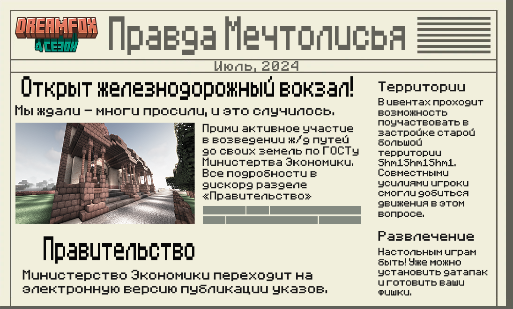<figcaption>
Выпуск #1
</figcaption></figure>

<figure>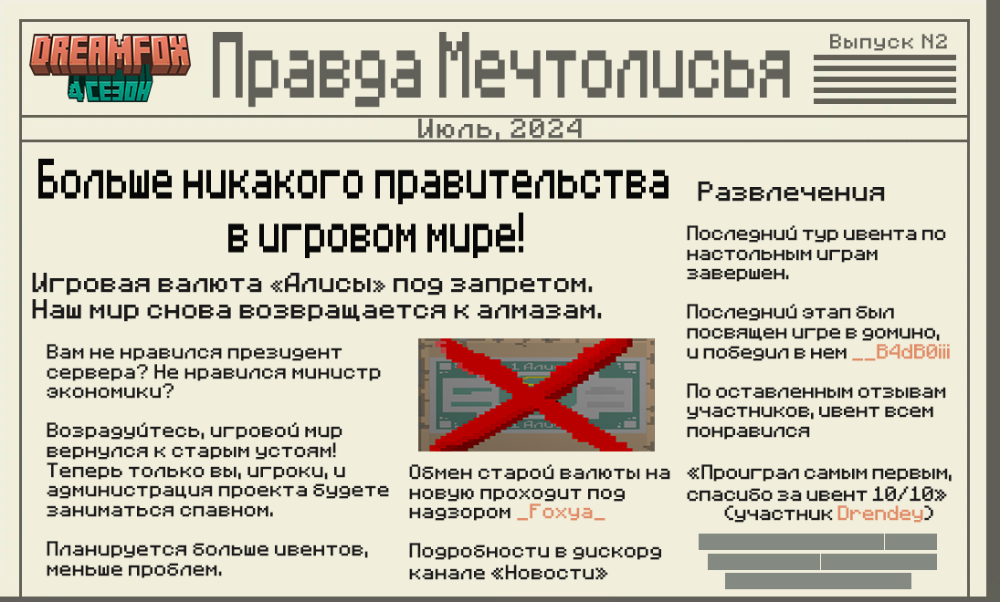<figcaption>
Выпуск #2
</figcaption></figure>

<figure>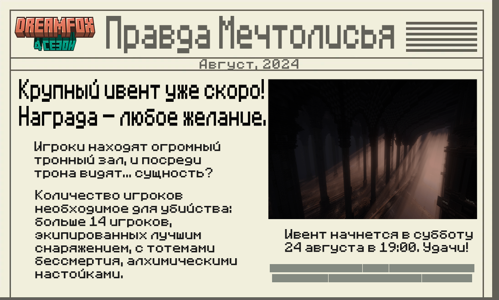<figcaption>
Выпуск #3
</figcaption></figure>

<figure>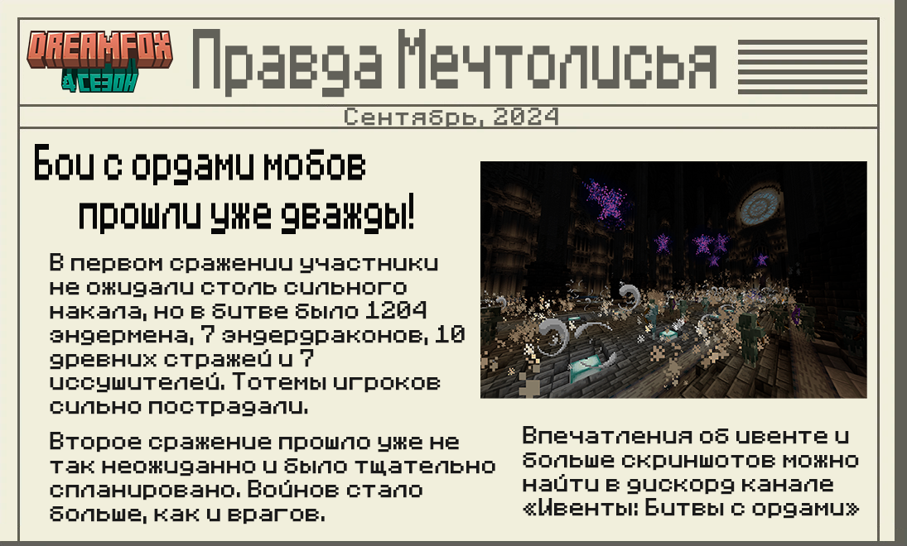<figcaption>
Выпуск #4
</figcaption></figure>

<figure>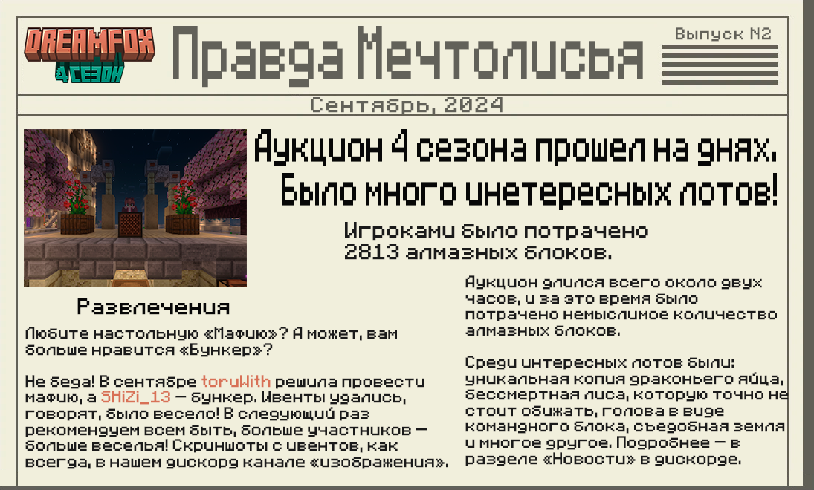<figcaption>
Выпуск #5
</figcaption></figure>

## Города

### Спавн <mark style="color:yellow;">«Мечтолисья»</mark>

Спавн можно по праву назвать небольшим, но центральным городом сезона. Здесь располагались различные постройки, а в какой-то период в нём проживали несколько игроков. Сам спавн был выполнен в песочных тонах и сохранял эту палитру до самого конца сезона.

<figure><figcaption>
Колезей
</figcaption></figure>

<figure>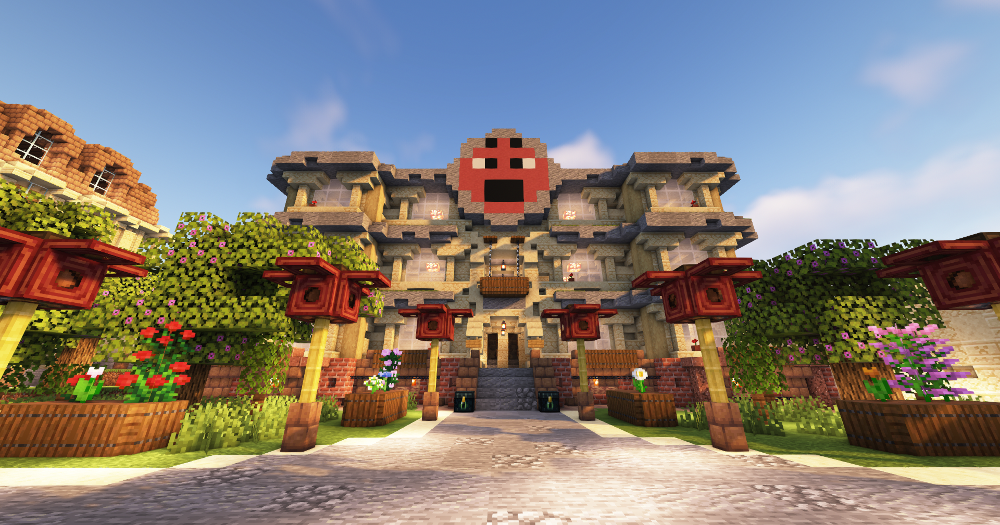<figcaption>
Банк
</figcaption></figure>

<figure><figcaption>
Магазин и торговые лавки
</figcaption></figure>

<figure>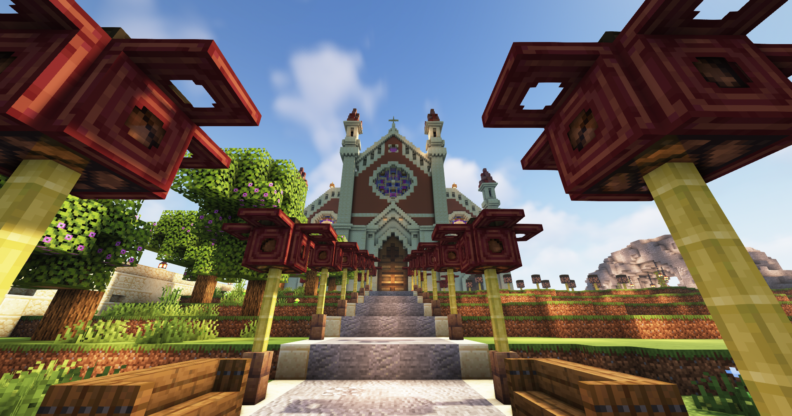<figcaption>
Церковь
</figcaption></figure>

<figure><figcaption>
Вид на колезей с стороны статуи
</figcaption></figure>

<figure><figcaption>
Карта спавна
</figcaption></figure>

### «Талангард»

Самый крупный город, построенный игроками на <mark style="color:yellow;">«Мечтолисье»</mark>. Город был основан игроком <mark style="color:orange;">Tallaris2002 (mas2002\_)</mark> и просуществовал с самого начала сезона до его завершения, что делает его самым большим и активным городом. В Талангарде жило более пяти человек, каждый из которых внёс свой уникальный вклад в его строительство.

Известные жители города: <mark style="color:orange;">Tallaris2002 (mas2002\_), Trelony, Sard23Fun, VINPIX, RINCHYRR.</mark>

<figure>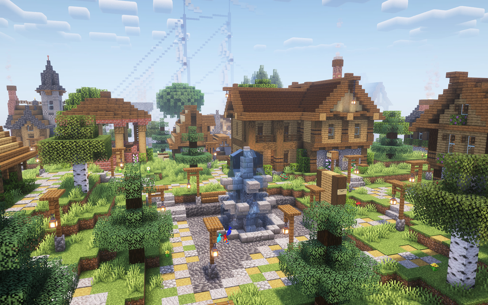<figcaption></figcaption></figure>

<figure>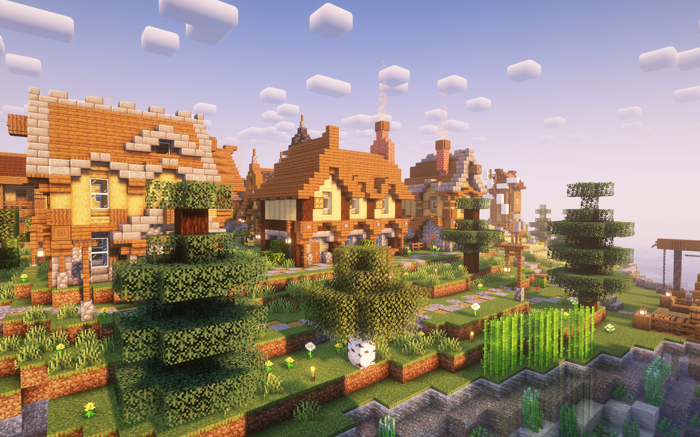<figcaption></figcaption></figure>

<figure>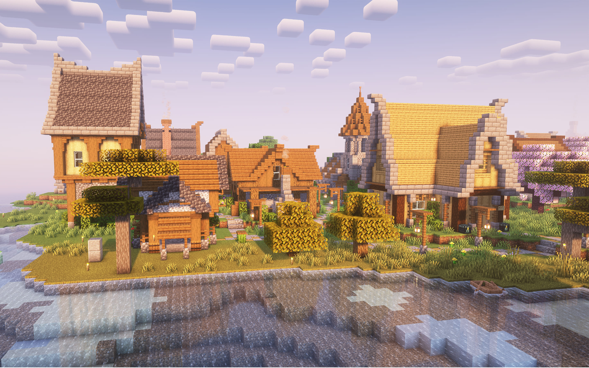<figcaption></figcaption></figure>

<figure>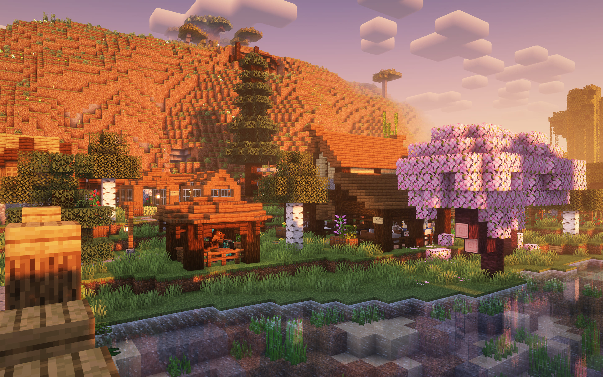<figcaption></figcaption></figure>

<figure><figcaption>
Карта города
</figcaption></figure>

### Город «Waldemarin»

Город начал своё развитие ближе к концу сезона. Строительство велось стремительно, но так и не было завершено.

<figure>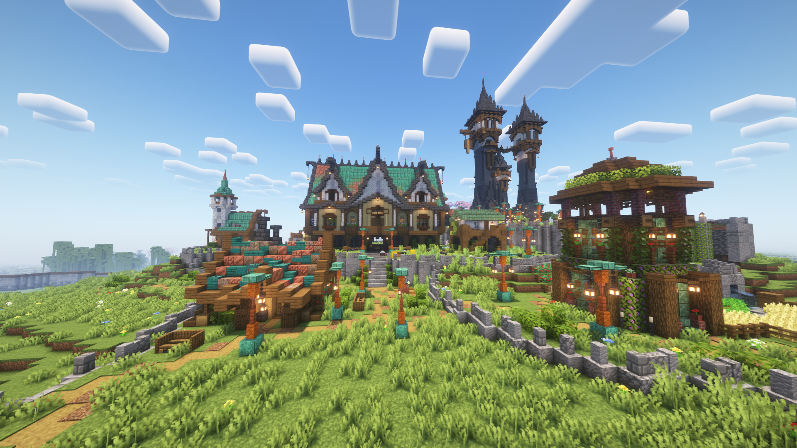<figcaption></figcaption></figure>

<figure>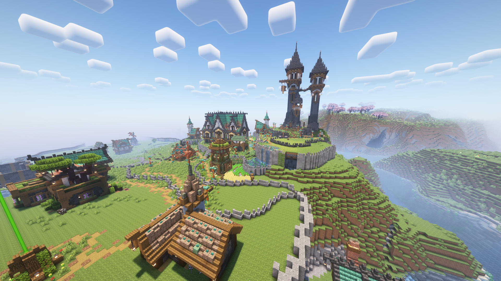<figcaption></figcaption></figure>

<figure>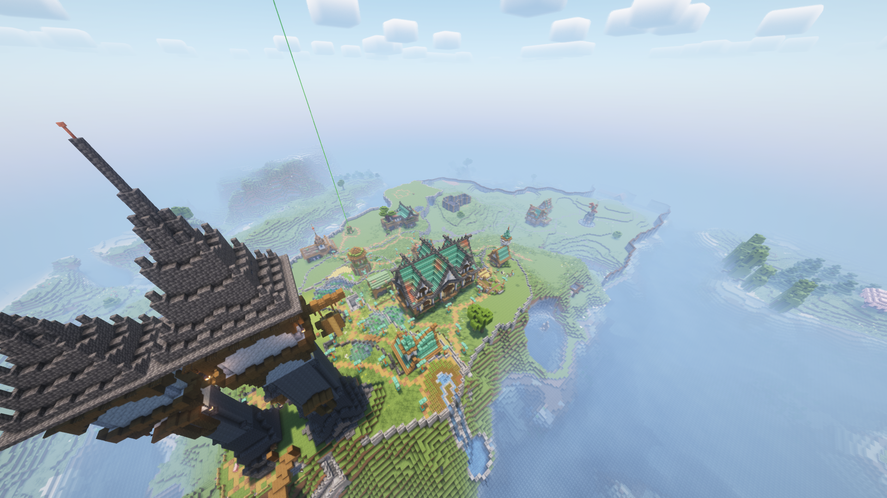<figcaption></figcaption></figure>

<figure><figcaption>
Карта города
</figcaption></figure>

## Гильдии

В мире <mark style="color:yellow;">«Мечтолисья»</mark> было не так много гильдий, но мы перечислим самые активные из них.

### Объединение «Первых»

Активные участники: <mark style="color:orange;">le kys1t, Schmierrohrlinge.</mark>\
Игроки, сделавшие открытия: <mark style="color:orange;">Tallaris2002 (mas2002\_), MrVimee, Rabihan.</mark>\
Нарушители гильдии: [<mark style="color:orange;">Waldemarrin</mark>](#user-content-fn-7)[^7]\
\
**Описание гильдии:**

Группа преследует одну цель: найти как можно больше мест, созданных природой, которые, по их мнению, являются красивыми, уникальными или необычными и заслуживают "открытия". Открытие — это размещение памятного столба с названием места и именем первооткрывателя. Рядом с открытием обычно оставляют бочку с едой, костер и другие полезные вещи, которые любой посетитель может взять.

Все открытия защищаются объединением «Первых». Если на вашей территории было сделано открытие, свяжитесь с его автором. Если его нет, обращайтесь к другим участникам объединения. Мы постараемся урегулировать все вопросы. В случае разрушения открытия, мы его восстановим и примем возможные мирные меры для наказания разрушителя.

Вход и выход в объединение свободные.

<figure>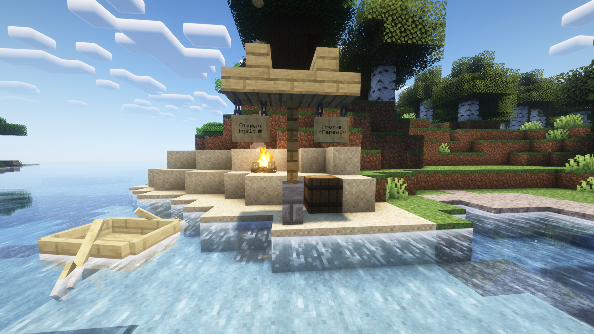<figcaption>
Первое открытие
</figcaption></figure>

<figure><figcaption>
Первые раскопки
</figcaption></figure>

<figure><figcaption>
Вторые раскопки
</figcaption></figure>

<figure><figcaption>
Последнее открытие
</figcaption></figure>

### «Гильдия Бездельников»

Цель: бездельничать. Гильдия активно поддерживала свою деятельность, ничем не занимаясь.\
Известные участники: <mark style="color:orange;">batkobelomor</mark>.

### «Триумвират»

Скрытая гильдия, чьи цели остались неясными. На протяжении сезона появлялись странные посты и комментарии, указывающие, что Триумвират наблюдает.

**Описание гильдии:**

Все участники, кроме меня, <mark style="color:orange;">DeltaTraveller</mark>, скрыты. Их личности и количество неизвестны. И помните: Триумвират следит.

<figure>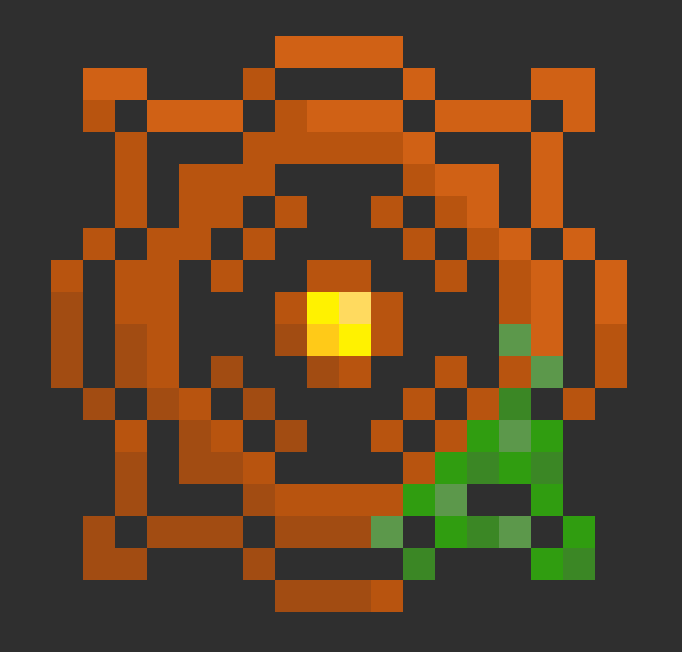<figcaption>
 Баннер гильдии
</figcaption></figure>

<figure><figcaption></figcaption></figure>

### «Белые медведи»

Известные участники: [<mark style="color:orange;">Shm1Shm1Shm1</mark>](#user-content-fn-8)[^8], <mark style="color:orange;">H2Ochess</mark>, возможно, были и другие, но информация утеряна. У гильдии было свое поселение на севере проекта.

**Описание гильдии:**

Белые медведи — это группа игроков, живущих на севере. Чтобы вступить в гильдию, нужно отправить анкету, и Белые медведи рассмотрят ваш запрос.

### «Деревня Хатено»

Небольшая деревня, организованная <mark style="color:orange;">batkobelomor</mark>, со своей религией — <mark style="color:purple;">Вишнеизм</mark>.

**Описание религии:**

<mark style="color:purple;">«Вишнеизм»</mark> — это очень спокойная религия, главный закон которой — всегда сохранять спокойствие. Мы верим, что в вишнёвой роще нашей деревни скрывается великий бог — Пчёлог. Он всегда любил пчёл и верил, что они поддерживают жизнь и экосистему каждого квадратика на нашей планете.

### Орден Аметиста

Известные участники: <mark style="color:orange;">MrSam, ToruWith, merol3678, R\_bit, xNFA, roleo1304, Layk\_Kotovich.</mark>

**Описание гильдии:**

В стародавние времена ценители прекрасного объединились, чтобы исследовать загадочные объекты — то ли метеориты, то ли редкие залежи. Внутри этих объектов был найден странный и манящий минерал — Аметист. После многих лет исследований был основан Орден Аметиста. Члены ордена почти поклонялись этому минералу.

Орден основал город Билджвотер, где заседали главы и приближённые. Со временем Орден стал править миром, начались эксперименты с магическими свойствами Аметиста. Они сумели отправить часть цитадели сквозь время и пространство вместе с группой фанатиков в другую вселенную (на другой сервер). В новой вселенной тоже были Аметисты, и орден начал строить свою империю с нуля. Башня цитадели при перемещении исказилась, и теперь неестественно повёрнута.

Они продолжили трудиться во благо Ордена и города, установили союзные связи с местным населением. История покажет, как сложится их судьба.

## Ивенты

### «Лососёвый фестиваль»

Организаторы: <mark style="color:orange;">Trelony</mark> и <mark style="color:orange;">Waldemarrin.</mark> \
Дата проведения: 21 апреля.\
\
**Описание:** \
Небольшое событие, на котором вы сможете насладиться ловлей рыбы, общением и получением наград. Суть ивента в ловле рыбы на специально отведённом участке, о котором мы сообщим чуть позже. Если вы выловили определённое кол-во лососиков, то можете обменять их в специальном пункте на определённые награды. Для упрощения набора нужного количества лососей мы также открыли пункт обмена, где вы, ребятки, сможете обменять остальной улов на лососей. Мероприятие предполагает сбор большого кол-ва людей для попутного общения и взаимодействия. Удочки мы выдадим на месте, но если хотите, то можете принести свои.

<figure>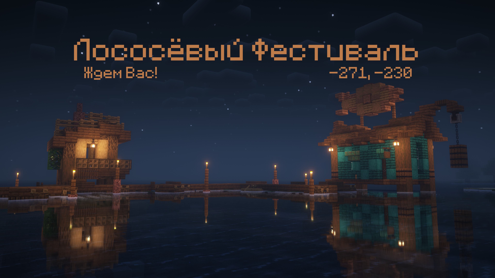<figcaption></figcaption></figure>

### «**Настольняшки**»

Организаторы: <mark style="color:orange;">администрация.</mark>\
Дата проведения: проводился несколько раз. 28 мая, 7 июня, 15 июля.

**Описание:** \
Ивент требует установку дата-пака сервера. Суть ивента заключается в игре в настольные игры, такие как шахматы, карты и домино, а также в организации отличного досуга в замечательной компании.

<figure><figcaption></figcaption></figure>

<figure>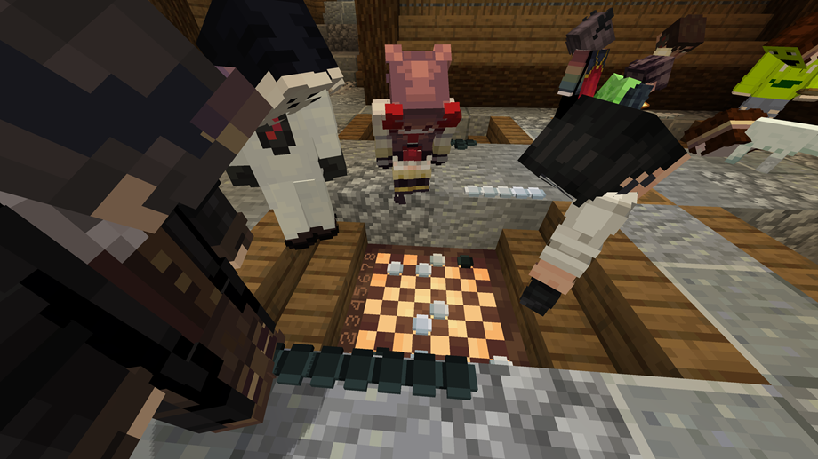<figcaption></figcaption></figure>

### «Заявка в президенты»

Организаторы: <mark style="color:orange;">администрация.</mark>\
Дата проведения: с 21 апреля.\
\
**Описание:** \
Мероприятие нацелено на отбор кандидата в президенты путем общего голосования. Кандидаты должны были представить свою предвыборную кампанию и явиться на выборы с ней.

<figure>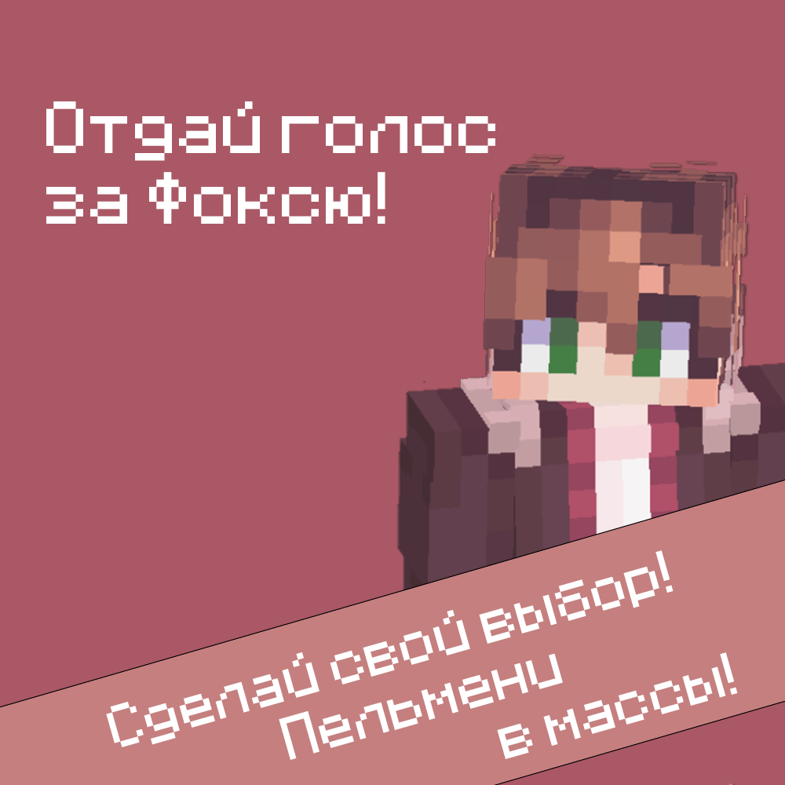<figcaption></figcaption></figure>

<figure><figcaption>
Победитель <mark style="color:orange;">Exeets</mark>
</figcaption></figure>

### «Конкурс на статую в римском стиле»

Организаторы: <mark style="color:orange;">TigranG8403 и JamaliSGT</mark>\
Дата проведения: с 21 мая.

**Описание:**\
Министерство экономики объявляет тендер на постройку статуи в древнеримском/римском стиле. Победителю на постройку статуи на сервере будет дана неделя, а также будет выделен бюджет в 16 алисов, которые он может использовать как угодно.

<figure>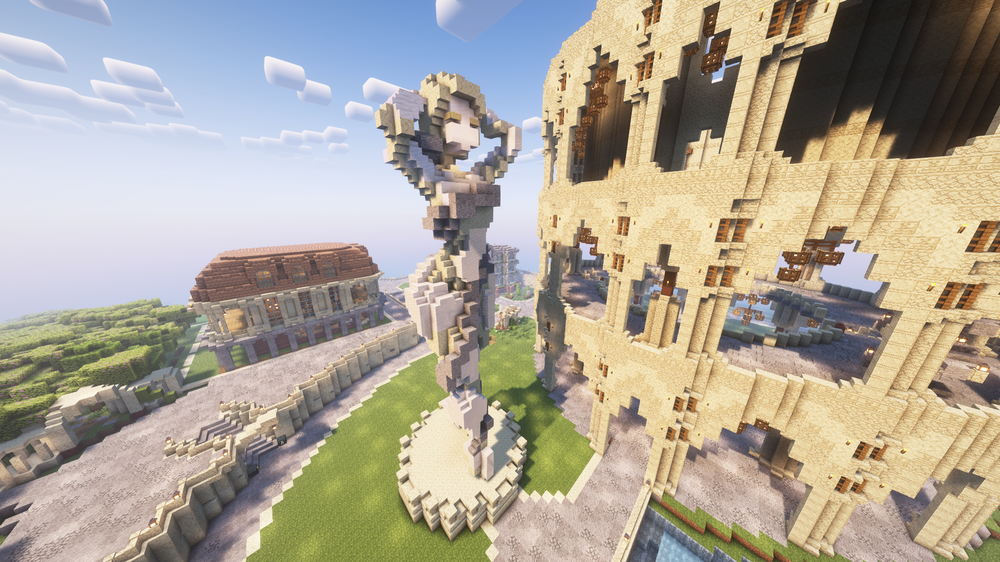<figcaption>
Победитель <mark style="color:orange;">Senzichi</mark>
</figcaption></figure>

### «Битва в тронном зале»

Организаторы: <mark style="color:orange;">администрация совместно с игроками</mark> \
Дата проведения: 24 августа.

**Описание:**\
Вам предстоит подготовиться к легендарному бою и одолеть босса в специально отведенном для этого месте. Игроки <mark style="color:orange;">Senzichi</mark> и <mark style="color:orange;">Dast2</mark> спроектировали и начали возведение огромного тронного зала вместе с помощниками. Ивент стал невероятным и уникальным, концепция пришлась игрокам по душе.

В качестве награды можно было загадать любое желание, и администрация исполнила его.

<figure>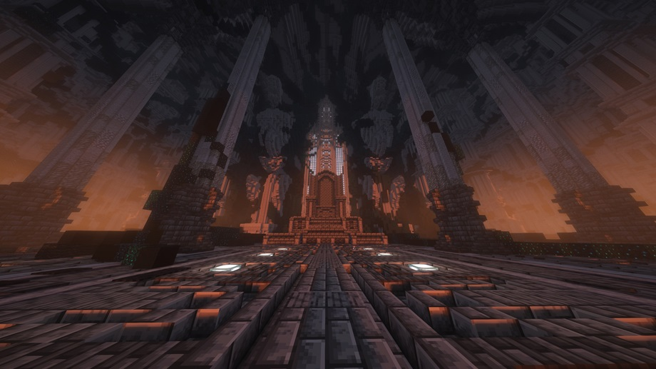<figcaption>
Тронный зал
</figcaption></figure>

<figure><figcaption>
Сам босс
</figcaption></figure>

### «Битва с ордой»

Организаторы: <mark style="color:orange;">администрация</mark>\
Дата проведения: 2 сентября.\
\
**Описание:**\
Суть ивента предельна проста, вы находясь в тронном зале убиваете орды мобов, награда будет, но несущественная, ивент для тех, кто хочет просто экшена и подраться.

<figure><figcaption></figcaption></figure>

[Видео](https://drive.google.com/file/d/1fyB_8NJozv034V884yDCOHCktM3dYBKD/view?usp=sharing) от лица игрока <mark style="color:orange;">MrSam.</mark>

### «Мафия»

Организатор: <mark style="color:orange;">toruWith</mark>\
Дата проведения: 5 сентября.\
\
**Описание:** \
Ивент по всемирно известной настольной игре «Мафия», только в кубическом пространстве.\
\
[Стрим ивента.](https://www.youtube.com/live/WuXcgsGNYvE?si=3nnFTnq1FcpQgNkC)

<figure><figcaption></figcaption></figure>

### «Бункер»

Организатор: <mark style="color:orange;">SHiZi\_13</mark>\
Дата проведения: 7 сентября.

**Описание:**\
Неоднократно организуемый и всеми любимый ивент, посвящённый этой увлекательной игре на дедукцию.

### Интересные истории

Сейчас этот раздел находится в процессе написания. Истории будут добавляться сюда по мере их появления в специальном [разделе](4-sezon.md#interesnye-istorii).

## [Ссылка на мир](https://drive.google.com/file/d/1sNaqcEfJ3TH3RNTeZXT3Wpp_rh3r2tSQ/view?usp=sharing)

[^1]: Макет игрока <mark style="color:orange;">Drendey</mark>

[^2]: Макетом и строительством занималась администрация

[^3]: Макет и строительство <mark style="color:orange;">Senzichi, Dast2</mark>

[^4]: Часть из них сделал главный по мостам <mark style="color:orange;">Trelony</mark>

[^5]: <mark style="color:orange;">Tigran, mas2002\_, Schmierrohrlinge.</mark> уверена, что кто-то ещё, но, к сожалению, информация утеряна

[^6]: <mark style="color:orange;">Andrew018k, toruWith, kolya6776, Tallaris2002 и Vzxtrot</mark>

[^7]: Уничтожил открытие

[^8]: Основатель
