# 5 сезон


Материал может содержать неточности и ошибки, а также быть субъективным, поскольку отражает восприятие автора. Если вы хотите внести какие-либо правки, пожалуйста, обратитесь в дискорд канал📝[<mark style="color:$warning;">«обращения»</mark>](https://discord.com/channels/956981761802375228/1245232823510503428).


## Продолжительность

Сезон начался <mark style="color:blue;">12 октября 2024</mark> года на версии 1.21.1, просуществовав по <mark style="color:blue;">6 марта 2025</mark> <mark style="color:blue;">года</mark>. Общая продолжительность составила чуть меньше пяти месяцев. На завершение сезона было несколько причин, такие как: критические ошибки карты мира, переход на новую версию 1.21.4, а также малый онлайн сервера в последнее, на тот момент, время.

## История

В каждом предыдущем вайпе было что-то особенное, и этот не стал исключением! Именно на 5 сезоне появилась новая и уникальная механика проекта, а именно — [«расы»](../o-proekte/osobennosti/rasy.md). Со старта игрокам давалась возможность выбрать расу с помощью специального предмета [«флакон душ»](../o-proekte/osobennosti/rasy.md#rasy-unikalnaya-mekhanika-dobavlennaya-na-5-sezone-prednaznachennaya-dlya-uluchsheniya-vzaimodeistvi). Всего стало доступно 9 разных видов, включая человека: эльф, дварф, кицунэ, каджит, драконорождённый, демон, аксол и аранара. При этом всё о расах игроки узнали далеко не сразу, выбирая свои будущие характеристики лишь по небольшому описанию. Это подогрело интерес участников проекта разбираться в данном нововведении, тестировать всё и проводить собственные исследования!&#x20;

Позже о расах стало известно больше, и эта механика позволила игрокам создавать новые объединения, торговые решения, а также разнообразила взаимоотношения на сервере.

&#x20;Спустя чуть больше недели, <mark style="color:blue;">20 октября</mark>, игроки собрались давать отпор дракону на открытии «Края». В этом же измерении произошёл рекордный, на тот момент, онлайн. Он составил 32 игрока из 30 возможных.

<figure>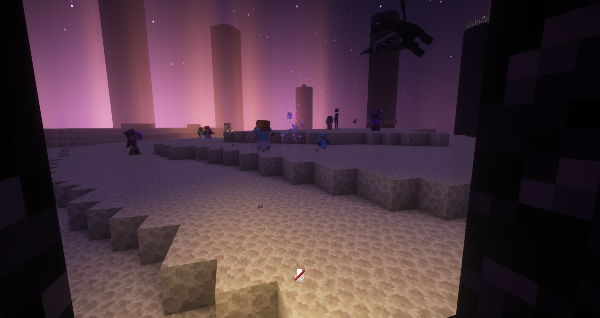<figcaption>
<em>Фото игрока</em> <em><mark style="color:$primary;"><strong>Schmierrohrlinge</strong></mark></em>
</figcaption></figure>

Вначале <mark style="color:blue;">ноября</mark> состоялся любимый многими ивент [«Бункер»](5-sezon.md#bunker), проведённый игроком <mark style="color:$primary;">**\_\_TopTuk\_\_**</mark>. Всего было 3 игры. На ивенте участники проекта смогли повеселиться и хорошо провести время, а кто-то даже проверить свои навыки убеждения и выстраивания коммуникации с другими игроками.

<figure>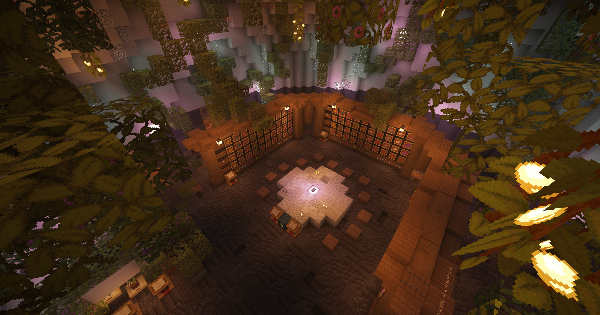<figcaption>
<em>Зона проведения «Бункера»</em>
</figcaption></figure>

После, вслед за «Бункером», прошёл ивент [«Мафия»](5-sezon.md#mafiya), организованный игроком <mark style="color:$primary;">**ToruWith**</mark>. Ребята собрались <mark style="color:blue;">16 ноября</mark>, чтобы разнообразить игровую жизнь и выяснить кто же самый лучший сыщик… или лжец?

<figure>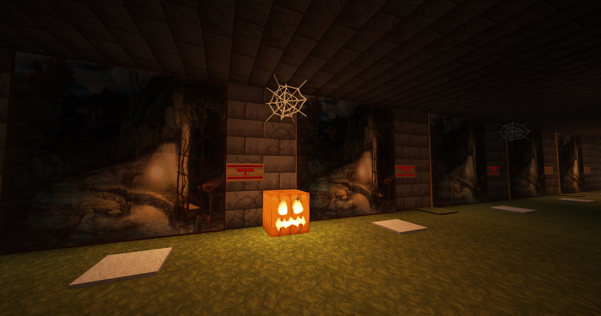<figcaption>
<em>Зона проведения «Мафии»</em>
</figcaption></figure>

Тем временем спавн неспешно развивался. Игроки, советовавшись с главой спавна <mark style="color:$primary;">**Trelony**</mark>, воздвигали свои постройки. Появлялись новые строения, в обсуждениях можно было видеть проекты магазинов. Так же активно процветала торговля картами с изображениями самых разных вещей, от аниме персонажей до абстракций. Рядом с другими торговыми точками даже открылось «казино» с артами от игрока <mark style="color:$primary;">**miniking1000**</mark>.

Уже можно было наблюдать некоторые торговые места, такие как магазины игроков: <mark style="color:$primary;">**KOTIK\_B\_CAXARE, Schmierrohrlinge, Tallaris2002, ToruWith и \_\_TopTuk\_\_, wertyjerri, \_BlackTime\_, Vesenka, I\_valentain\_I**</mark> и <mark style="color:$primary;">**RINCHYRR**</mark>. Так же собственный магазин был и у объединения [«Багровые Низины»](5-sezon.md#bagrovye-niziny).

<figure>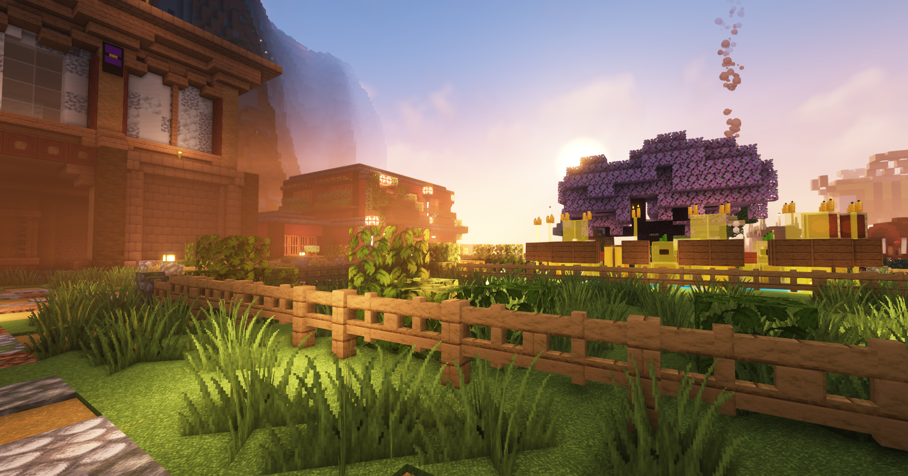<figcaption>
<em>Вид на магазин <mark style="color:$primary;"><strong>ToruWith</strong></mark> и <mark style="color:$primary;"><strong>__TopTuk__</strong></mark></em>
</figcaption></figure>

В конце <mark style="color:blue;">ноября</mark> на сервер был добавлен новый предмет — [«Мегаультрапуперсуперлисопалка»](/broken/pages/8uSOCiKJ45UcUWDYyDwk). В отличии от обычной палки отладки она позволила игрокам перемещать различные предметы без обновления блоков.

&#x20;

После празднования Нового года сервер ждало небольшое обновление. Была добавлена «пчелиная доставка» для отправки и получения посылок с помощью особых полосатых курьеров. Эта особенность стала милым дополнением сервера. Так же была добавлена новая чародейская книга [«Сбор»](../o-proekte/osobennosti/unikalnye-zacharovaniya.md#sbor). С её помощью игроки смогли сразу получать в инвентарь вскапываемые ресурсы. Зачарование надолго спасло участников сервера от падающих в лаву алмазов.

&#x20;

В понедельник, <mark style="color:blue;">10 февраля</mark>, администрацией было проведено сразу два ивента: [«Бункер»](5-sezon.md#bunker-2.0) и [«Настольняшки»](5-sezon.md#nastolnyashki). После долгожданного «Бункера» можно было сыграть в карты, шашки, шахматы, домино, мяч или просто посидеть в приятной компании!

<figure>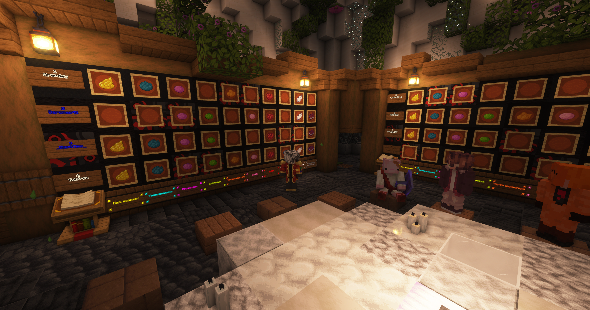<figcaption>
<em>Ивент «Бункер»</em>
</figcaption></figure>

<figure>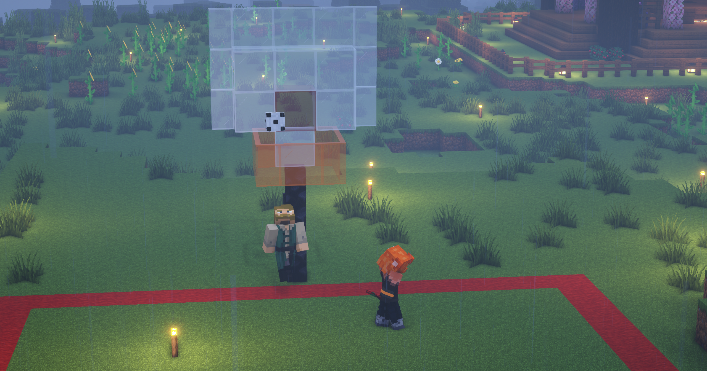<figcaption>
<em>Игра в мяч в дождливый день</em>
</figcaption></figure>

Вскоре, <mark style="color:blue;">5 марта</mark>, стало известно о переходе сервера на 1.21.4, а также вайпе, состоявшемся <mark style="color:blue;">8 марта</mark>. На этом 5 сезон завершил своё существование, позволив игрокам идти дальше и открывать для себя что-то новое!

## Города

### Спавн 5 сезона

Спавн 5 сезона так же заслуживает отдельного внимания. Он получился по своему солнечным и уютным, а дополнениями стали магазины игроков, выполненные в разных стилистиках.

<figure>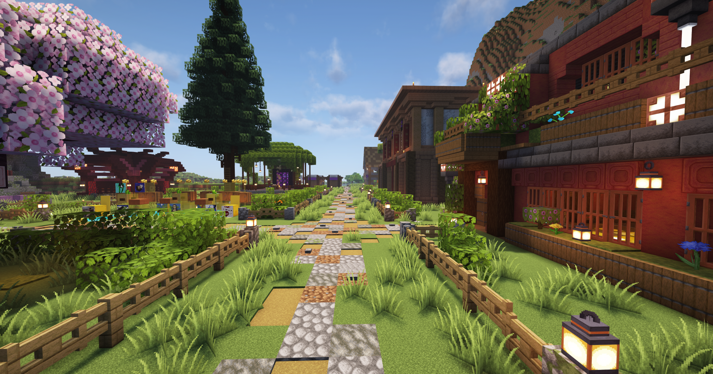<figcaption>
<em>Торговая улица</em>
</figcaption></figure>

<figure>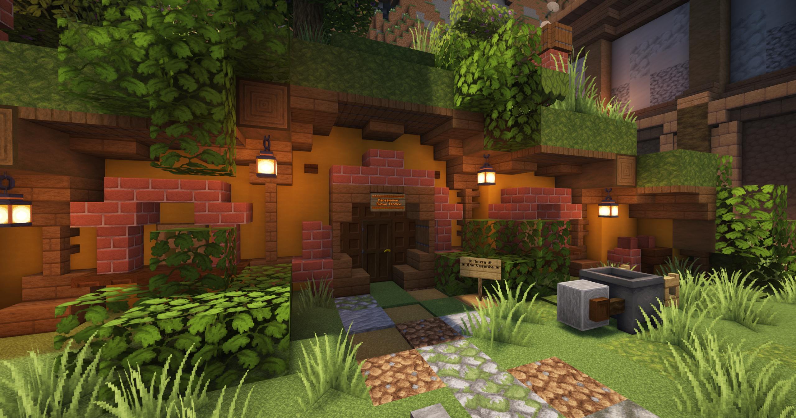<figcaption>
<em>Магазинчик игрока <mark style="color:$primary;"><strong>Vesenka</strong></mark></em>
</figcaption></figure>

<figure>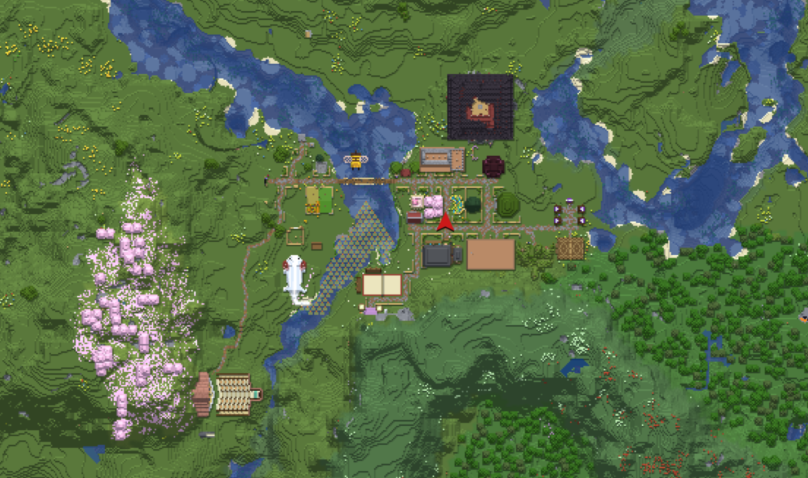<figcaption>
<em>Карта спавна</em>
</figcaption></figure>

Так же недалеко от нулевых координат расположились две большие постройки — статуя «Кицунэ» игрока <mark style="color:$primary;">**BULLIEHKAHATOPTE**</mark> и статуя «Вардена» игрока <mark style="color:$primary;">**Strus**</mark>.

<figure>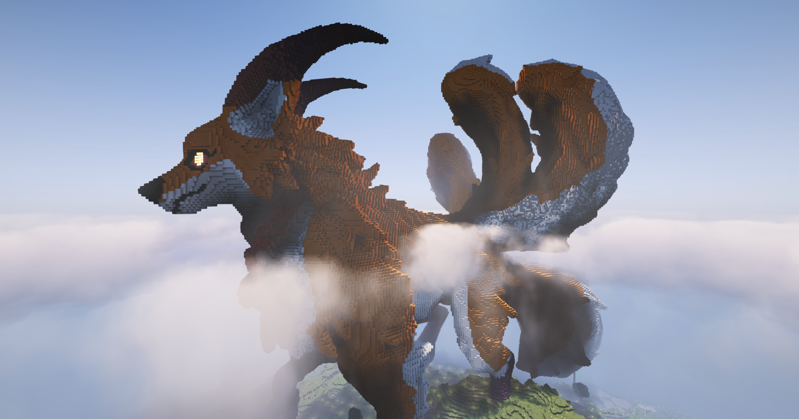<figcaption>
<em>«Кицунэ»</em>
</figcaption></figure>

<figure>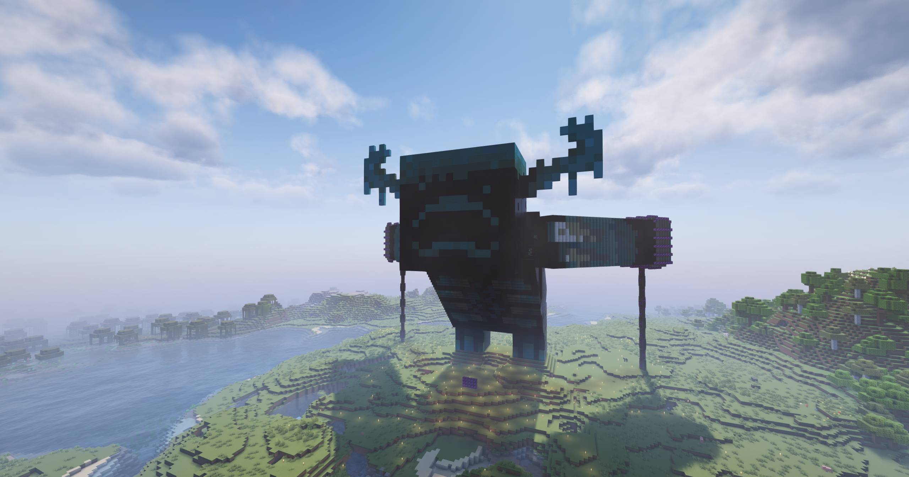<figcaption>
<em>«Варден»</em>
</figcaption></figure>

### «Деревня новичков»

Недалеко от спавна, за вишнёвой рощей, почти со старта сезона зародилась деревня для облегчения игры новоприбывшим игрокам. В деревне были библиотекари с самыми нужными книгами, загоны с животными для лёгкой добычи еды, а также засаженные разными культурами поля.

<figure>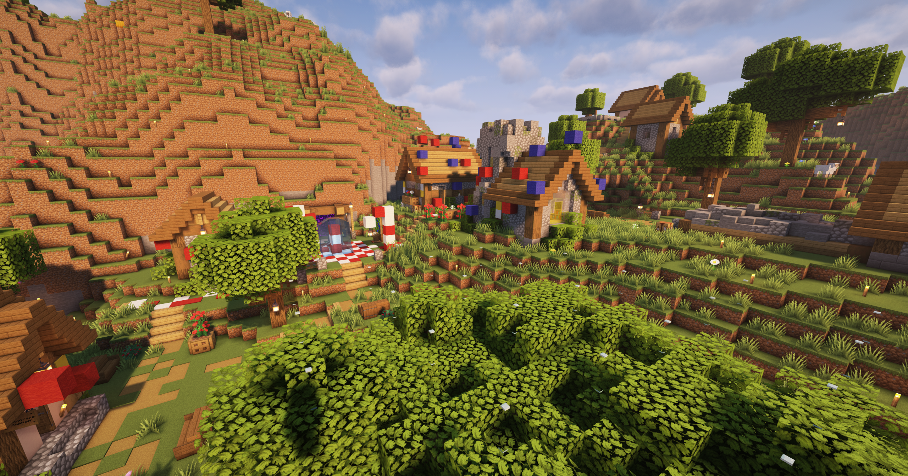<figcaption>
<em>Вид на деревню</em>
</figcaption></figure>

<figure>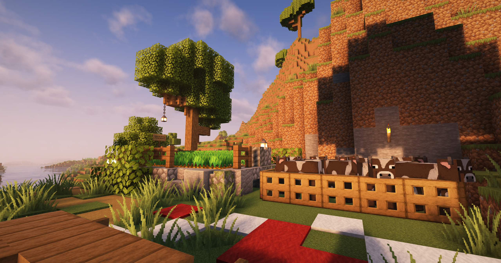<figcaption>
<em>Посевы и загон с животными</em>
</figcaption></figure>

<figure>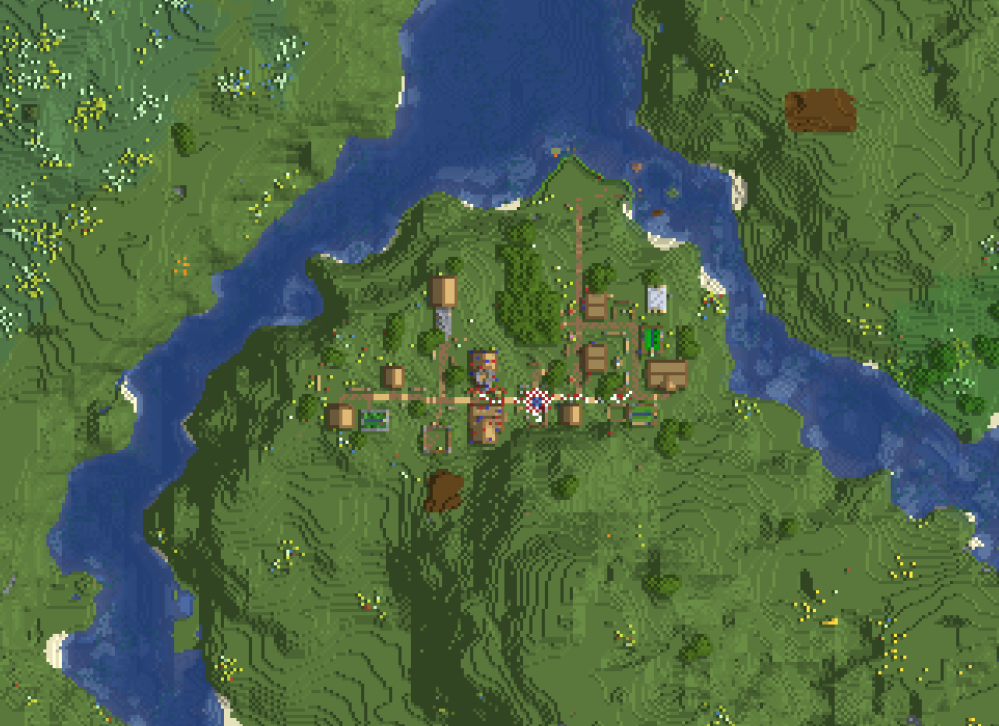<figcaption>
<em>Карта «Деревни новичков»</em>
</figcaption></figure>

### «Республика Елизавета»

Игрок <mark style="color:$primary;">**Coldrex**</mark> начал построение республики с небольшого поселения Канкон, а после развил его в городок с заводами, зданием правительства и другими строениями.

<figure>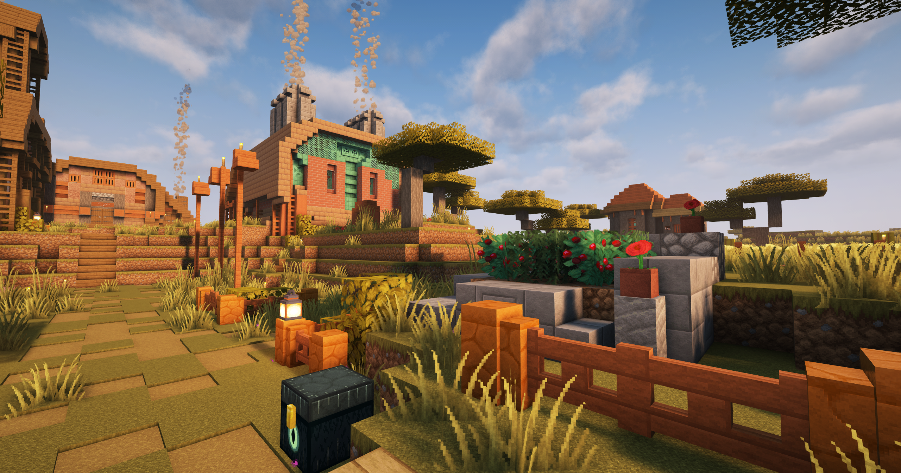<figcaption>
<em>Вид на завод Им. Митамото</em>
</figcaption></figure>

Республика развивала торговые и дипломатические отношения с другими городами и участниками сервера, а также провела свои собственные выборы.

<figure>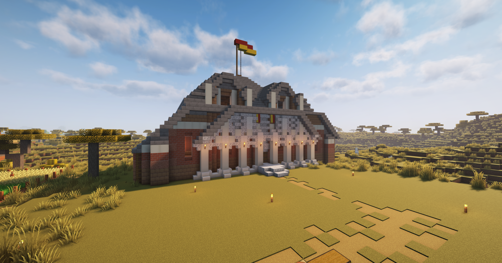<figcaption>
<em>Здание правительства</em>
</figcaption></figure>

<figure>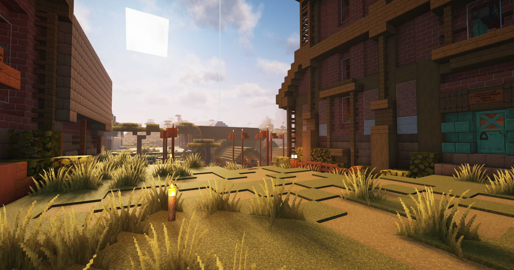<figcaption>
<em>Канкон на закате</em>
</figcaption></figure>

<figure><figcaption>
<em>Карта Республики Елизавета</em>
</figcaption></figure>

### Земли «Багровых Низин»

Посреди самого обыкновенного леса возник кусочек багрового биома! Это территория объединения «Багровые Низины». Известные обитатели: <mark style="color:$primary;">**\_\_MrSam\_\_, fr00di, TroupFish**</mark>.

<figure>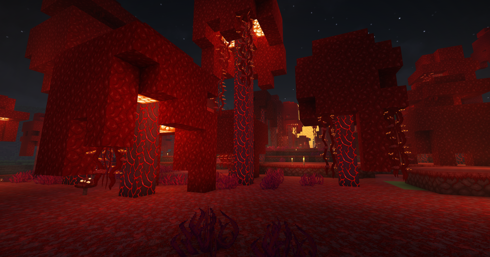<figcaption>
<em>Багровый лес</em>
</figcaption></figure>

<figure>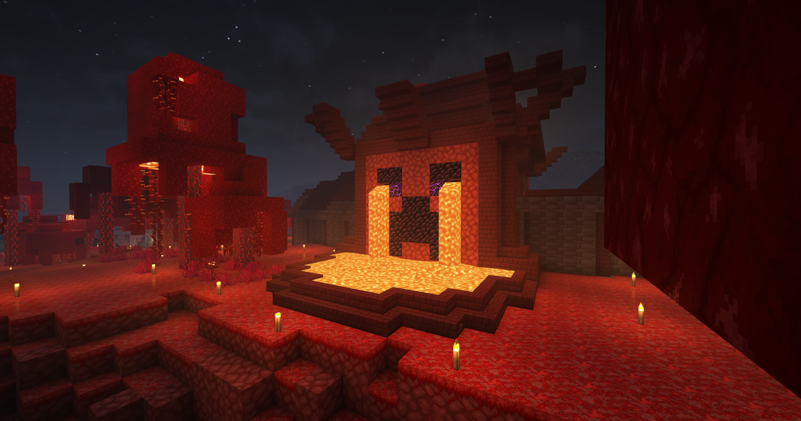<figcaption>
<em>Лавовый фонтан</em>
</figcaption></figure>

<figure>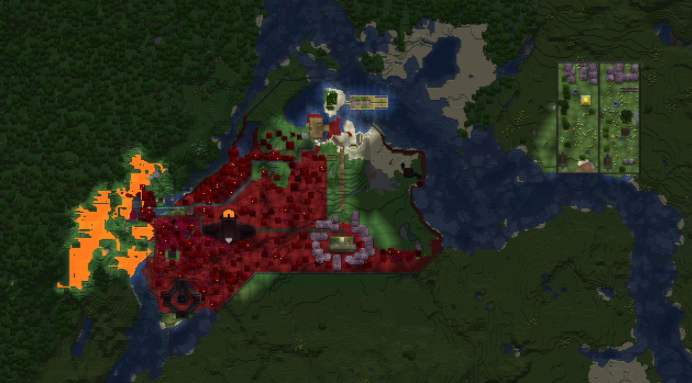<figcaption>
<em>Карта территории</em>
</figcaption></figure>

## Гильдии

На 5 сезоне активных гильдий было не так много, но из различных источников информации известно о некоторых из них.

### ЗАО «Vilous»

Объединение учёных, созданное игроком <mark style="color:$primary;">**Unissy\_Trye**</mark>. По заявлению создателя, данная организация занималась получением лекарственных препаратов из материалов, добытых на грибном острове. Остальная информация была утеряна…

<figure>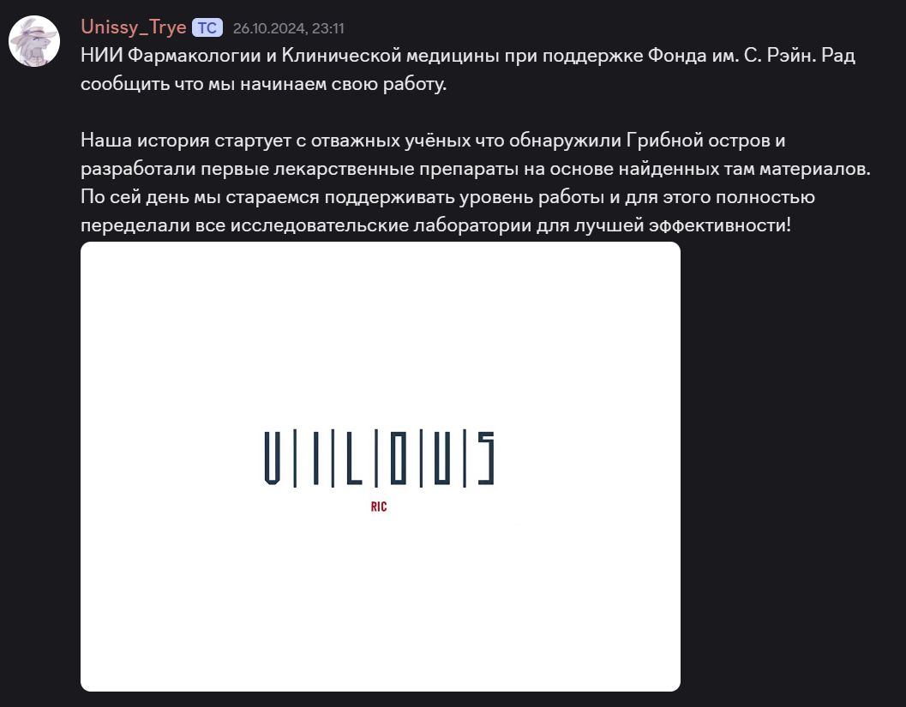<figcaption>
<em>Сообщение в ветке объединения</em>
</figcaption></figure>

### «Багровые Низины»

Объединение демонов, проживающих на своём адском «островке» в центре леса обычного мира. В объединении состояли: <mark style="color:$primary;">**\_\_MrSam\_\_, fr00di**</mark> и <mark style="color:$primary;">**TroupFish**</mark>. Игроки жили вместе и занимались добычей адских ресурсов для последующей продажи на спавне сервера, а также оккупировали часть леса, сделав комфортные условия для собственного проживания и экстремальные для мимо проходящего.

<figure>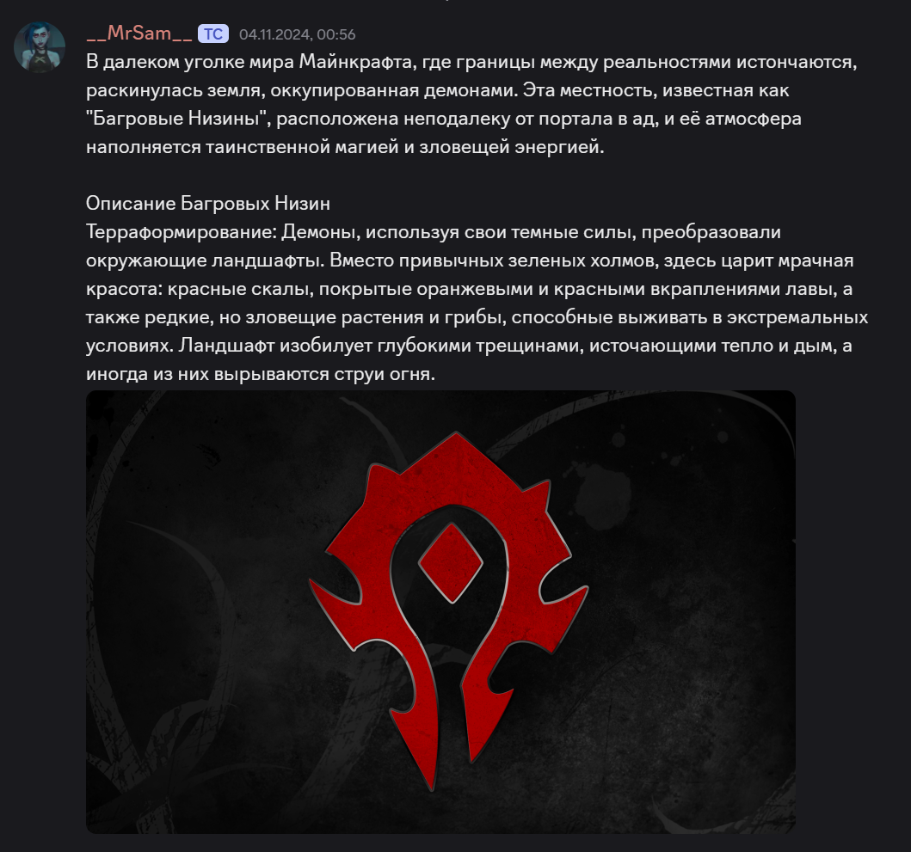<figcaption>
<em>Сообщение в ветке объединения</em>
</figcaption></figure>

## Ивенты

### «Ивент с цыплятами»

Организатор: <mark style="color:$primary;">**wertyjerri**</mark>.

Дата проведения: 9 ноября 2024 года.

**Описание:** \
Игрок под ником <mark style="color:$primary;">**wertyjerri**</mark> растеряла своих цыплят во время прогулки по миру, и просит помочь ей их найти. Цыплята находились на водоёмах по всему миру. На каждом птенчике была рамка с подарком для отыскавшего.

<figure>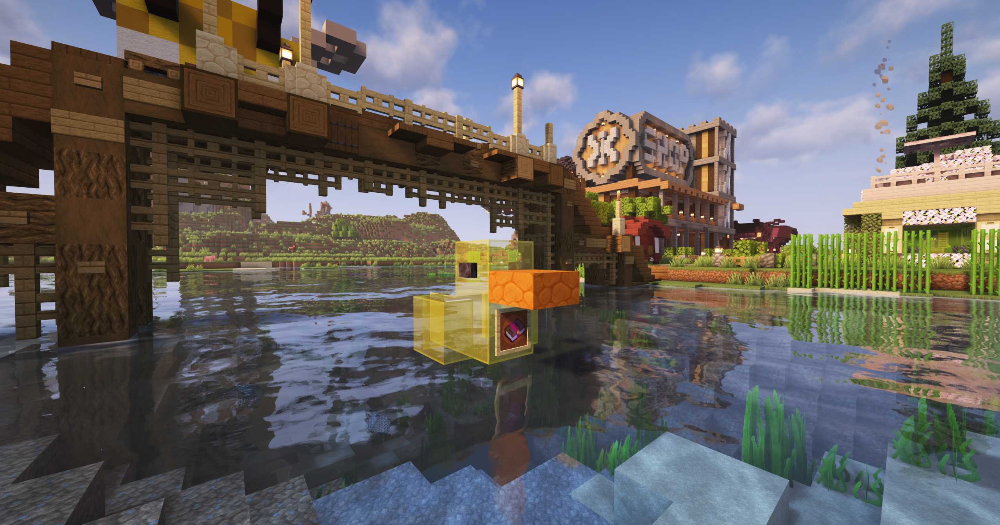<figcaption>
<em>Цыплёнок неспешно плавает по реке</em>
</figcaption></figure>

### «Бункер»

Организатор: <mark style="color:$primary;">**\_\_TopTuk\_\_**</mark>.

Дата проведения: 10 ноября 2024 года.

**Описание:** \
Полюбившийся многими ивент, проходящий уже не первый сезон. Задача со случайными характеристиками отыграть своего персонажа так, чтобы другие сочли его полезным и оставили в бункере.

<figure>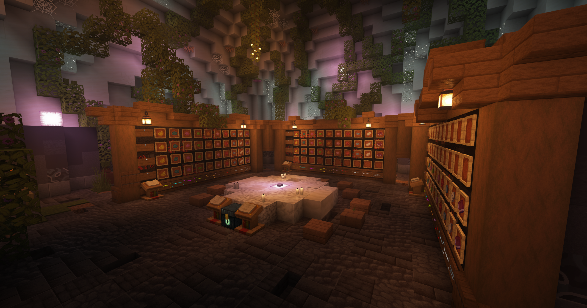<figcaption>
<em>Зона проведения ивента</em>
</figcaption></figure>

### «Мафия»

Организатор: <mark style="color:$primary;">**ToruWith**</mark>.

Дата проведения: 16 ноября 2024 года.

**Описание:**\
Классическая игра в мафию. На каждую ночь игроки уходили в свои комнатки, спрятанные за картинами, что добавляло особую атмосферу происходящего.

<figure>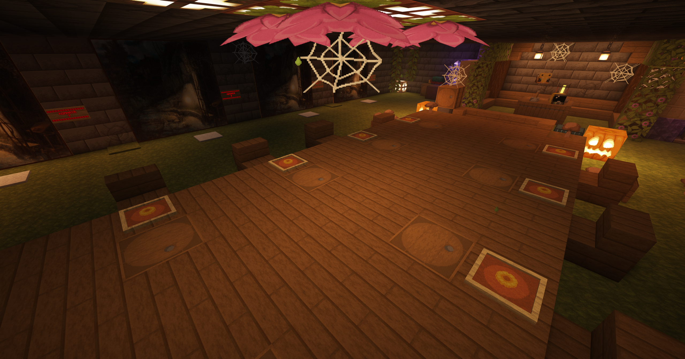<figcaption>
<em>Игровой стол</em>
</figcaption></figure>

### «Бункер 2.0»

Организаторы: <mark style="color:$primary;">**администрация**</mark>.

Дата проведения: 10 февраля 2025 года.

**Описание:**\
Повтор легендарного «Бункера». На ивент так же смогли прийти игроки, не побывавшие на первом «Бункере». Ребята хорошо провели время и в очередной раз испытали себя!

<figure>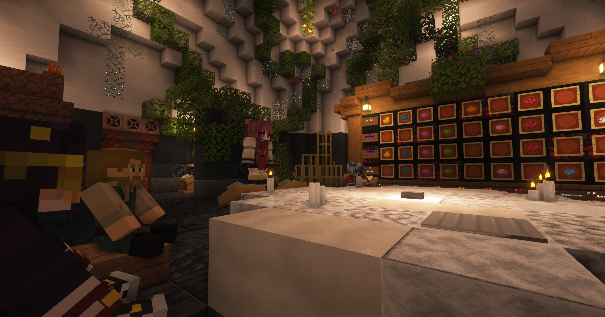<figcaption>
<em>Игроки на ивенте</em>
</figcaption></figure>

### «Настольняшки»

Организаторы: <mark style="color:$primary;">**администрация**</mark>.

Дата проведения: 10 февраля 2025 года.

**Описание:**\
Шашки, шахматы, карты, домино или мяч — спутники данного мероприятия. Каждый игрок мог найти что-то для себя и здорово скоротать время в хорошей компании.

<figure>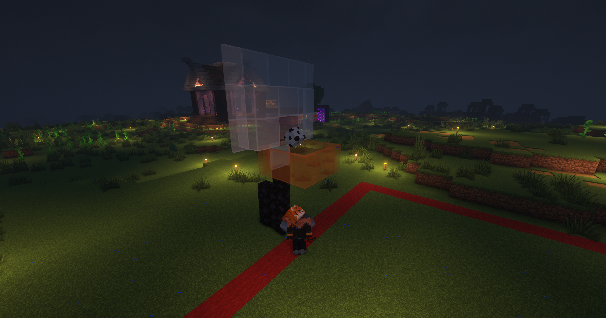<figcaption>
<em>Игрок <mark style="color:$primary;"><strong>OmegaSgushenka</strong></mark></em>
</figcaption></figure>

## [Ссылка на мир](https://drive.google.com/file/d/1CovmpRWxtoL9PjAhFhnr3agUXRyNP6sd/view?usp=sharing)
