# 6 сезон


Материал может содержать неточности и ошибки, а также быть субъективным, поскольку отражает восприятие автора. Если вы хотите внести какие-либо правки, пожалуйста, обратитесь в дискорд канал 📝[<mark style="color:$warning;">«Обращения»</mark>](https://discord.com/channels/956981761802375228/1245232823510503428).


## Продолжительность

Шестой сезон стартовал <mark style="color:blue;">8 марта 2025</mark> года на версии 1.21.4, а чуть позже, <mark style="color:blue;">в апреле</mark>, сервер отметил своё трёхлетие. Продлился же сезон до середины лета — окончание произошло <mark style="color:blue;">12 июля 2025</mark> <mark style="color:blue;">года</mark>.
&#x20; Это был интересный и насыщенный путь, но как известно, конец одного приключения — это начало нового.&#x20;

## История

Каждый вайп на проекте приносит уникальные воспоминания, и шестой сезон начался с обустройства центральной локации — спавна. Первоначальным ландшафтом и разметкой занимался <mark style="color:$primary;">**Infernum**</mark> — он полностью подготовил рельеф, осветил территорию и возвёл величественный портал. Затем пост главы спавна заняла <mark style="color:$primary;">**Volo\_nonValeo**</mark>, которая спроектировала основные здания. У неё были огромные амбициозные планы: планировалось построить ботанический сад с кастомными растениями, алхимическую башню, подземную железную дорогу до статуи Падшего Ангела и церковь для свадебных церемоний.

<figure>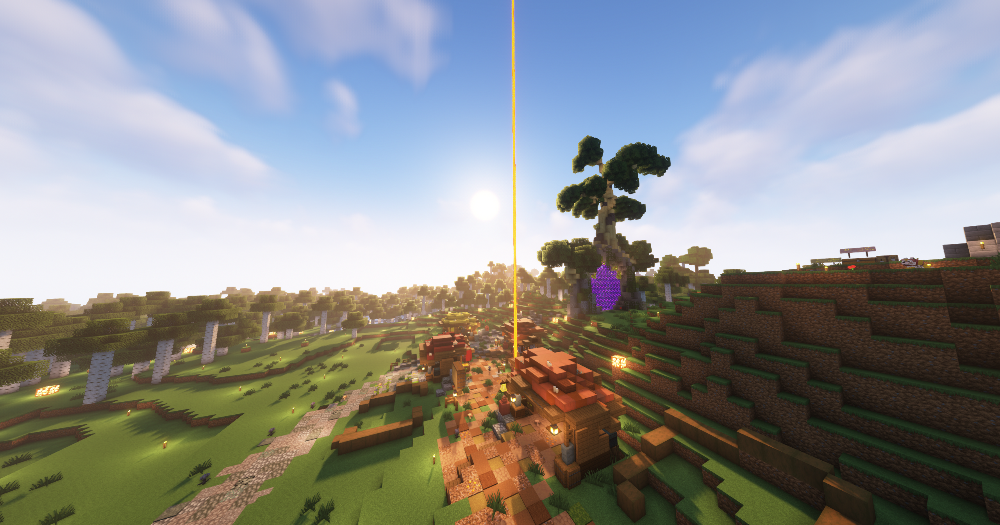<figcaption>
<em>Начало стройки спавна: портал и первые торговые лавки</em>
</figcaption></figure>

Однако <mark style="color:blue;">12 мая 2025 года</mark> <mark style="color:$primary;">**Volo\_nonValeo**</mark>, официально ушла со своего поста, из-за чего большая часть задуманного так и не была реализована. Несмотря на это, общими усилиями спавн удалось сделать крайне практичным, красивым и очень уютным. На его территории успешно открылись и функционировали общественный оружейный магазин инструментов и брони, торговые лавки, таверна, картинная галерея, книжный магазин, общая библиотека и банк СвагаСити.

<figure>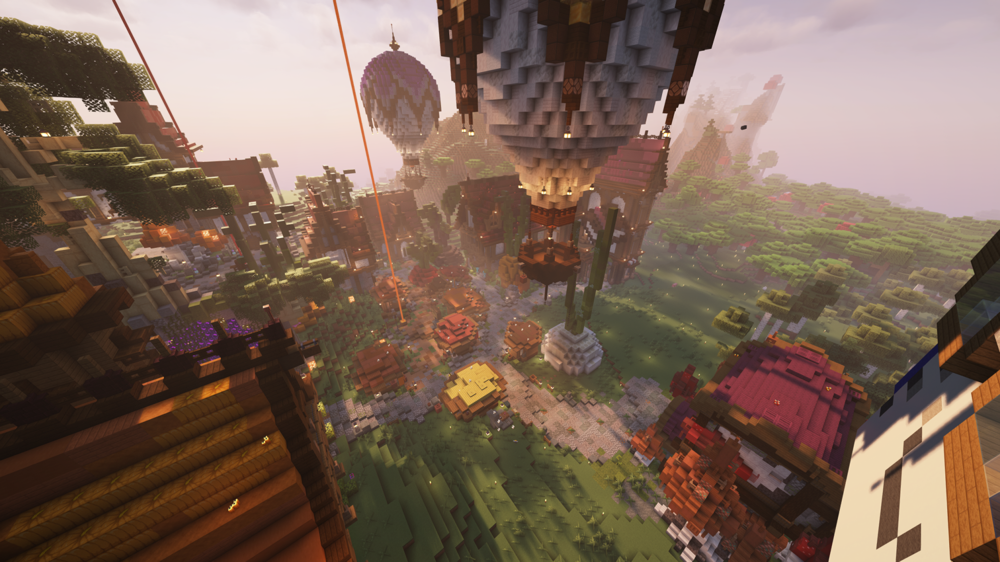<figcaption>
<em>Спавн в завершённом виде</em>
</figcaption></figure>

<figure>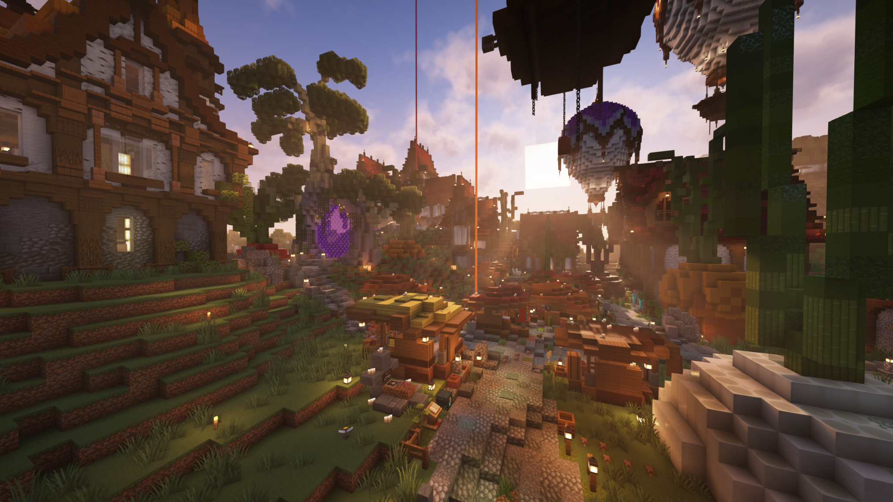<figcaption>
<em>Вид на портал, торговую зону и оружейный магазин</em>
</figcaption></figure>

Параллельно шло развитие инфраструктуры Нижнего мира. Оно началось с разработки уникального дизайна адских дорог от игрока <mark style="color:$primary;">**Xenon\_xe**</mark>, чью стройку впоследствии продолжил и развил <mark style="color:$primary;">**Infernum**</mark>.

<figure>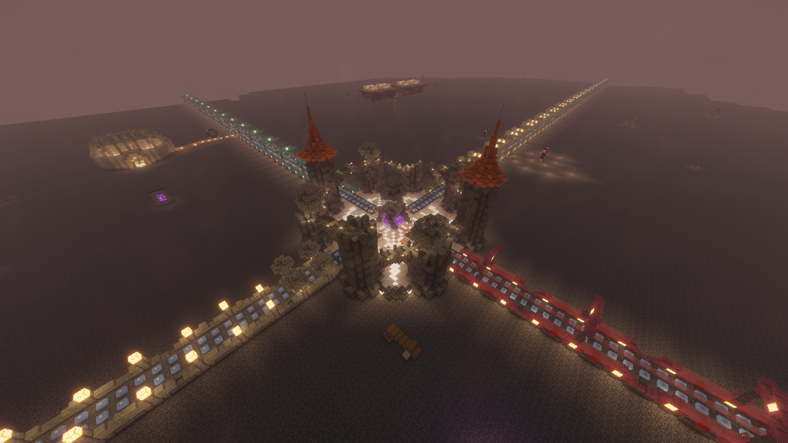<figcaption>
<em>Вид хаба сверху</em>
</figcaption></figure>

Для поддержки обычных игроков на сервере были возведены крупные общественные фермы золота и железа в Незере, полностью спроектированные <mark style="color:$primary;">**Infernum**</mark>.\
Пару раз ферма золота полностью перерабатывалась, для наибольшей производительности в условиях оптимизации сервера. Однако, несмотря на колоссальную помощь с ресурсами, практика показала, что подобные общественные фермы скорее вредят экономике сервера, а также вызывают конфликты и недопонимания.

<figure>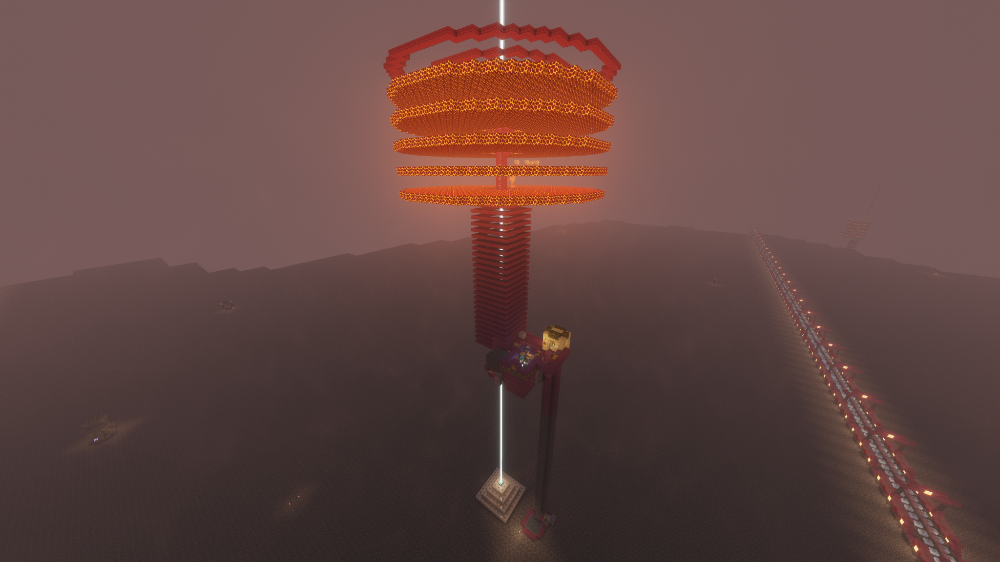<figcaption>
<em>Общественная ферма золота</em>
</figcaption></figure>

<figure>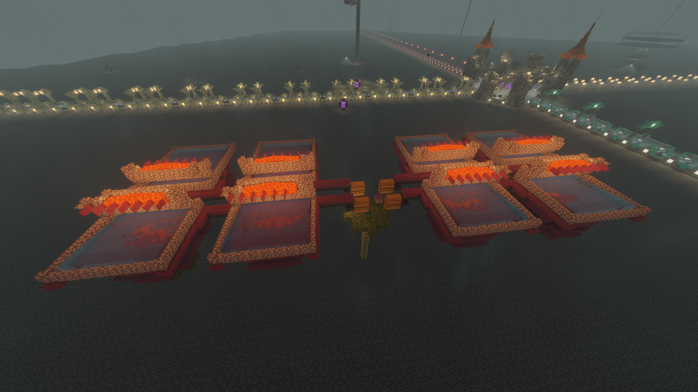<figcaption>
<em>Общественная ферма железа</em>
</figcaption></figure>

Сезон также запомнился изменениями в плагинах: из-за ошибок и крайне низкой популярности, полностью убрали плагин на пчелиную доставку. Следом из-за проблем с сохранением готовых карт окончательно сломался ArtMap. Взамен сервер перешел на использование нового плагина, который значительно экономит время игроков и позволяет быстрее достигать результатов при рисовании картин.

Среди геймплейных нововведений важнейшей вехой стало введение [гибридов рас](../o-proekte/osobennosti/rasy.md), среди которых были: Падший Ангел, Эльх, Пустотник и Кобольд. Игрокам пришлось самостоятельно искать секретный рецепт «гибридизации» и изучать их скрытые характеристики на собственном опыте. Одновременно в игру добавили новые редкие зачарования: [«Головорез»](../o-proekte/osobennosti/unikalnye-zacharovaniya.md#golovorez) и [«Связь пустоты»](../o-proekte/osobennosti/unikalnye-zacharovaniya.md#svyaz-pustoty).

В ночь с <mark style="color:blue;">22</mark> на <mark style="color:blue;">23 марта 2025 года</mark> сервер перенёс серьёзный удар — ночной взлом аккаунта модератора <mark style="color:$primary;">**miniking1000**</mark>. (подробнее об этом событии читайте здесь [«Ночь, которой не стало»](interesnye-istorii/noch-kotoroi-ne-stalo.md))

<figure><figcaption>
<em>Ну, что, читатели, доигрались?</em>
</figcaption></figure>

<mark style="color:blue;">23 марта 2025 года</mark> произошло долгожданное открытие Края. Битва превратилась в настоящий хардкор: помимо баффнутого Дракона, игрокам пришлось одновременно сражаться с призванными визерами и варденами.

<figure>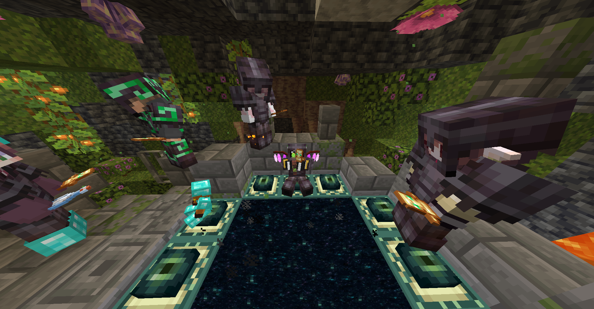<figcaption>
<em>Долгожданное открытие Края</em>
</figcaption></figure>

В самом конце сезона, <mark style="color:blue;">13 июля 2025 года</mark>, на спавне прошёл финальный аукцион, где игроки смогли обменять накопленные за сезон алмазы и скупить ценные ресурсы для плавного старта в грядущем 7 сезоне.

<figure>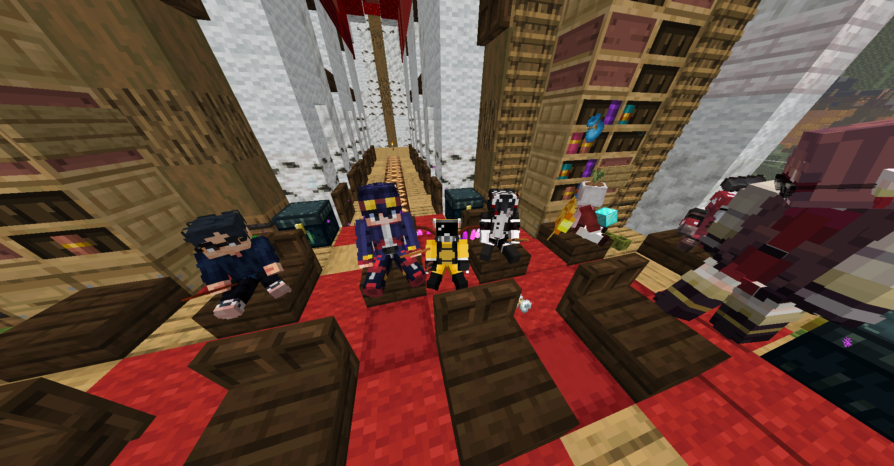<figcaption>
<em>Место проведения аукциона</em>
</figcaption></figure>

<figure>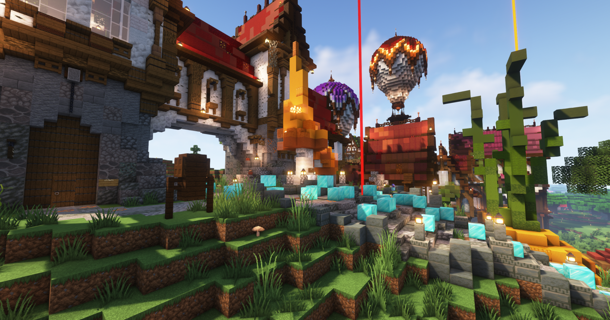<figcaption>
<em>В последние минуты сезона игроки расставляли свои алмазные блоки по спавну</em>
</figcaption></figure>

## Города

### «СвагаСити»

Колоритное и самобытное город-государство, расположившееся немного южнее спавна. Официальной (хоть и не до конца точной) идеологией поселения был провозглашен анархо-капитализм.

<figure>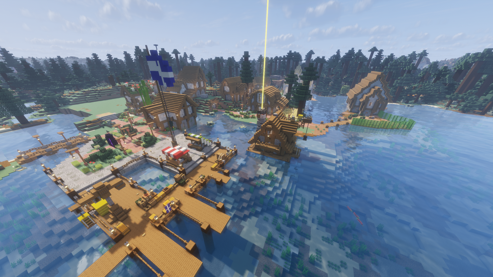<figcaption>
<em>Город, окружённый еловым лесом</em>
</figcaption></figure>

В СвагаСити действует прямая демократия: абсолютно все ключевые решения и законы принимаются коллегиально по итогам всеобщих колхозных собраний. Пост местного Шерифа закрепил за собой игрок <mark style="color:$primary;">**xatab1xa**</mark>. Согласно официальной переписи от <mark style="color:blue;">24 апреля 2025 года</mark>, костяк постоянного населения города составили: <mark style="color:$primary;">**xatab1xa, Bereza\_33, RusMacintosh, LEMON323323, m29ark, NoyAboba, dieplstnx, Eugene, Bananis\_504**</mark> и <mark style="color:$primary;">**AngelDeaded**</mark>.

### «Республика Мандора»

Развивающееся и амбициозное государство, получившее мощный толчок к развитию благодаря уверенному руководству его лидера — игрока <mark style="color:$primary;">**Shaxta**</mark>. Будучи не только дальновидным правителем, но и активным строителем, <mark style="color:$primary;">**Shaxta**</mark> лично занимался детальным планированием и архитектурным обликом будущей столицы.

<figure>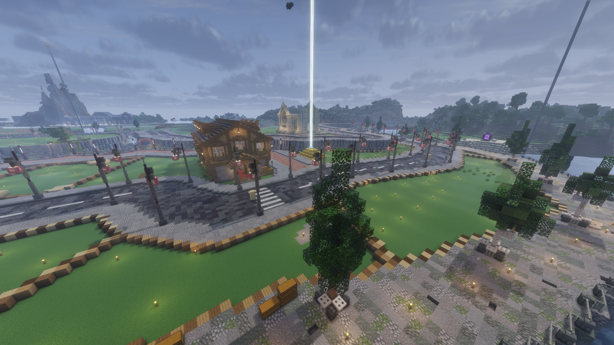<figcaption>
<em>Вид на строения Мандоры</em>
</figcaption></figure>

<figure>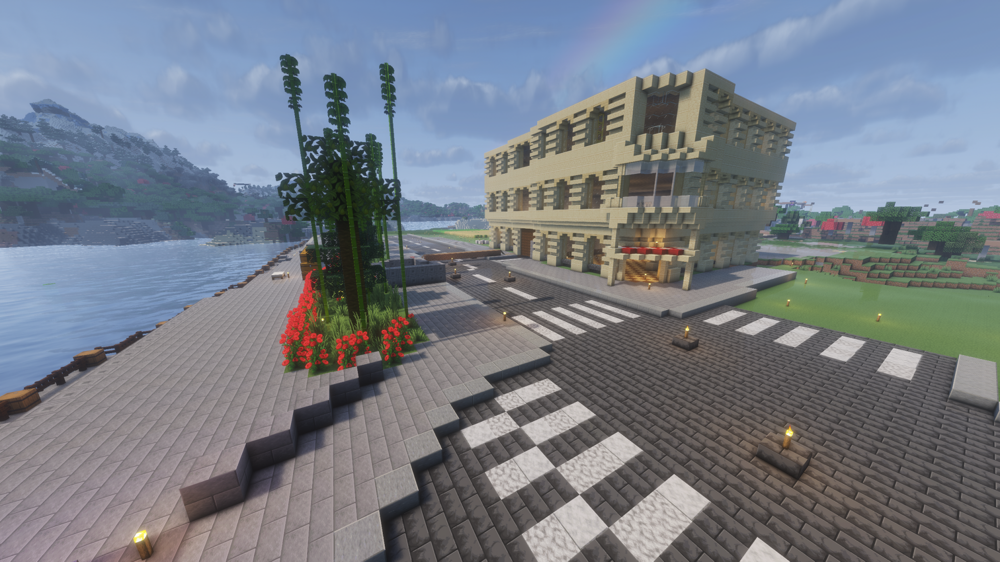<figcaption>
Природа, соединённая с городским колоритом
</figcaption></figure>

Благодаря его неиссякаемой энергии, Мандора быстро стала привлекательным центром для новых жителей. В этот период к республике начали активно присоединяться игроки из других организаций сервера, чья внутренняя активность к середине сезона сильно угасла. Это позволило государству накопить рабочие руки, спасти одиночек от скуки и заложить прочный фундамент для превращения Мандоры в сверхдержаву грядущего 7-го сезона.

### «Небельмайр»

Атмосферное и уединённое поселение, основанное посреди глухих и труднопроходимых болотных топей. Первопроходцем этих мест стал переселенец <mark style="color:$primary;">**Logics362**</mark>, который решил задержаться в Ягодных топях благодаря обилию рыбы и загадочной, мистической атмосфере (по ночам здесь шептались духи, а днём из-под густого тумана сочились причудливые образы).

<figure><figcaption>
<em>Перевал в ночи</em>
</figcaption></figure>

Поскольку болото оказалось буквально изолировано от внешнего мира, для привлечения финансов и развития экономики жители Небельмайра запустили уникальное производство чая на базе местных болотных трав. На этапе основания поселение придерживается строго нейтральной политики, а его немногочисленные жители сосредоточены на развитии внутренней инфраструктуры: добыче ресурсов в лесу и шахтах до заката солнца.

### «Империя Кёко»

Могущественное государство в хвойных лесах, основанное группой авантюристов расы кицунэ. Первоначально империя создавалась как дом для зверолюдей — кицунэ и каджитов, однако 10 апреля 2025 года был официально подписан исторический договор о принятии в состав граждан людей и драконорожденных на абсолютно равных правах.

<figure>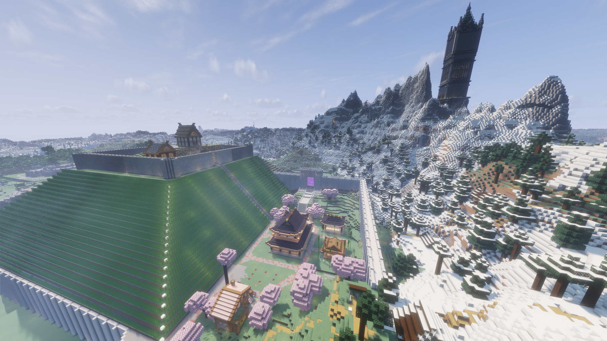<figcaption>
Вид на Империю Кёко
</figcaption></figure>

Архитектура поселения сочетает в себе восточный и западный стили, разделенные по соответствующим районам. Основным ремеслом местных жителей стало масштабное облагораживание диких территорий и разведение живности. Империя развивалась благодаря взаимопомощи: игроки <mark style="color:$primary;">**I\_valentain\_I**</mark> и <mark style="color:$primary;">**RaruDu\_KOT**</mark> помогли ресурсами и контролем строительных машин для расчистки земли под новые районы, а строитель <mark style="color:$primary;">**fireruss**</mark> возвёл в горах монументальное и высокое здание Имперской Библиотеки. Согласно весенней переписи, костяк населения составили: <mark style="color:$primary;">**\_\_MrSam\_\_, frOOdi, TroupFish, Domovoy, DeadHanter420, ElizarovS, SunsetRavenSK, Arseny, Mad4MeMore**</mark> и <mark style="color:$primary;">**aghostinsorrow**</mark>.

### «Королевство Аллария»

Живописная суверенная монархия, зародившаяся из небольшого экспедиционного лагеря авантюристов среди цветущих розовых деревьев восточного континента Лары. Земли Алларии _(от «Ал» — люди, и «Лара» — континент)_ спроектированы по канонам раннефеодальной эпохи: каждый холм королевства увенчан благородным поместьем или замком, а по склонам тянутся густые виноградники. У королевства были собственные флаг, герб и гимн. Основателем Алларии и правителем был игрок <mark style="color:$primary;">**Coldrex**</mark>.

<figure>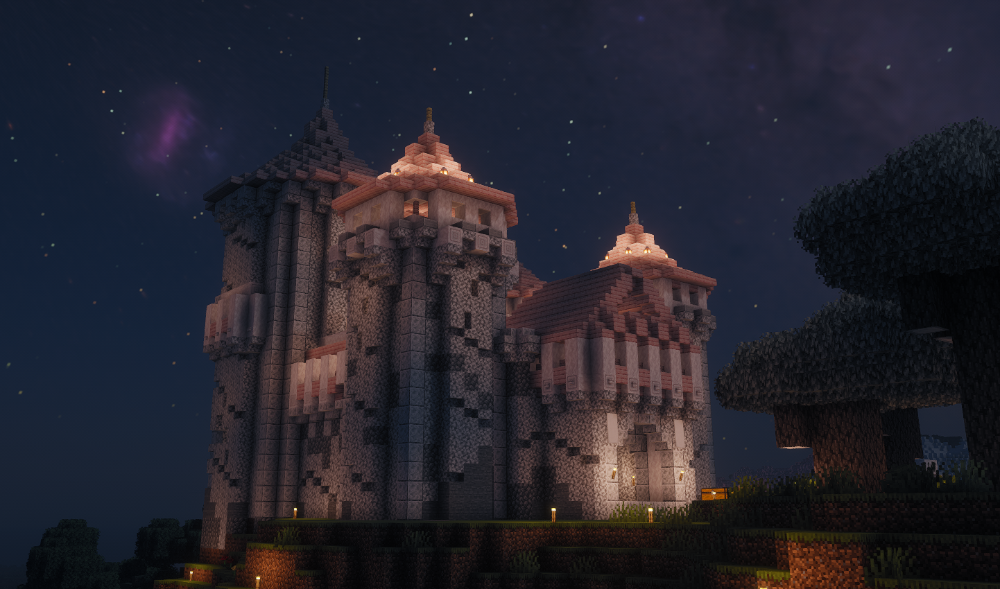<figcaption>
<em>Основное здание королевства</em>
</figcaption></figure>

<mark style="color:blue;">30 марта 2025 года</mark> в государстве официально отпраздновали завершение строительства первой твердыни и провозгласили полноценную государственность. В строительстве столицы — Миратара — львиную долю сложнейшего труда взял на себя <mark style="color:$primary;">**Vesenka**</mark>, раскопки масштабных подземелий под замком полностью организовал <mark style="color:$primary;">**Waldemarr1n**</mark>, а <mark style="color:$primary;">**Volo\_nonValeo**</mark> помогла наполнить гостевой зал первыми послами из чужих земель.

## Гильдии

### «Сборище одиночек»

Уникальное и очень дружное неформальное объединение игроков, у которых на момент начала сезона по разным причинам не было своей постоянной фракции или клана. Чтобы не выживать в одиночку на просторах нового мира, эти люди решили сплотиться в единую гильдию для совместной комфортной игры, активного общения, взаимовыручки и фана. Костяк этой компании «одиночек» составили игроки: <mark style="color:$primary;">**Sard23Fun, PinkMike, \_BlackTime\_, Volo\_nonValeo, Unissy\_Trye, Waldemarr1n**</mark> и <mark style="color:$primary;">**nibunaka**</mark>.

### «Культ Кувшина»

Влиятельное и глубоко проработанное религиозно-идеологическое течение сервера, выстроившее четкую вертикаль власти и влияния.\
Руководство культа: основателем культа выступал игрок <mark style="color:$primary;">**Opracus**</mark>, когда же просветителем культа стал <mark style="color:$primary;">**Cultyapa**</mark>.

<figure>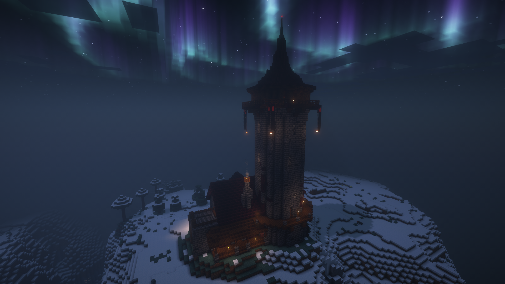<figcaption>
<em>Обсерватория Культа Кувшина</em>
</figcaption></figure>

Для адептов движения была официально введена и закреплена строгая трехступенчатая Иерархия Культа Кувшина:

_I ступень_ — Рядовой верующий. Обычный житель мира, который искренне верит в Кувшин и по мере своих возможностей старается соблюдать базовые ритуалы.\
_&#x49;I ступень_ — Служитель Культа. Полноценный представитель и миссионер культа в рамках своей родной страны, города, поселения или организации. Он обязан строго соблюдать все ритуалы и активно проповедовать веру.\
_&#x49;II ступень_ — Высший культист. Игрок, полностью посвятивший свою жизнь тотальному служению Культу. Он проживает непосредственно в Оплоте Культа бок о бок с его основателями.

<figure>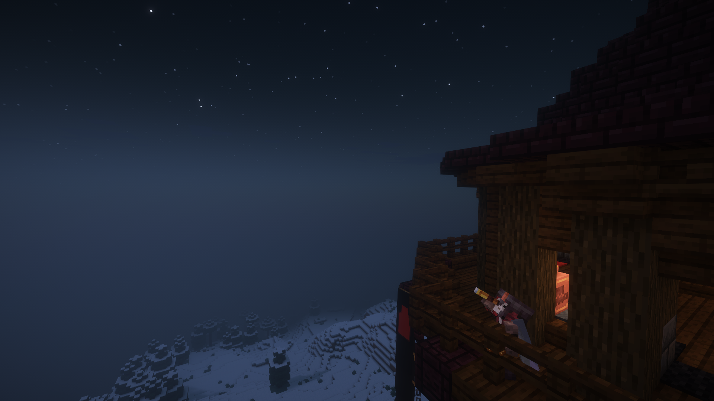<figcaption>
<em>Изучающий звёзды <mark style="color:$primary;"><strong>Cultyapa</strong></mark></em>
</figcaption></figure>

### «СвагаСити»

Влиятельное экономическое и территориальное объединение жителей южного города-государства. Помимо активного участия в собраниях, члены гильдии также интегрировались в экономику всего сервера. Главным инфраструктурным достижением гильдии стало открытие официального Банка СвагаСити на спавне, ставшего надёжным финансовым узлом для многих игроков шестого сезона.

### «Берёзелизм»

Уникальное философско-религиозное движение, зародившееся вокруг доброго странника под ником <mark style="color:$primary;">**Bereza\_33**</mark>. Согласно лору, задолго до появления СвагаСити, этот человек путешествовал по миру в окружении берёзовых листьев и помогал нуждающимся, оставляя после себя цветущие сады. Позже он осел в порту и помог основать СвагаСити. Учение Берёзелизма проповедует абсолютную доброту, сопереживание, скромность, терпимость к ближним и обязательство сохранять и улучшать окружающий мир.

<figure>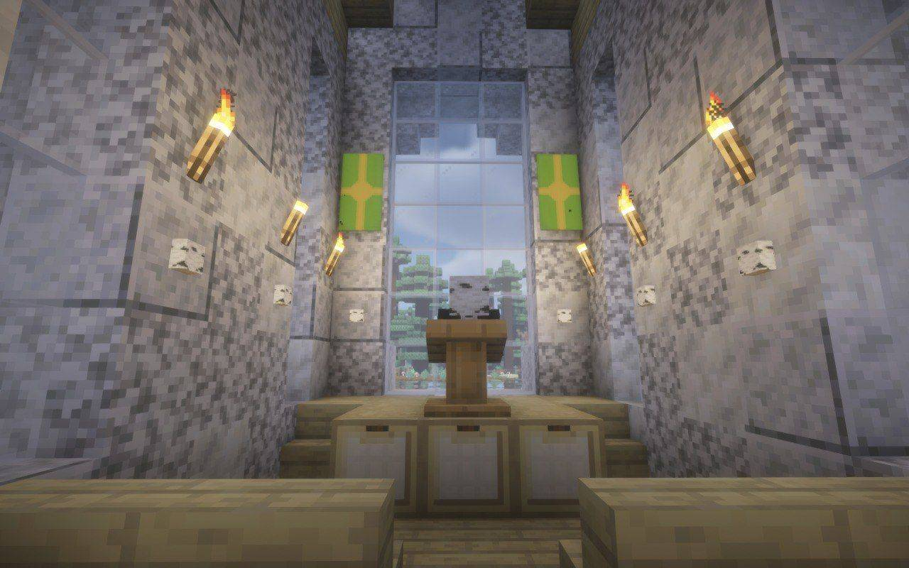<figcaption>
<em>Служение в храме Берёзы</em>
</figcaption></figure>

### «Brotherhood of the Twilight Blade»

Эльфийский клан под предводительством <mark style="color:$primary;">**Rokbees**</mark>, основавший потрясающий скрытый город Ореол. Архитектурная концепция города базируется на эстетике лунного света, магии, цветов аметиста и розами, овеянных духом древних легенд. Клан позиционирует себя как мирное экономическое объединение, созданное для комфортного совместного выживания и созидания. На момент основания в состав Братства Сумеречного Клинка также вошли игроки <mark style="color:$primary;">**THEFRST**</mark> и <mark style="color:$primary;">**ZloyDomosed**</mark>.

<figure>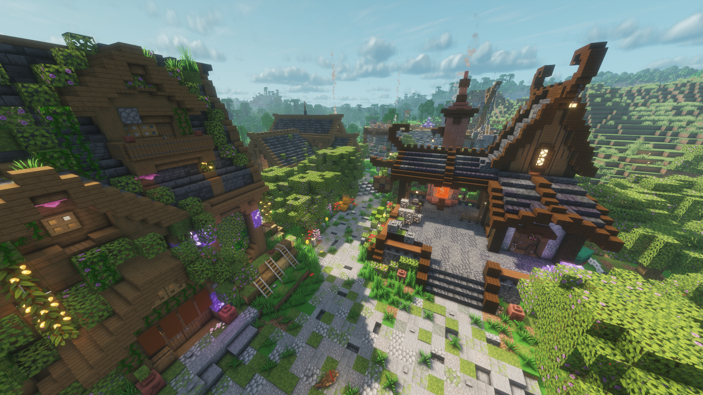<figcaption>
<em>Вид на магическое поселение</em>
</figcaption></figure>

## Ивенты

### «Поиск крафта ядра перерождения»

Организатор: <mark style="color:$primary;">**администрация**</mark>.

Дата проведения: 27 марта 2025 года.

**Описание:**\
Поисковый квест от администрации, приуроченный к запуску механики гибридов. Игрокам сервера пришлось искать спрятанные по всему миру кафедры с книгами-подсказками в точках «пересечения света и тьмы», чтобы первыми открыть заветный путь перерождения.

<figure>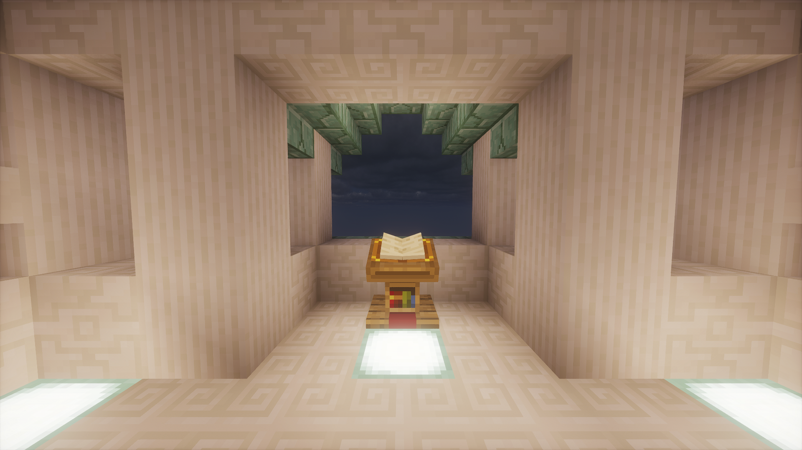<figcaption>
<em>Одна из подсказок</em>
</figcaption></figure>

### «Мафия»

Организатор: <mark style="color:$primary;">**Volo\_nonValeo**</mark>.

Дата проведения: 3 мая 2025 года.

**Описание:**\
На спавне состоялся крупный ивент по игре «Мафия». Игры проходили в красиво оформленном зале под спавном.

В первой партии сокрушительную победу одержали мафиози: <mark style="color:$primary;">**\_Caiiko\_, \_\_MrSam\_\_**</mark> и <mark style="color:$primary;">**Opracus**</mark>.

Во второй партии мирные жители смогли взять полный реванш благодаря слаженной игре команды: <mark style="color:$primary;">**nibunaka, Opracus, Yohan, torvik2007, Sard23Fun, \_Caiiko\_, PURRCHIN**</mark> и <mark style="color:$primary;">**\_\_MrSam\_\_**</mark>_._

<figure>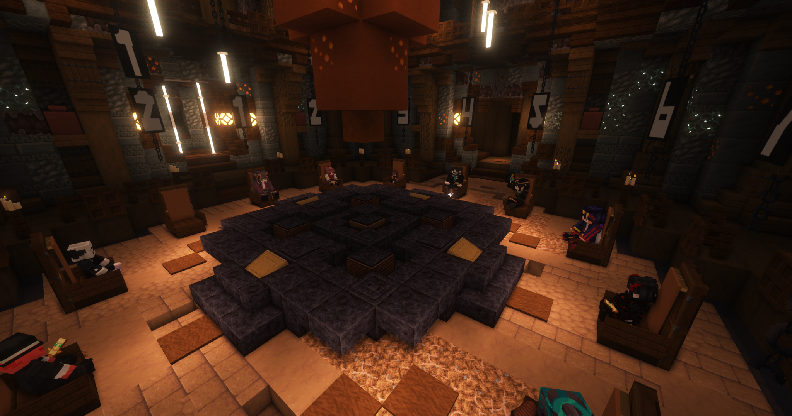<figcaption>
<em>Зал для проведения ивента</em>
</figcaption></figure>

17 мая 2025 года на спавне в том же зале ивент был проведён повторно. В этот раз его организовала администрация проекта.&#x20;

В первой партии из-за безупречной игры одного из мафии одержали победу следующие игроки: <mark style="color:$primary;">**Infernum, efmsdfg, Bereza\_33**</mark>.

Во второй партии мафию одолели мирные жители, среди которых: <mark style="color:$primary;">**torvik2007, I\_valentain\_I, RIpa, \_Caiiko\_, xatab1xa, LEMON323323, codi3222, meruka**</mark>.

### «Лисьи посиделки»

Организатор: <mark style="color:$primary;">**администрация**</mark>.

Дата проведения: 12 апреля 2025 года.

**Описание:**\
Администрация провела для комьюнити сервера мини-ивент под названием «Лисьи посиделки». Мероприятие было организовано как ламповая встреча для игры в настольные игры, такие как: шашки, шахматы, карты, домино. Все пришедшие на ивент игроки получили ценные награды.

<figure>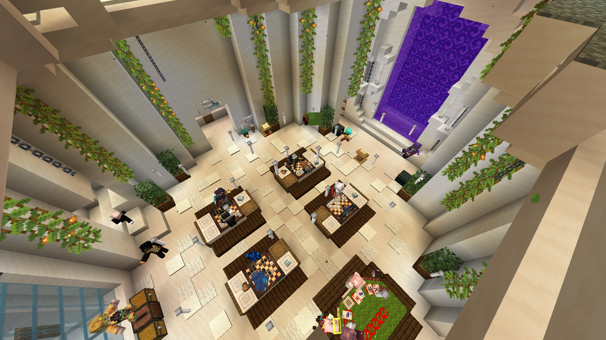<figcaption>
<em>Зал, ноходившийся в большом белом замке</em>
</figcaption></figure>

## [Ссылка на мир](https://drive.google.com/file/d/1Mmc7pNl0SHx-BhQharaNULsXt49c5hyr/view?usp=sharing)
