# 7 сезон


Материал может содержать неточности и ошибки, а также быть субъективным, поскольку отражает восприятие автора. Если вы хотите внести какие-либо правки, пожалуйста, обратитесь в дискорд канал 📝[<mark style="color:$warning;">«Обращения»</mark>](https://discord.com/channels/956981761802375228/1245232823510503428).


## Продолжительность

Сезон официально стартовал <mark style="color:blue;">19 июля 2025 года</mark> в 20:00 по МСК. Техническая подготовка к вайпу началась за неделю до открытия: серверное ядро обновилось до версии 1.21.7, была проведена работа над ресурс-паком, а так же произошло обновление всех плагинов и датапаков.\
Сезон завершился <mark style="color:blue;">26 января 2026 года</mark>.\
Из-за слишком большого веса мир не удалось выложить в общий доступ, поэтому администрация рекомендовала игрокам сохранять свои постройки с помощью сторонних модов.

## История

Организацией и проектированием главного строения сезона занималась <mark style="color:$primary;">**Uwka**</mark>. За основу концепта она взяла масштабную постройку из карты на киберпанковую тематику и детально адаптировала её под нужды спавна. Проект оказался настолько колоссальным, что ресурсы на его возведение собирали общими силами всего сервера. Из-за гигантских объёмов работа велась большую часть сезона, и <mark style="color:blue;">12 октября 2025 года</mark> спавн был официально достроен, поразив игроков своим футуристичным и уютным видом.

<figure>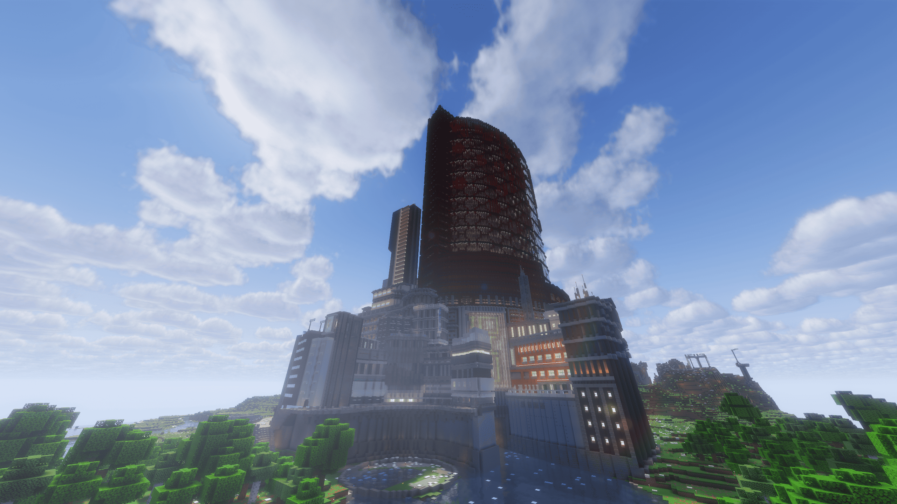<figcaption></figcaption></figure>

<figure>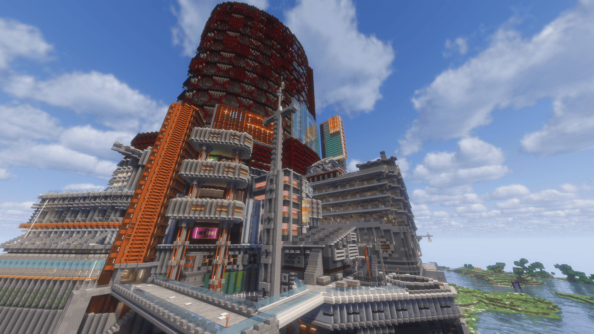<figcaption>
<em>Величественный вид достроенного спавна</em>
</figcaption></figure>

Развитие незерского хаба в 7 сезоне — это настоящая история о том, как из маленькой частной инициативы родился полноценный рынок! Ещё в самом начале сезона игрок <mark style="color:$primary;">**PURRCHIN**</mark> построила свою скромную торговую лавочку в районе нулевых координат на крыше Незера. Эта идея настолько зажгла остальных, что другие игроки моментально подхватили инициативу! Вокруг палатки <mark style="color:$primary;">**PURRCHIN**</mark> начал разрастаться бурный рынок, который и послужил главным источником вдохновения для последующей постройки всего хаба.

<figure>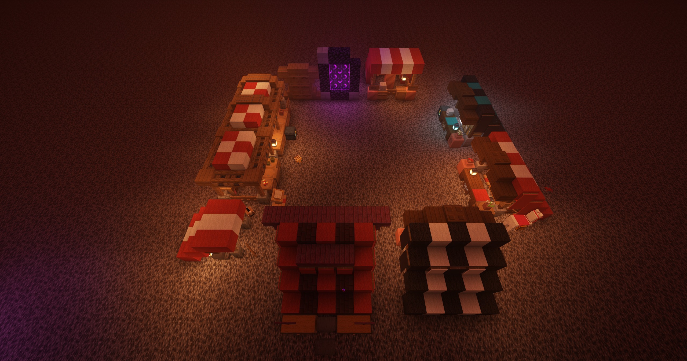<figcaption>
<em>Лавочки игроков прямо у портала на спавн</em>
</figcaption></figure>

В начале августа игрок <mark style="color:$primary;">**\_\_MrSam**</mark>_<mark style="color:$primary;">**\_\_**</mark>_ взял на себя ответственность за проектирование и возведение транспортной системы хайперлупов на крыше незера. По результатам всеобщего голосования игроки выбрали минималистичную палитру оформления веток. Благодаря помощи игрока <mark style="color:$primary;">**PARAVAZIVAL**</mark>, а также регулярным поставкам ключевых ресурсов от <mark style="color:$primary;">**I\_valentain\_I**</mark> и <mark style="color:$primary;">**PURRCHIN**</mark>, строителям удалось в краткие сроки проложить ветки до 518-х координат. Для дополнительного удобства хаб был оснащён вторым кольцом, внутри которого игрок <mark style="color:$primary;">**PURRCHIN**</mark> спроектировала и построила удобную торговую зону с лавочками которые могли занять игроки.

<figure>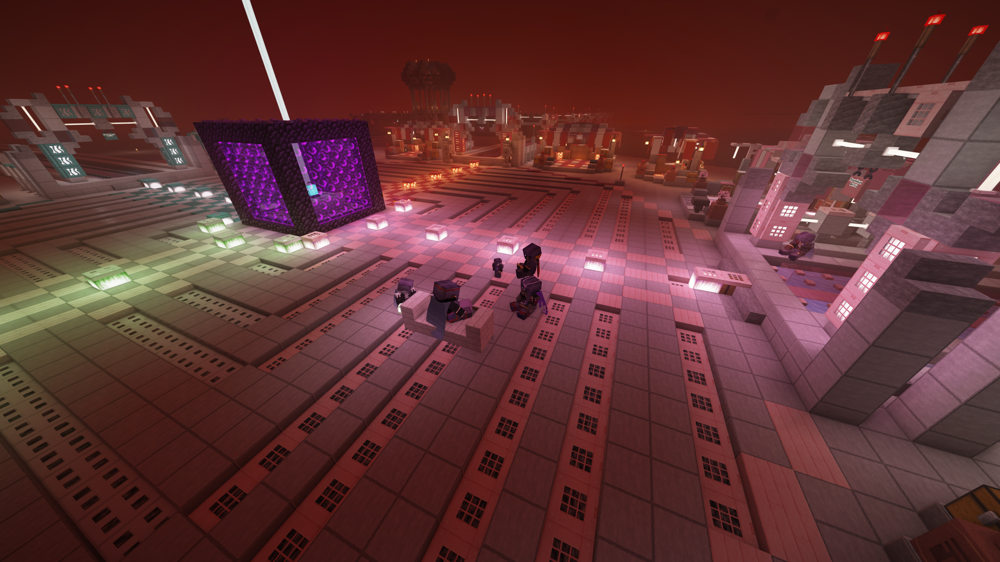<figcaption>
<em>Игроки ведут деловую встречу в хабе</em>
</figcaption></figure>

<mark style="color:blue;">2 августа 2025 года</mark> администрация преподнесла всем строителям сервера подарок! На сервер добавили высокоскоростной способ [моментального замачивания сухого бетона](../o-proekte/krafty/beton-v-kotle.md). Вместо нудной ручной укладки блоков у воды, игрокам стало достаточно просто кидать целые стаки  цемента прямо в наполненный водой котёл! Это нововведение в разы ускорило возведение мегапостроек, сэкономив тонны времени при добыче цветных материалов из бетона.

Тем же днем на сервере произошло аномальное открытие Края. Игроки оказались заперты в измерении без Дракона и портала, пока центральный остров осыпался в бездну. (подробнее об этом событии читайте здесь [«Остров, ушедший в пустоту»](interesnye-istorii/ostrov-ushedshii-v-pustotu.md))

<figure>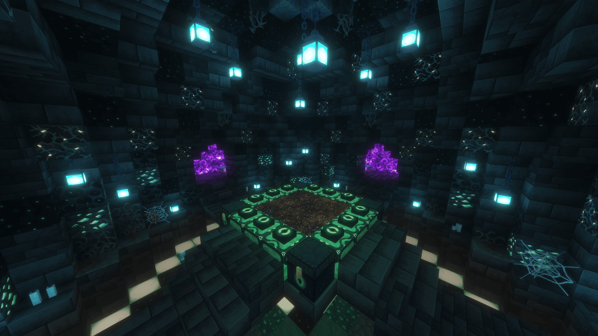<figcaption>
<em>Общественный портал в Край</em>
</figcaption></figure>

Важнейшим нововведением сезона стало появление механики [мутаций счастливых гастов](../o-proekte/osobennosti/mutacii-schastlivykh-gastov.md). Игроки получили возможность гибко настраивать скорость и размер своих летающих питомцев в пределах от 0.2 до 2.0. Для кастомизации параметров использовались обычные бирки, переименованные на наковальне. Это новшество не только позволило обзавестись уникальными спутниками, но и легло в основу внутриигровых активностей: игроки активно использовали модифицированных гастов как в качестве помощников при строительстве, так и для участия в серверных ивентах.

<figure><figcaption>
<em>Счастливые гасты разных размеров</em>
</figcaption></figure>

Был добавлен забавный и практичный кастомный предмет — [**крюк-хвататель**](../o-proekte/krafty/kryuk-khvatatel.md). Этот уникальный инструмент позволял игрокам буквально захватывать других участников проекта и усаживать их себе на голову. Предмет быстро обрёл популярность и стал основой для множества шуток и дружеских пранков.

<mark style="color:blue;">19 октября 2025 года</mark> администрация внедрила интерактивную систему наград за поддержку проекта на мониторинге. С добавлением команды /vote каждый активный игрок смог ежедневно вносить свой вклад в продвижение любимого сервера и получать за свои голоса гарантированные внутриигровые подарки в красивых праздничных коробках!

Инфраструктура Края также претерпела глобальную перестройку в рамках амбициозного проекта «Компас Вселенной». Организатором тотальной стройки выступил игрок <mark style="color:$primary;">**Aviator**</mark> при поддержке <mark style="color:$primary;">**N3R\_VO1D**</mark>. За несколько дней непрерывной работы они выстроили красивый хаб Края, напоминающий по форме гигантский космический компас.

<figure>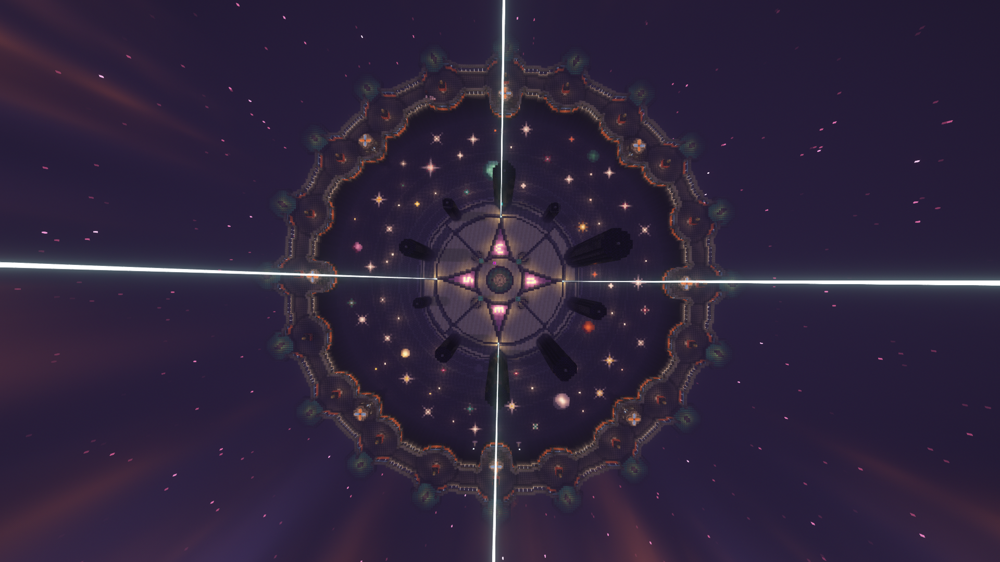<figcaption>
<em>Вид сверху на</em> «<em>Компас Вселенной</em>»
</figcaption></figure>

Одной из главных геймплейных особенностей последнего месяца сезона стали метеориты. С характерным нарастающим гулом, периодически возле случайного игрока, космические объекты падали на землю, образуя глубокие кратеры. Падения уничтожали постройки, попавшие в эпицентр, однако внутри воронок генерировались ценные ресурсы, включая древние обломки и алмазную руду.&#x20;

<figure>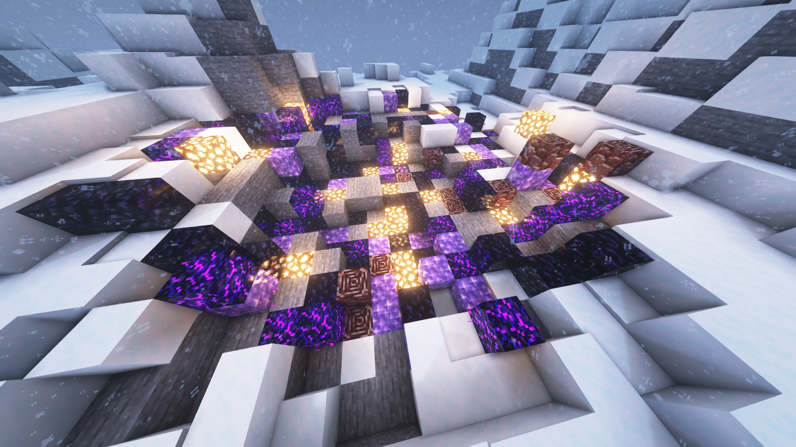<figcaption>
<em>Место преземления метеорита с ценными блоками</em>
</figcaption></figure>

Чтобы обезопасить свои постройки, игроки позже получили секретный чертёж кастомного блока-прототипа, который блокировал падение метеоритов в радиусе 300 блоков.

<figure><figcaption>
<em>Крафт метеороотвода</em>
</figcaption></figure>

&#x20;

В самом конце сезона, <mark style="color:blue;">18 января 2026 года</mark> в 18:00 по МСК, на высоких этажах спавна прошёл масштабный предвайповый аукцион. Его главной фишкой стали лутбоксы с секретным содержимым: игроки вслепую скупали пронумерованные коробки за алмазы, а узнать какие ресурсы они выкупили, смогли только после старта следующего сезона.

<figure>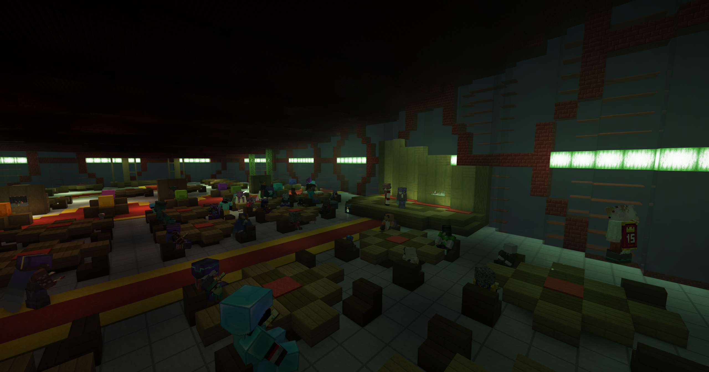<figcaption></figcaption></figure>

<figure>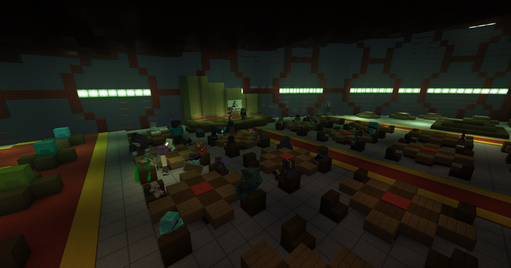<figcaption>
<em>На аукцион пришло около 40 человек!</em>
</figcaption></figure>

## Города

### Республика Мандора

Крупное централизованное государство, на территории которого в 7 сезоне развернулось масштабное строительство. Территориально республика делилась на крупные регионы: Кардифф, Нью-Остин, Кингстон и Порт-о-Пренс.

<figure>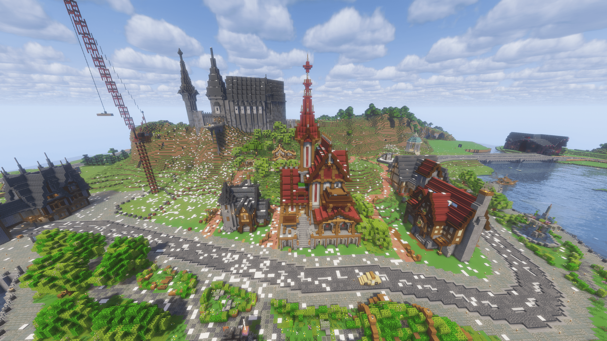<figcaption>
<em>Вид на столицу</em>
</figcaption></figure>

В столице Нью-Остин было завершено возведение массивного исторического здания в средневековом стиле, которое решением Офиса Президента было отдано под жилые помещения, торговые лавки и уютный бар. Главным экономическим локомотивом страны стала государственная корпорация McKay Global, созданная путём слияния небольших частных магазинов игроков <mark style="color:$primary;">**Shaxta**</mark> и <mark style="color:$primary;">**Bababoi97**</mark> в центре адского хаба. Объединение позволило насытить рынок новыми высококлассными и уникальными товарами, значительно подняв экономику всей Мандоры.

<figure>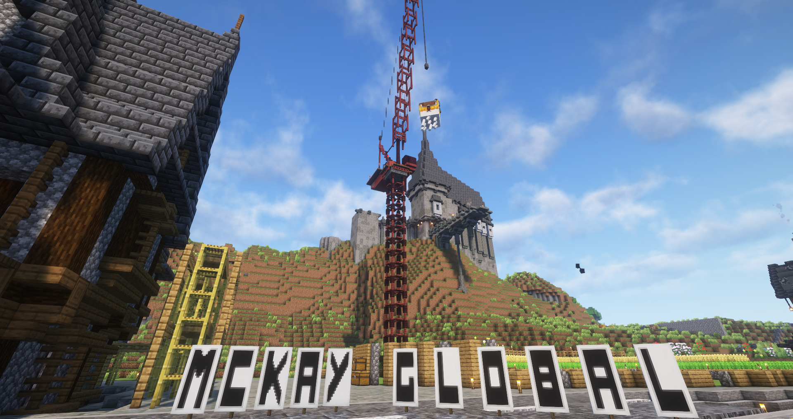<figcaption>
<em>Строительство экономического центра</em>
</figcaption></figure>

Во владение Республики Мандоры так же входили такие объединения как Гильдия Волшебный дракон и Багровые низины. Из-за этого и так не малочисленное население Республики Мандоры было поистине крупнейшим объединением на сервере за все время.

<figure>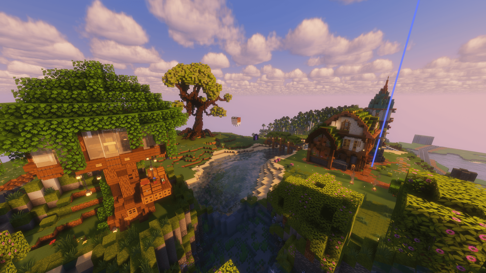<figcaption>
<em>Окраина Республики Мандора</em>
</figcaption></figure>

## Гильдии

### ООБ «ЦПБ»

Организация Объединенных Баз «Цветные Подземные Базы» — масштабный строительный проект, запущенный игроком <mark style="color:$primary;">**Shm1Shm1Shm1**</mark> перед стартом сезона. Концепция гильдии подразумевала объединение 12 участников каждый из которых строил собственную изолированную подземную базу, оформленную в одном из 12 основных цветов бетона в Майнкрафте (черный, серый и светло-серый использовались как дополнительные). Все подземные бункеры имели схожий архитектурный стиль с отсеками для автоматических ферм, трейдхоллами и были соединены между собой сетью укрепленных подземных дорог.

<figure>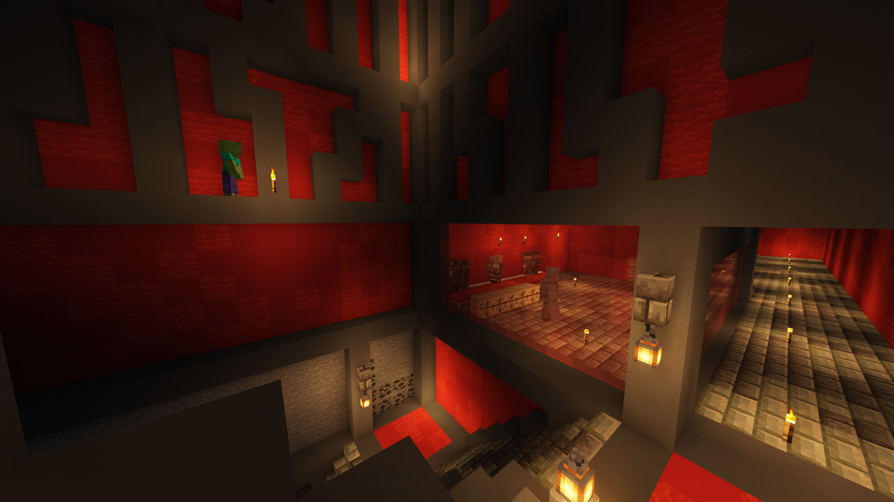<figcaption>
<em>Красный сектор</em>
</figcaption></figure>

Список участников и их цветовые секторы: <mark style="color:$primary;">**Shm1Shm1Shm1**</mark> — Красный сектор, <mark style="color:$primary;">**\_Caiiko**</mark> — Пурпурный сектор, <mark style="color:$primary;">**Meruka**</mark> — Оранжевый сектор, <mark style="color:$primary;">**RaruDu\_KOT\_**</mark> — Белый сектор, <mark style="color:$primary;">**torvik2007**</mark> — Фиолетовый секто, <mark style="color:$primary;">**Waldemarrin**</mark> — Лаймовый сектор, <mark style="color:$primary;">**Cultyapa**</mark> — Зелёный сектор, <mark style="color:$primary;">**Vesenka**</mark> — Розовый сектор.

### Культ кувшина

Религиозная организация продолжила свою сверхактивную деятельность и в 7 сезоне. <mark style="color:blue;">30 августа 2025 года</mark> адепты культа под руководством <mark style="color:$primary;">**Cultyapa**</mark> закончили возведение сети священных Монументов Кувшина во всех уголках игрового мира.

<figure>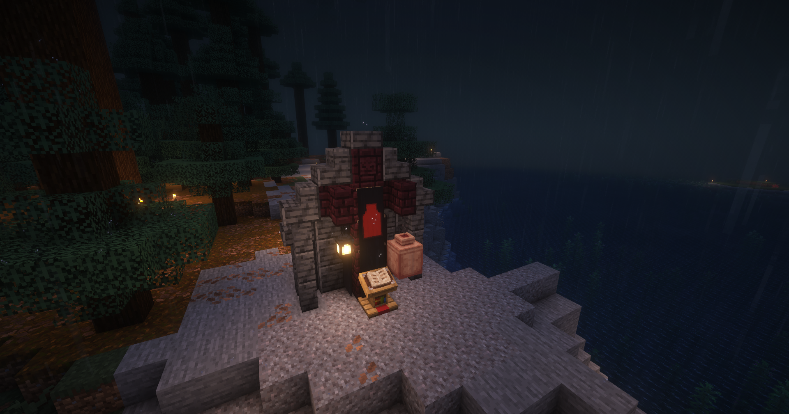<figcaption>
<em>Монументы содержали книги с информацией о культе</em>
</figcaption></figure>

Позже, <mark style="color:blue;">3 октября 2025 года</mark>, в Оплоте организации был официально оформлен полноценный секретный зал для безболезненных жертвоприношений, открытый для всех последователей.&#x20;

<figure>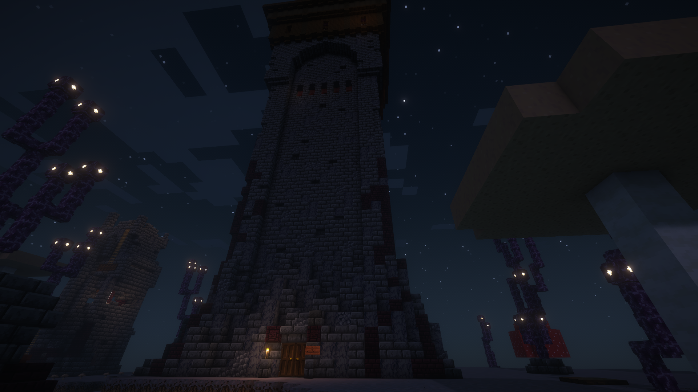<figcaption>
<em>Оплот Культа Кувшниа</em>
</figcaption></figure>

В ноябре в глубине джунглей культисты обнаружили и полностью восстановили древний полуразрушенный Храм, где проводились регулярные лекции о строении мира и поддержании добра.&#x20;

<figure>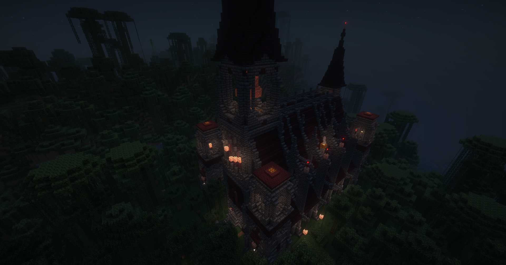<figcaption>
<em>Храм в джунглях</em>
</figcaption></figure>

В самом конце сезона, в связи с космическими катаклизмами, советом Культа было принято решение законсервировать наземные постройки и начать углубление всех структур в недра земли.

### Гильдия Волшебный Дракон

Элитарное сообщество выдающихся магов и волшебников, чья деятельность была сосредоточена в удалённой области Республики Мандора. История фракции уходит корнями на три столетия назад, когда двое странствующих путников случайно обнаружили в глуши руины древнего сооружения. В центре этих руин они нашли Стол с семью мечами и старинный хроникальный манускрипт, который положил начало новой эре изучения магических практик.

Состав совета магов: глава Гильдии — <mark style="color:$primary;">**Ketrin\_27**</mark>**;** заместитель главы — <mark style="color:$primary;">**toshiiyo**</mark>; участники — <mark style="color:$primary;">**Leinovic, CDHTBuTGDND, Makarbi, sonuyuu, kwakman45**</mark>.

### Багровые низины

Сообщество Демонов, обосновавшееся в Нижнем мире. Согласно лору организации, после многовекового удержания территорий в верхнем мире, демоны свернули подконтрольное пространство и перенесли его обратно в родную обитель в Незере, так как образцы гибридной почвы Верхнего мира не прижились. Архитектура фракции представлена мрачными крепостями, вырезанными из камня, окруженными защитными стенами и украшенными магическими рунами. Внутри крепостей демоны проводили темные ритуалы призыва существ из других измерений. В гильдии царил строгий порядок и иерархия, основанная на силе и подчинении Верховному Демону.&#x20;

<mark style="color:blue;">4 августа 2025 года</mark> глава Багровых Низин <mark style="color:$primary;">**\_\_MrSam**</mark>_<mark style="color:$primary;">**\_\_**</mark>_ официально провел дипломатические переговоры с правителем Республики Мандора <mark style="color:$primary;">**Shaxta**</mark> о вступлении гильдии в состав государства в обмен на ценные ресурсы и особые возможности.

Актуальный состав Багровых Низин: <mark style="color:$primary;">**\_\_MrSam**</mark>_<mark style="color:$primary;">**\_\_**</mark>_ — Верховный Демон <mark style="color:$primary;">**Sadowning**</mark> — заместитель главы; <mark style="color:$primary;">**ElizarovS**</mark> — житель; <mark style="color:$primary;">**TroupFish**</mark> — житель.

### SCP Foundation

Крупная военизированная научно-исследовательская организация, развернувшая на сервере масштабный комплекс «Зона-2». Игроки фракции вели на сервере глубокое, детально проработанное и активное ролевое взаимодействие по вселенной Фонда, публикуя классифицированные рекрутинговые протоколы, проводя эксперименты с аномальными артефактами и организуя круглосуточную охрану периметра. В организацию входили: <mark style="color:$primary;">**Volo\_nonValeo**</mark>, <mark style="color:$primary;">**Waldemarrin**</mark>, <mark style="color:$primary;">**Meruka**</mark>, <mark style="color:$primary;">**nibunaka**</mark>, <mark style="color:$primary;">**PinkMike**</mark> и <mark style="color:$primary;">**Sard23Fun**</mark>. К сожалению, в разгаре сезона из-за конфликта с некоторыми игроками и администрацией проекта, команда Фонда в полном составе приняла решение покинуть DreamFox.

<figure>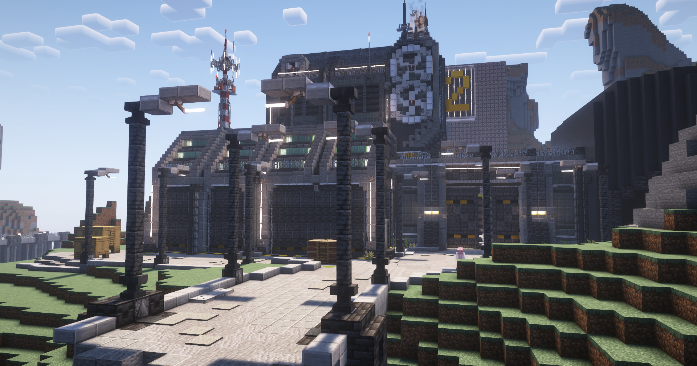<figcaption>
<em>Вход в комлекс</em>
</figcaption></figure>

### Обсерватория «Горизонт»

Некоммерческая научно-исследовательская организация, созданная игроком <mark style="color:$primary;">**Unissy\_Trye**</mark> при поддержке гранта Фонда им. С. Рейна. Главной задачей команды стало изучение глубокого космоса и трансляция открытий общественности. Учёные Обсерватории регулярно публиковали детализированные внутренние технические сводки и отчеты.

<figure>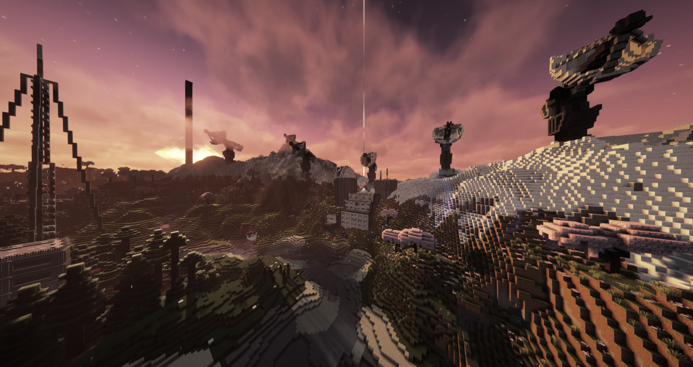<figcaption>
<em>Территория Обсерватории на закате</em>
</figcaption></figure>

### Организация «И.Н.А.»

Институт Неземных Аномалий — специализированная научно-исследовательская гильдия, официально созданная игроком <mark style="color:$primary;">**Prizrachel**</mark> <mark style="color:blue;">10 января 2026 года</mark> на пике активности метеоритных потоков. Главной задачей организации стал комплексный мониторинг неба, сбор данных о местах и времени падения осколков, оперативная помощь пострадавшему от разрушений населению, а также координация усилий для поиска инженерного решения проблемы. Ввиду смежных научных целей, организация тесно взаимодействовала и вела открытое технологическое сотрудничество с обсерваторией «Горизонт».

<figure>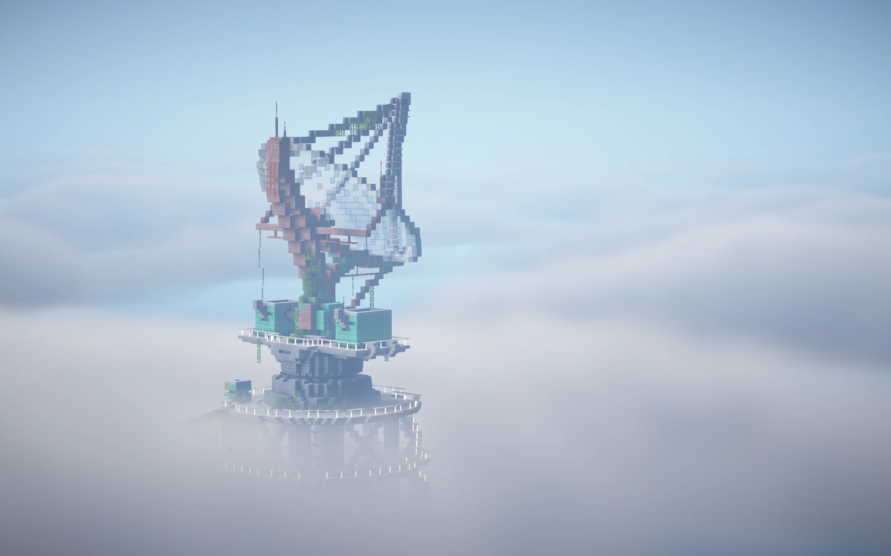<figcaption>
<em>Радиотелескоп Организации «И.Н.А.»</em>
</figcaption></figure>

### ПСГ (Пакт Свободных Городов)

Мощный союз суверенных городов, сформированный <mark style="color:blue;">16 января 2026 года</mark> по инициативе игрока <mark style="color:$primary;">**Aviator.**</mark> Организация базировалась на трёх нерушимых принципах: неприкосновенность границ, ведение честной торговли и обязательная взаимопомощь всем нуждающимся участникам договора. Пакт объединил большое количество игроков сервера, но основную роль сыграл уже на следующем сезоне.

<figure>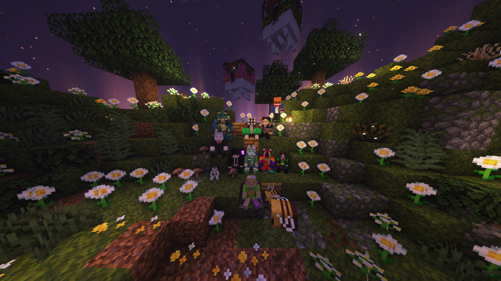<figcaption>
<em>Первые участники ПСГ</em>
</figcaption></figure>

Официальный список участников союза: <mark style="color:$primary;">**Aviator**</mark>, <mark style="color:$primary;">**Creator\_MoD**</mark>, <mark style="color:$primary;">**Unissy\_Trye**</mark>, <mark style="color:$primary;">**vatyaoo**</mark>, <mark style="color:$primary;">**zefirushka12**</mark>, <mark style="color:$primary;">**AngelDeaded**</mark>, <mark style="color:$primary;">**N3R\_VO1D**</mark>, <mark style="color:$primary;">**Zilzard**</mark>, <mark style="color:$primary;">**baron\_elfanguece**</mark>, <mark style="color:$primary;">**RU\_TiCk**</mark>, <mark style="color:$primary;">**Deskrine\_Zet\_X**</mark>, <mark style="color:$primary;">**X0miach0k**</mark>, <mark style="color:$primary;">**DeltaTraveller**</mark>, <mark style="color:$primary;">**svetoslav11**</mark>, <mark style="color:$primary;">**igroman007**</mark>, <mark style="color:$primary;">**Vzxtrot**</mark>**.**

## Ивенты

### Пляжный волейбол

<mark style="color:blue;">3 августа 2025 года</mark> в 14:00 по МСК игрок <mark style="color:$primary;">**Shm1Shm1Shm1**</mark> организовал спортивный летний мини-ивент на специально оборудованном песчаном корте. Игроки собирались командами, звали друзей и активно играли динамичные матчи как на чистый интерес, так и на внутриигровые ценности.

<figure>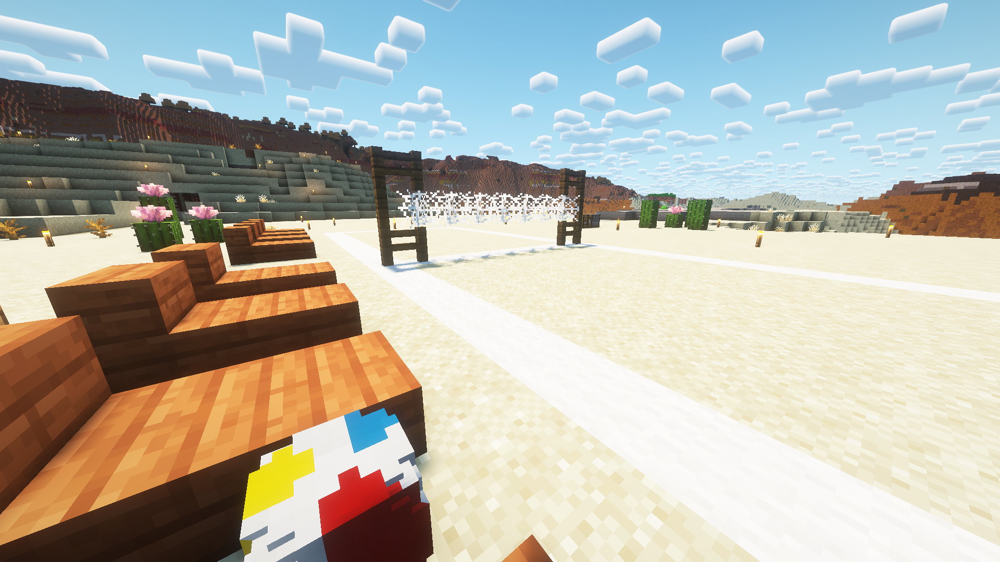<figcaption>
<em>Поле для игры в волейбол</em>
</figcaption></figure>

### Операция «Гаст-Транспорт»

<mark style="color:blue;">28 сентября</mark> <mark style="color:blue;">2025 года</mark> игрок <mark style="color:$primary;">**Infernum**</mark> провёл уникальный командный ивент, рассчитанный на 8 игроков.

Правила: До 4 команд (по 2 игрока в каждой) перемещались по арене верхом на прирученных Гастах и перетаскивали разбегающихся животных в вольеры своих баз с помощью поводков. Каждое животное приносило очки: овца цвета своей команды давала +2 поинта, овца чужого цвета +1 поинт, а коварная свинья отнимала -5 поинтов. Внутри команд роли разделялись: первый игрок летел на медленном большом гасте с двухместной лодкой, а второй — на быстром маленьком гасте с лодкой-сундуком.

<figure>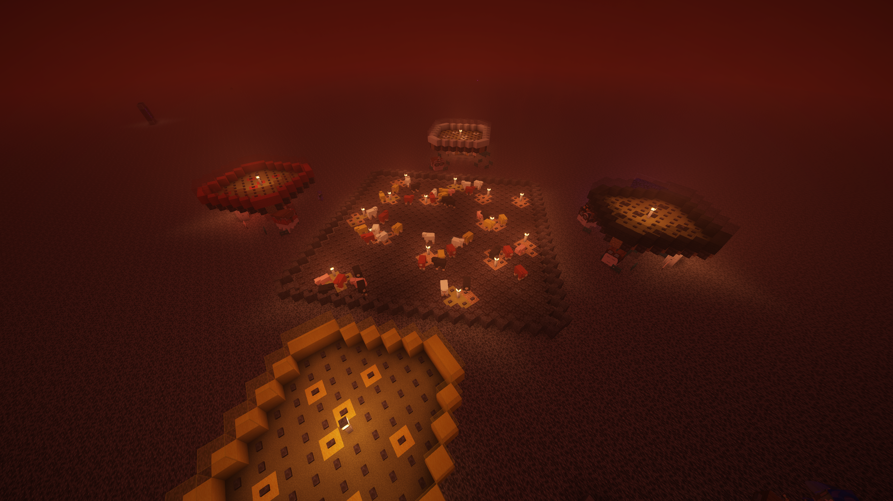<figcaption>
<em>Зона проведения ивента</em>
</figcaption></figure>

Итоги операции: 1-е место  — <mark style="color:$primary;">**kaleo00203**</mark>; 2-е место — <mark style="color:$primary;">**I\_valentain\_I**</mark>; 3-е место  — <mark style="color:$primary;">**KOTIK\_B\_CAXAPE\_**</mark>; 4-е место — <mark style="color:$primary;">**ForgeEagle**</mark>. Победители разделили между собой большой призовой фонд.

### В погоне за щебнем

<mark style="color:blue;">5 октября 2025 года</mark> в 19:00 по МСК на сервере прошёл весёлый разрушительный ивент от игрока <mark style="color:$primary;">**KOTIK\_B\_CAXAPE\_**</mark>. Организатор воссоздал на сервере 6 культовых построек из другой популярной игры. Задача участников заключалась в том, чтобы максимально эффектно и быстро взорвать эти здания любыми доступными способами. Специально для ивента все игроки снабжались арбалетами, стреляющими динамитом. Так как в таком ивенте выбрать победителя не представляется возможным, в конце была проведена жеребьевка, с помощью которой были выбраны игроки, получившие уникальное зачарование [«Взрывной заряд»](../o-proekte/osobennosti/unikalnye-zacharovaniya.md#vzryvnoi-zaryad).

<figure><figcaption>
<em>Скриншот сохранившийся с ивента</em>
</figcaption></figure>

&#x20;

### Настолочки в Червонном замке

<mark style="color:blue;">26 октября 2025 года</mark> игроки <mark style="color:$primary;">**PURRCHIN**</mark> и <mark style="color:$primary;">**I\_valentain\_I**</mark> провели ивент по настольным играм. Специально для проведения мероприятия великолепная библиотека Червонного замка была временно переоборудована: установлены три стола для игры в шашки и шахматы, а также три стола для различных вариаций карточных игр, домино и костей. Все участники получили памятные сувениры, а игроки, одержавшие за время ивента две победы и более, были награждены богатыми эксклюзивными подарками.

<figure>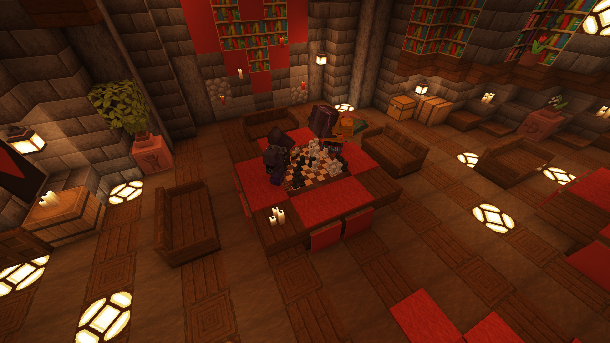<figcaption>
<em>Игрок <mark style="color:$primary;"><strong>Infernum</strong></mark> показывает свое мастерство в шахматах</em>
</figcaption></figure>

<figure>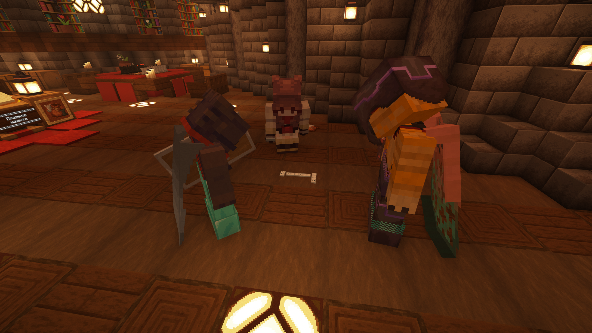<figcaption>
<em>Игроки увлечены домино</em>
</figcaption></figure>

### Конкурс машин

<mark style="color:blue;">С 14 по 28 декабря 2025 года</mark> глава спавна <mark style="color:$primary;">**Uwka**</mark> провела творческий конкурс. Участникам требовалось построить свою декоративную машинку прямо на спавне в специально отведенном месте и выложить её фотографию в специальный канал. Победители определялись по максимальному количеству лайков-реакций в виде сердечка.

<figure>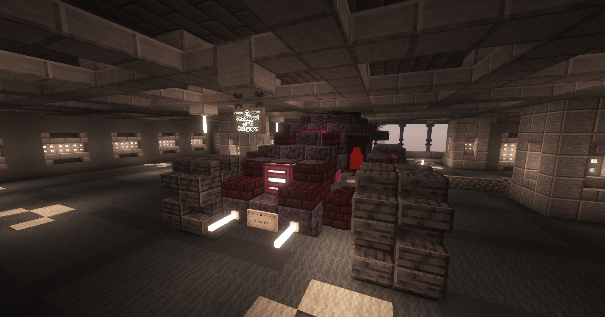<figcaption></figcaption></figure>

1-е место — <mark style="color:$primary;">**Aviator**</mark>. 2-е место — <mark style="color:$primary;">**Creator\_MoD\_**</mark>. 3-е место — разделили <mark style="color:$primary;">**Cultyapa**</mark> и <mark style="color:$primary;">**Uwka**</mark>.

### Новогодний интерактив от vatyaoo

<mark style="color:blue;">1 января 2026 года</mark> игроки <mark style="color:$primary;">**vatyaoo**</mark> и <mark style="color:$primary;">**baron\_elfanguece**</mark> провели большой праздничный новогодний ивент. Этот день стал крайне важным рубежом для самой <mark style="color:$primary;">**vatyaoo**</mark>, так как помог ей социализироваться на сервере и ближе познакомиться с игровым комьюнити сервера.

Программа интерактива состояла из четырёх увлекательных этапов:

Ламповый сбор: Игроки уютно устроились у праздничного костра, весело болтали по душам и пили новогоднюю выпивку.

Арбалетный тир: Соревнование на меткость, где участники стреляли из арбалетов по мишеням. При точном попадании загоралась редстоун-лампочка, а стрелку выдавалась ценная награда.

Психологический «Бункер»: Творческая ролевая игра, которую игроки так и не успели закончить из-за внезапного вмешательства администрации. Администратор <mark style="color:$primary;">**\_Foxya\_**</mark> устроил на месте проведения настоящий весёлый хаос: сначала заспавнил гигантского аксолотля, а затем призвал на головы участников кучу вихрей!

<figure>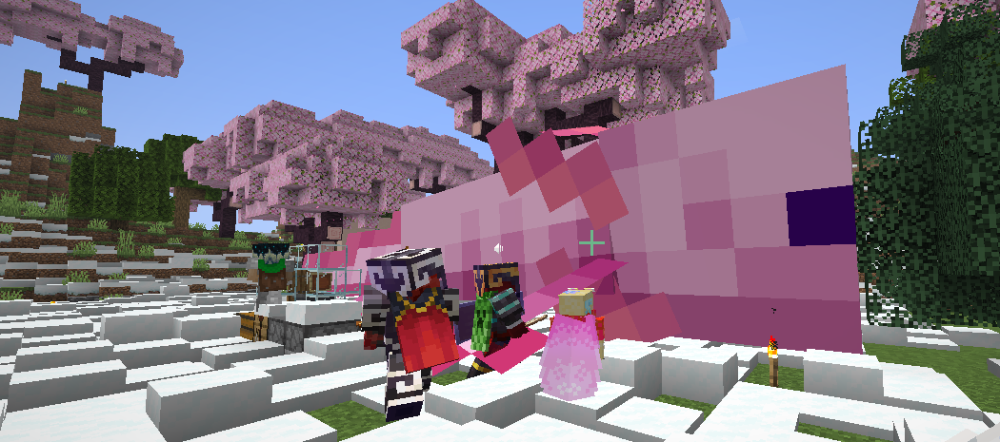<figcaption>
<em>Игроки возле гигансткого аксолотля</em>
</figcaption></figure>

Арена гладиаторов: После устроенного админом погрома выжившая половина игроков дружно отправилась на боевую арену, где сплочённо сражалась с огромным количеством опасных мобов и сильным боссом.

<figure>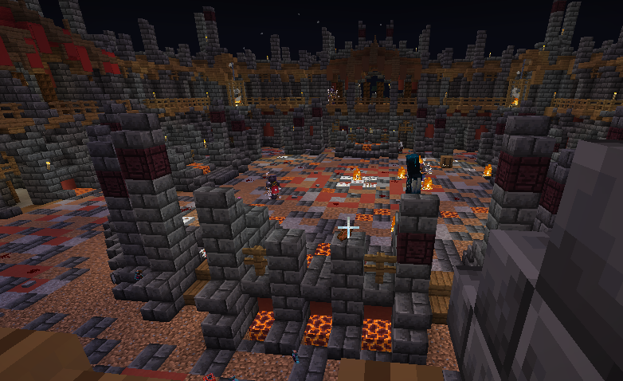<figcaption>
<em>Битва на арене</em>
</figcaption></figure>

### «Поиск Элитр»

<mark style="color:blue;">4 января 2026 года</mark> игрок <mark style="color:$primary;">**Aviator**</mark> запустил масштабный поисковый квест по всей карте. Он надёжно спрятал в крупных постройках игроков и в местах проведения прошлых ивентов 10 шалкеров с элитрами, тотемами и изумрудами. Шалкеры делились на 4 уровня сложности: Лайт (3 шт.), Медиум (3 шт.), Хард (3 шт.) и Импоссибл (1 шт.). Застрявшие игроки могли официально выкупить точные координаты нужного ящика за Алмазные Блоки. Квест вызвал огромный ажиотаж, и в течение суток искатели успешно вскрыли все тайники.

Результаты поисков:

Лайт-боксы: Два ящика нашел <mark style="color:$primary;">**\_Exeets\_**</mark> (хаб Края и спавн верхнего мира), один забрал **X0miach0k** (на рынке в хабе незера).

Медиум-боксы: <mark style="color:$primary;">**Deskrine\_Zet\_X**</mark> ( на базе <mark style="color:$primary;">**Zilzard**</mark>), <mark style="color:$primary;">**\_Exeets\_**</mark>(за автопечкой в Фонде SCP), <mark style="color:$primary;">**X0miach0k**</mark> (в маяке возле Мандоры).

Хард-боксы: <mark style="color:$primary;">**Cultyapa**</mark> (храм Культа Кувшина в джунглях), <mark style="color:$primary;">**kipolik1111**</mark> (в домике Санты), <mark style="color:$primary;">**\_Exeets\_**</mark> (в доме _<mark style="color:$primary;">**Bababoi97**</mark>_ на территории Республики Мандора).

Импоссибл-бокс: Главный приз за всю игру забрал <mark style="color:$primary;">**kipolik1111**</mark>, обнаружив сложнейший тайник в одной из пятиэтажек на базе <mark style="color:$primary;">**Unissy\_Trye**</mark>.

### Праздник песен!

<mark style="color:blue;">20 января 2026 года</mark> на сервере отгремело яркое и незабываемое событие — Праздник песен, организованный игроком <mark style="color:$primary;">**Creator\_MoD\_**</mark>. Все участники собрались в прекрасном саду <mark style="color:$primary;">**zefirushka12**</mark> в 18:00 по МСК, чтобы наполнить воздух красивыми мелодиями и колоссальной энергией. Игроки не побоялись публики, активно выступали на сцене и пели любимые песни вживую.

<figure>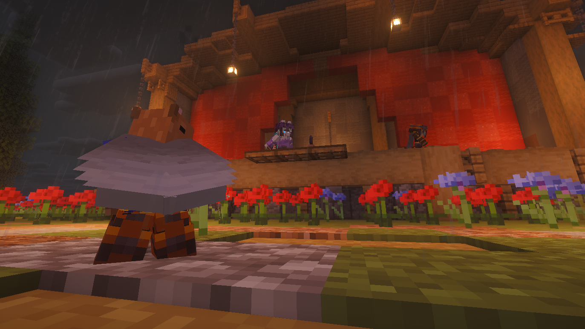<figcaption>
<em>Выступление игрока <mark style="color:$primary;"><strong>vatyaoo</strong></mark></em> 
</figcaption></figure>

По результатам выступлений и количеству исполненных треков места распределились так:

1-е место — <mark style="color:$primary;">**vatyaoo**</mark> (исполнила рекордные 11 песен, обогнав абсолютно всех участников!).

2-е место — <mark style="color:$primary;">**Creator\_MoD\_**</mark> (занял почётную позицию, исполнив 9 песен).

3-е место — разделили <mark style="color:$primary;">**Aviator,**</mark> <mark style="color:$primary;">**Cultyapa**</mark> и <mark style="color:$primary;">**AngelDeaded**</mark> (исполнили по 2 песни).

Отдельную порцию бурных оваций за смелость получили игроки <mark style="color:$primary;">**egg19275808**</mark>_,_ <mark style="color:$primary;">**baron\_elfanguece**</mark> _и_ <mark style="color:$primary;">**svetoslav11**</mark>, которые также вышли к микрофону и подарили массу эмоций.

<figure><figcaption>
<em>Игроки пришедшие на ивент</em>
</figcaption></figure>

### Чаепитие в саду

<mark style="color:blue;">24 января 2026 года</mark> игроки <mark style="color:$primary;">**Deskrine\_Zet\_X**</mark> и <mark style="color:$primary;">**zefirushka12**</mark> провели уютный ивент «Чаепитие в саду». Игроки со всего сервера собирались на личной красивой территории этих участников и потрясающе провели время за тёплыми рассказами, локальными мемами, весёлыми приколами и употреблением виртуального алкоголя.

<figure>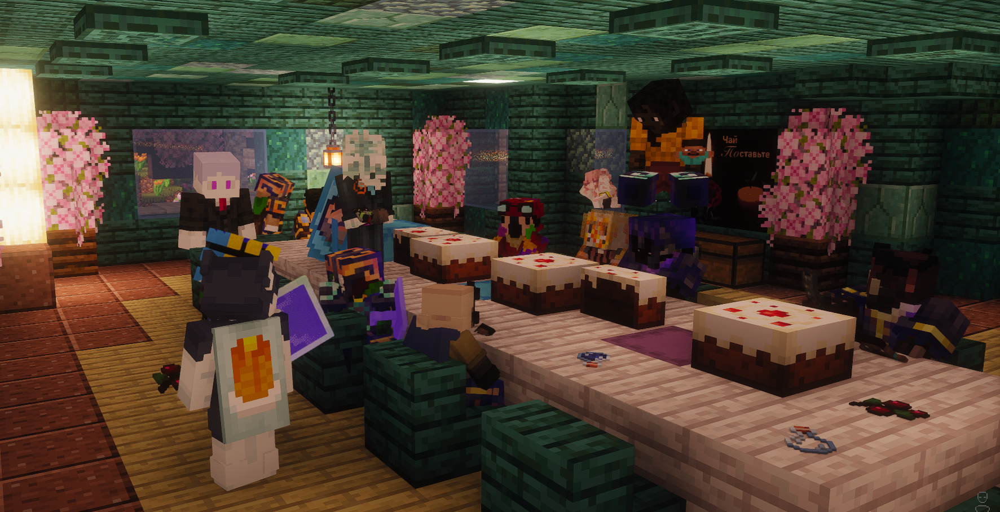<figcaption></figcaption></figure>

<figure>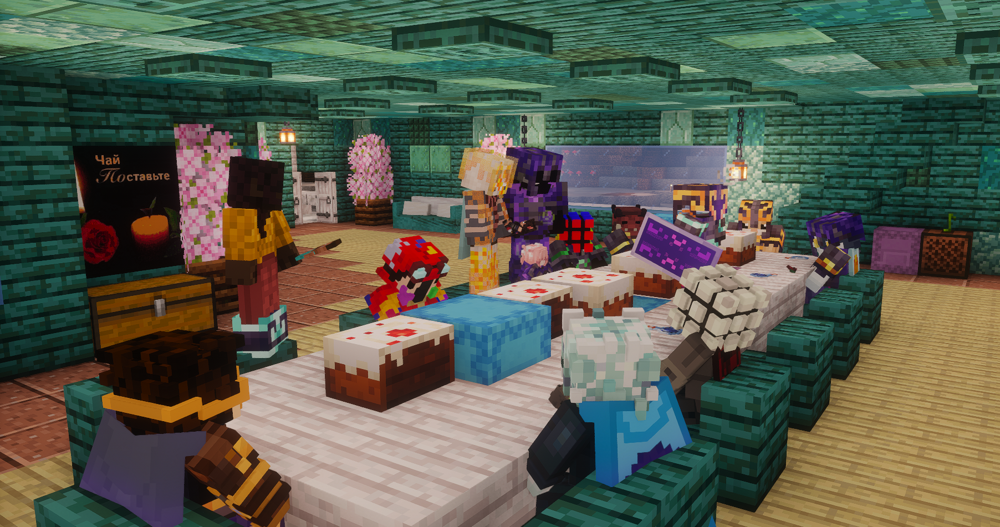<figcaption>
<em>Последняя крупная встреча игроков перед окончанием сезона</em>
</figcaption></figure>
