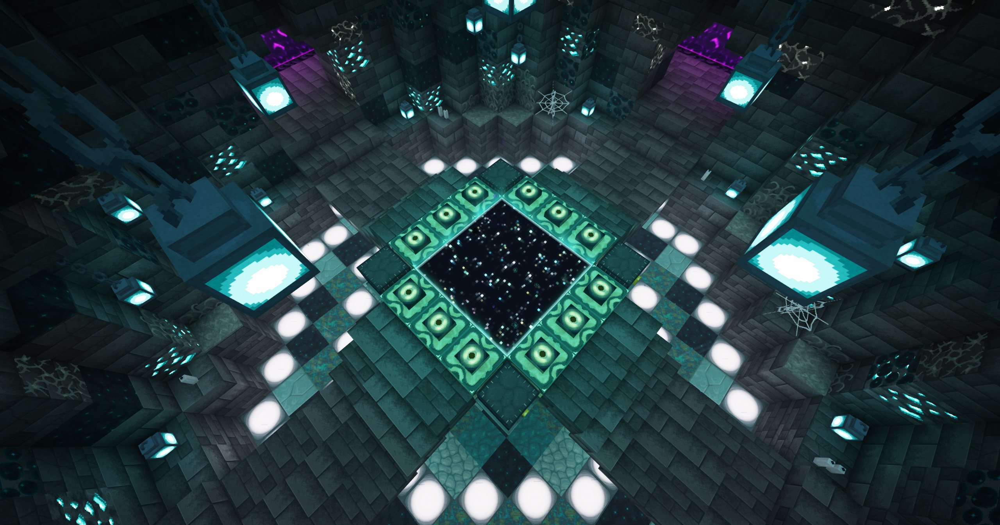
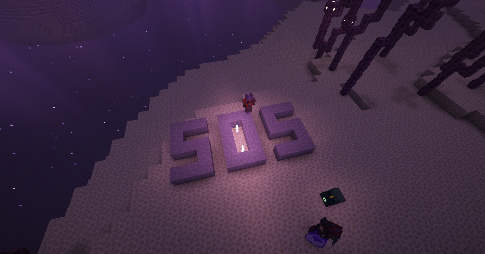
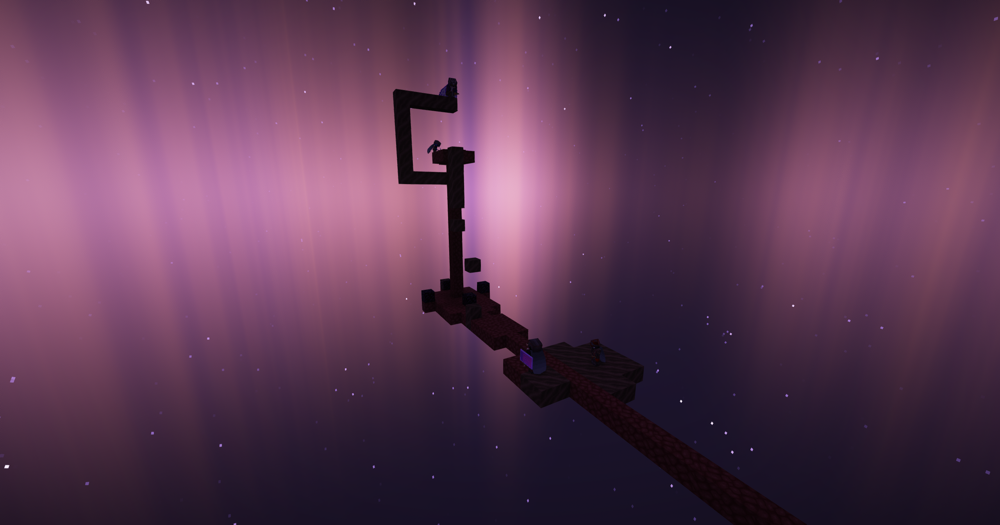
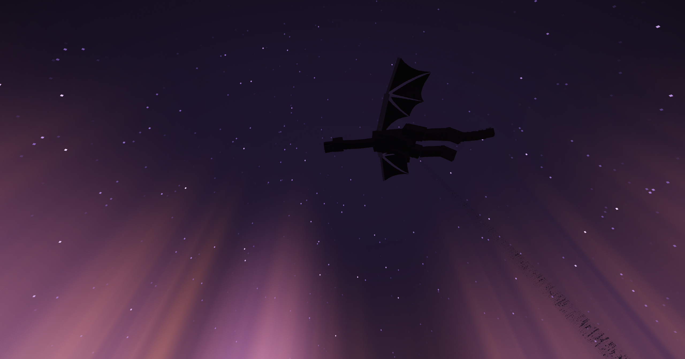
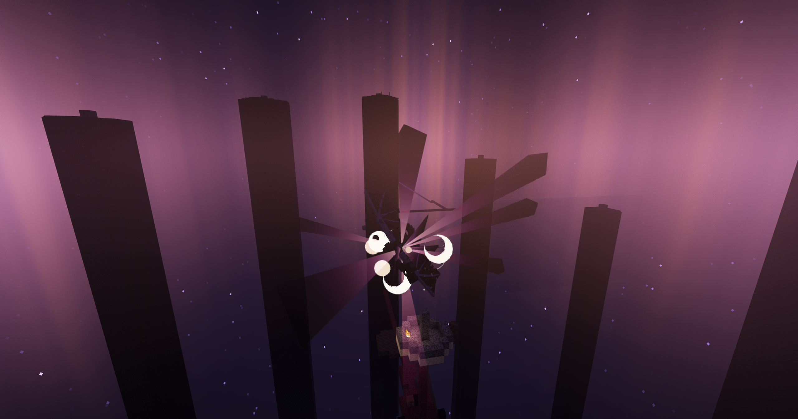

# «Остров, ушедший в пустоту»

### Начало истории

Это событие произошло <mark style="color:blue;">2 августа 2025</mark> года, когда на сервере состоялось долгожданное открытие Края. Вместо привычной битвы с боссом оно превратилось в настоящую игру на выживание!

<figure><figcaption>
<em>Общественный портал, задекорированный <mark style="color:$primary;"><strong>PURRCHIN</strong></mark></em>
</figcaption></figure>

Шагнув в портал, игроки замерли в недоумении: в измерении не было ни Дракона, ни обратного пути домой. Вместо этого центральный остров Края начал буквально на глазах исчезать по кусочкам. Поняв, что оставаться на месте — значит погибнуть, первопроходцы начали в панике спасаться бегством в сторону дальних островов.

Каждый выживал как мог: одни спешно строились блоками над пропастью, другие использовали редстоун-машины для генерации водных дорог, а самые хитрые и подготовленные заранее влетели в Край на прирученных гастах и спокойно переждали катастрофу в воздухе.&#x20;

Как только центральный остров окончательно растворился в пустоте, в игровом чате высветилось зловещее объявление от администратора <mark style="color:$primary;">**\_Foxya\_**</mark>: «ДОБРО ПОЖАЛОВАТЬ В МАСТЕРА МЕЧА ОНЛАЙН!»

Пути назад больше не было — все вошедшие оказались заперты в измерении Края.

### Гнетущая атмосфера и плачущие ангелы

Поначалу запертые игроки не сильно унывали, ведь перед ними открылись бескрайние просторы с городами Края и заветными элитрами. Однако они даже не догадывались, какие ужасы приготовило для них изменённое измерение.

Во время обыска структур начали происходить пугающие аномалии: \
• На игроков периодически навешивался долгий эффект голода;\
• Эндермены полностью исчезли с островов;\
• Каждый, кто осмеливался взять в руку тотем бессмертия, внезапно мог быть подброшен вверх мощным эффектом левитации;

Но самой смертоносной угрозой стали <mark style="color:$danger;">**плачущие ангелы**</mark>, случайно появляющиеся рядом с игроками. Это были абсолютно бессмертные версии визер-скелетов с колоссальным уроном, способные с одного удара отправить на тот свет даже тяжело экипированного игрока.&#x20;

<figure><figcaption>
<em>Сохранившийся снимок плачущего ангела на корабле</em>
</figcaption></figure>

Атмосфера была невероятно гнетущей и напряжённой: каждая остановка в городе Края могла стать последней.

<figure><figcaption>
<em>Сигнал о помощи от <mark style="color:$primary;"><strong>__MrSam__</strong></mark></em>
</figcaption></figure>

### Загадка исчезнувшего портала

Выбраться живыми из ловушки казалось невозможным. Часть игроков смирилась со своей участью и просто прыгала в пустоту, выбирая смерть ради возрождения в Верхнем мире.\
Но нашлись и те, кто отказался сдаваться без боя — они твёрдо решили разгадать тайну Края, вернуть портал и одолеть дракона.

Администратор оставил в чате подсказку: «Посмотрите с помощью команды [/co](../../o-proekte/vasha-podderzhka/rol-yagoda.md#dostupnye-komandy), где я сломал портал».

Приняв вызов, игрок <mark style="color:$primary;">**Infernum**</mark> вернулся в Верхний мир через смерть, забрал с собой кристаллы Края для возрождения дракона и снова прыгнул в ловушку. Скооперировавшись с отважной командой в лице <mark style="color:$primary;">**I\_valentain\_I, PURRCHIN**</mark> и <mark style="color:$primary;">**\_\_MrSam\_\_**</mark>, они выдвинулись к координатам уничтоженного центрального острова.

<figure><figcaption>
<em>Работа над восстановлением портала</em>
</figcaption></figure>

С помощью логики и проверок игроки с точностью до блока вычислили высоту и место, где изначально стоял портал. Как только они установили кристаллы, поставленные на обсидиановые блоки, Край содрогнулся: обсидиановые столбы начали регенерировать прямо из пустоты, в центре появилась рамка портала из коренной породы, а в небесах с оглушительным рёвом возродился дракон Края!

<figure><figcaption>
<em>Дракон, летающий над островом</em>
</figcaption></figure>

Быстро уничтожив исцеляющие кристаллы на вершинах столбов, сплочённый отряд бросился в атаку. Дракон был повержен, а портал домой окончательно открылся, ознаменовав спасение всех застрявших. Игроки, одолевшие дракона, триумфально объявили в общий чат о том, что Край наконец свободен.

<figure><figcaption>
<em>Победа над драконом</em>
</figcaption></figure>

Это событие стало самым необычным, сложным и атмосферным открытием Края за всю историю проекта. Несмотря на то, что изначально игроки ждали классическую битву, этот масштабный интерактив от администрации навсегда врезался в память комьюнити, по праву став самым ярким событием 7 сезона!
