# Легенды проекта

<h2 align="center"><mark style="color:orange;"><strong>miniking1000</strong></mark></h2>

<figure>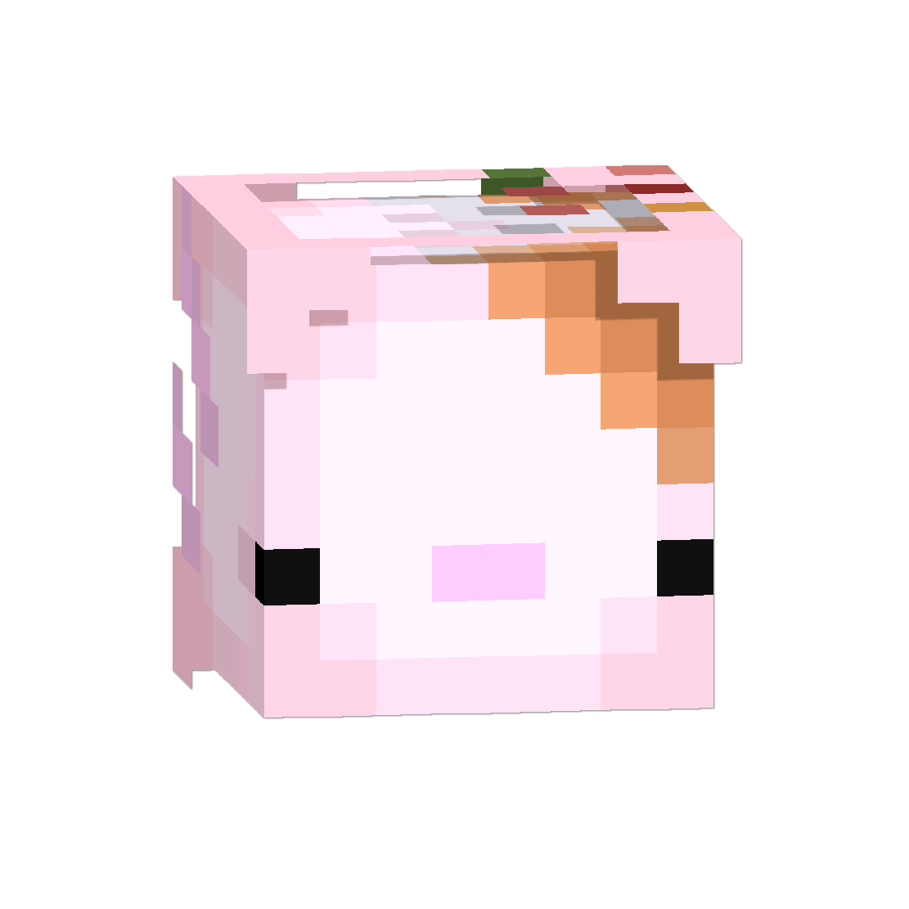<figcaption>
Голова игрока
</figcaption></figure>

**Администрация выражает благодарность игроку&#x20;**<mark style="color:$primary;">**miniking1000**</mark>**&#x20;за..**

Огромный вклад в создание плагинов и дата-паков, а так же за проведение ивентов и участие в жизни сервера!

<h2 align="center"><mark style="color:orange;"><strong>Darcnes45</strong></mark></h2>

<figure><figcaption>
Голова игрока
</figcaption></figure>

**Администрация выражает благодарность игроку&#x20;**<mark style="color:$primary;">**Darcnes45**</mark>**&#x20;за..**

Большое количество времени, проведённого на проекте, воплощение собственных постpоек, а так же за активное участие в жизни сервера!

<h2 align="center"><mark style="color:orange;"><strong>vatyaoo</strong></mark></h2>

<figure><figcaption>
Голова игрока
</figcaption></figure>

**Администрация выражает благодарность игроку&#x20;**<mark style="color:$primary;">**vatyaoo**</mark>**&#x20;за..**

Воплощение собственных постpоек, самый крутой рисунок обложки сервера, а так же за активное участие в жизни проекта!

<h2 align="center"><mark style="color:orange;"><strong>Waldemarrin</strong></mark></h2>

<figure>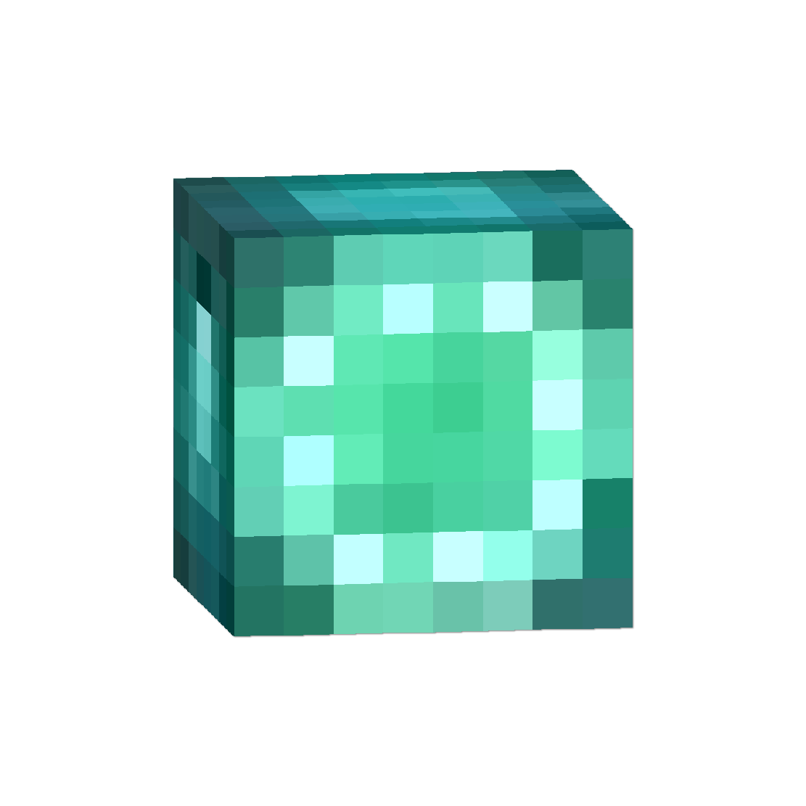<figcaption>
Голова игрока
</figcaption></figure>

**Администрация выражает благодарность игроку&#x20;**<mark style="color:$primary;">**Waldemarrin**</mark>**&#x20;за..**

Большое количество времени, проведённого на проекте, организацию ивентов, воплощение собственных постpоек, а так же за активное участие в жизни сервера!

<h2 align="center"><mark style="color:orange;"><strong>__nikto__</strong></mark></h2>

<figure>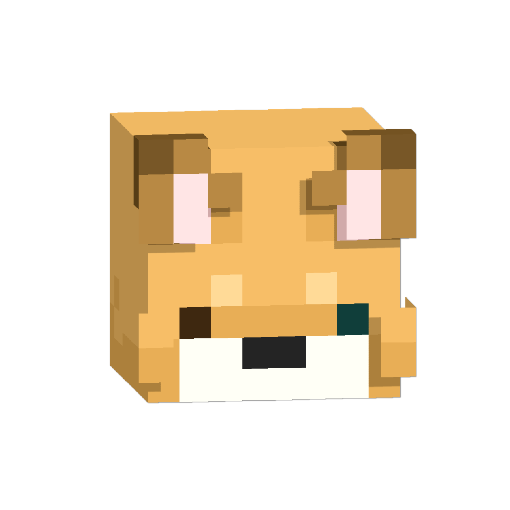<figcaption>
Голова игрока
</figcaption></figure>

**Администрация выражает благодарность игроку&#x20;**<mark style="color:$primary;">**\_\_nikto\_\_**</mark>**&#x20;за..**

Большое количество времени, проведённого на проекте, а так же за активное участие в жизни сервера!

<h2 align="center"><mark style="color:orange;"><strong>__TopTuk__</strong></mark></h2>

<figure><figcaption>
Голова игрока
</figcaption></figure>

**Администрация выражает благодарность игроку&#x20;**<mark style="color:$primary;">**\_\_TopTuk\_\_**</mark>**&#x20;за..**

Проведение ивентов, воплощение собственных постpоек, а так же за активное участие в жизни сервера!

<h2 align="center"><mark style="color:orange;"><strong>_Exeets_</strong></mark></h2>

<figure>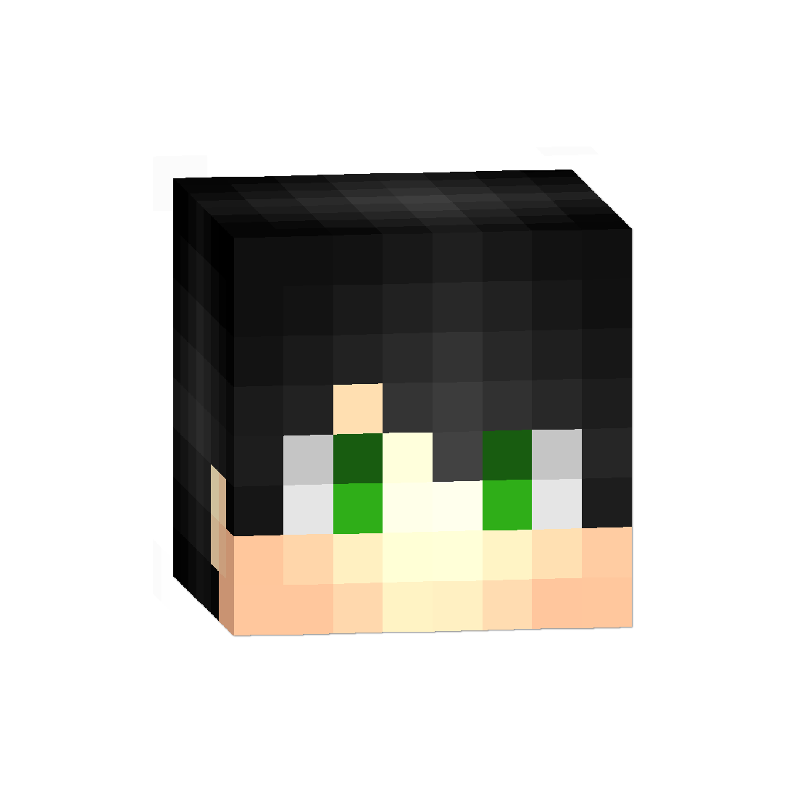<figcaption>
Голова игрока
</figcaption></figure>

**Администрация выражает благодарность игроку&#x20;**<mark style="color:$primary;">**\_Exeets\_**</mark>**&#x20;за..**

Большое количество времени, проведённого на проекте, а так же за активное участие в жизни сервера!

<h2 align="center"><mark style="color:orange;"><strong>Shaxta</strong></mark></h2>

<figure><figcaption>
Голова игрока
</figcaption></figure>

**Администрация выражает благодарность игроку&#x20;**<mark style="color:$primary;">**Shaxta**</mark>**&#x20;за..**

Большое количество времени, проведённого на проекте, воплощение собственных постpоек, а так же за активное участие в жизни сервера!

<h2 align="center"><mark style="color:orange;"><strong>A300386i</strong></mark></h2>

<figure>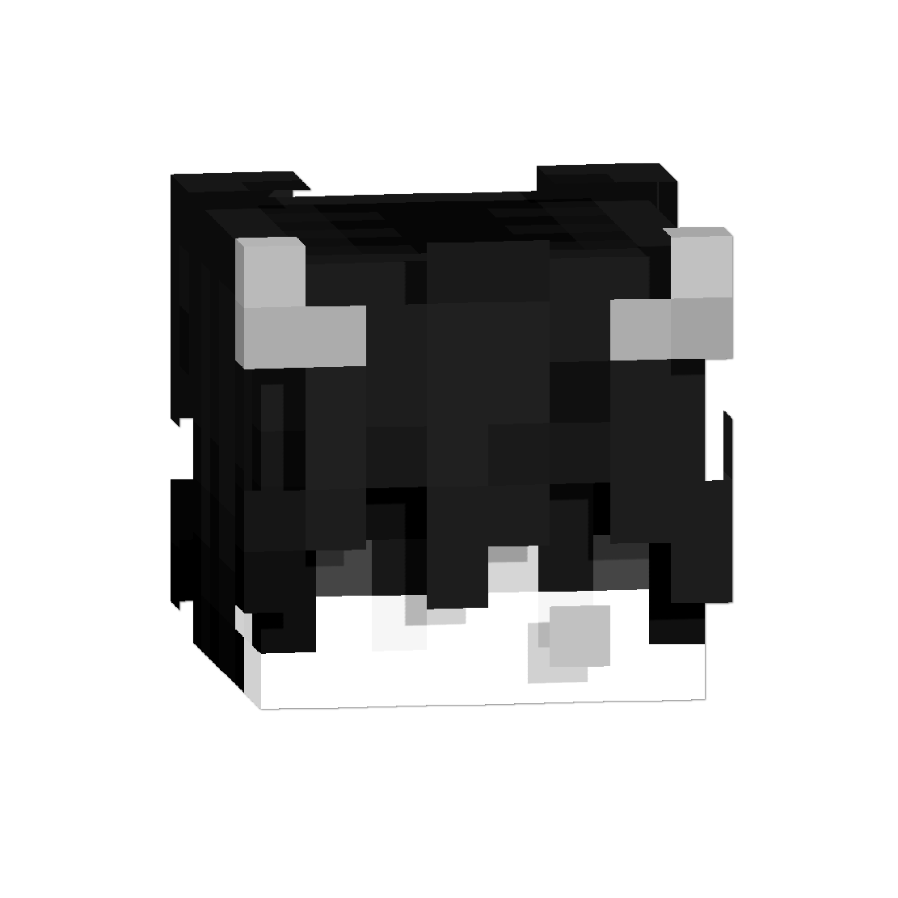<figcaption>
Голова игрока
</figcaption></figure>

**Администрация выражает благодарность игроку&#x20;**<mark style="color:$primary;">**A300386i**</mark>**&#x20;за..**

Большое количество времени, проведённого на проекте, а так же за активное участие в жизни сервера!

<h2 align="center"><mark style="color:orange;"><strong>PURRCHIN</strong></mark></h2>

<figure><figcaption>
Голова игрока
</figcaption></figure>

**Администрация выражает благодарность игроку&#x20;**<mark style="color:$primary;">**PURRCHIN**</mark>**&#x20;за..**

Большое количество времени, проведённого на проекте, организацию ивентов, воплощение собственных постpоек, а так же за активное участие в жизни сервера!

<h2 align="center"><mark style="color:orange;"><strong>I_valentain_I</strong></mark></h2>

<figure><figcaption>
Голова игрока
</figcaption></figure>

**Администрация выражает благодарность игроку&#x20;**<mark style="color:$primary;">**I\_valentain\_I**</mark>**&#x20;за..**

Невероятно большое количество времени, проведённого на проекте, организацию ивентов, воплощение собственных постpоек, а так же за активное участие в жизни сервера!

<h2 align="center"><mark style="color:orange;"><strong>KOTIK_B_CAXARE_</strong></mark></h2>

<figure><figcaption>
Голова игрока
</figcaption></figure>

**Администрация выражает благодарность игроку&#x20;**<mark style="color:$primary;">**KOTIK\_B\_CAXARE\_**</mark>**&#x20;за..**

Большое количество времени, проведённого на проекте, организацию ивентов, воплощение собственных постpоек, а так же за активное участие в жизни сервера!

<h2 align="center"><mark style="color:orange;"><strong>Jodaell_</strong></mark></h2>

<figure><figcaption>
Голова игрока
</figcaption></figure>

**Администрация выражает благодарность игроку&#x20;**<mark style="color:$primary;">**Jodaell\_**</mark>**&#x20;за..**

Большое количество времени, проведённого на проекте, воплощение собственных постpоек, а так же за активное участие в жизни сервера!

<h2 align="center"><mark style="color:orange;"><strong>Drendey</strong></mark></h2>

<figure>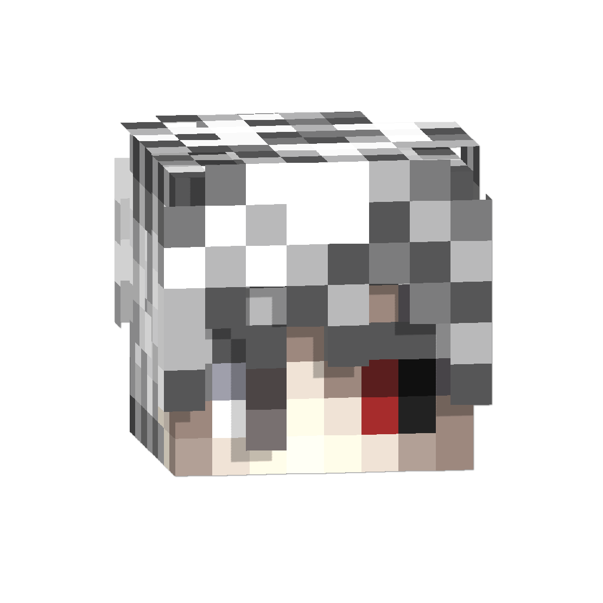<figcaption>
Голова игрока
</figcaption></figure>

**Администрация выражает благодарность игроку&#x20;**<mark style="color:$primary;">**Drendey**</mark>**&#x20;за..**

Большое количество времени, проведённого на проекте, организацию ивентов, а так же за активное участие в жизни сервера!

<h2 align="center"><mark style="color:orange;"><strong>lekys1t</strong></mark></h2>

<figure>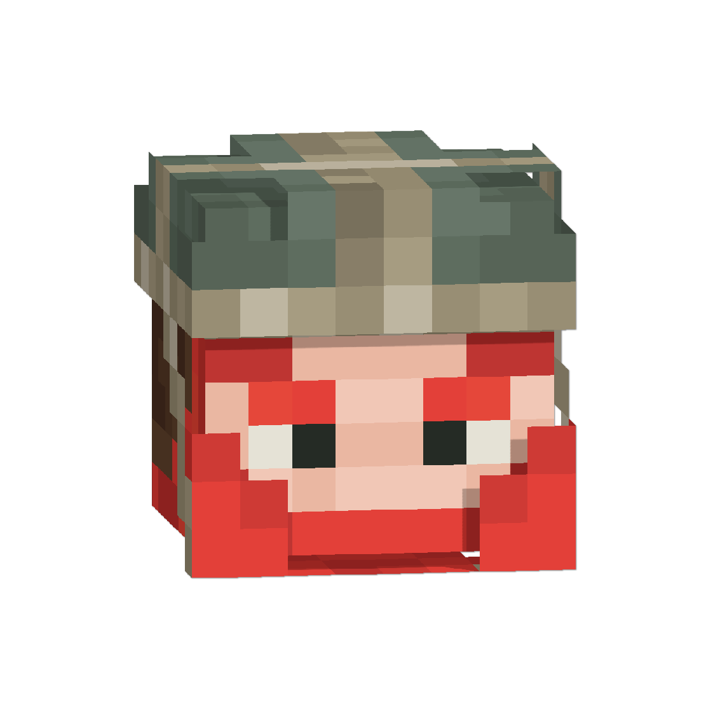<figcaption>
Голова игрока
</figcaption></figure>

**Администрация выражает благодарность игроку&#x20;**<mark style="color:$primary;">**lekys1t**</mark>**&#x20;за..**

Большое количество времени, проведённого на проекте, воплощение собственных постpоек, а так же за активное участие в жизни сервера!

<h2 align="center"><mark style="color:orange;"><strong>rex2207</strong></mark></h2>

<figure>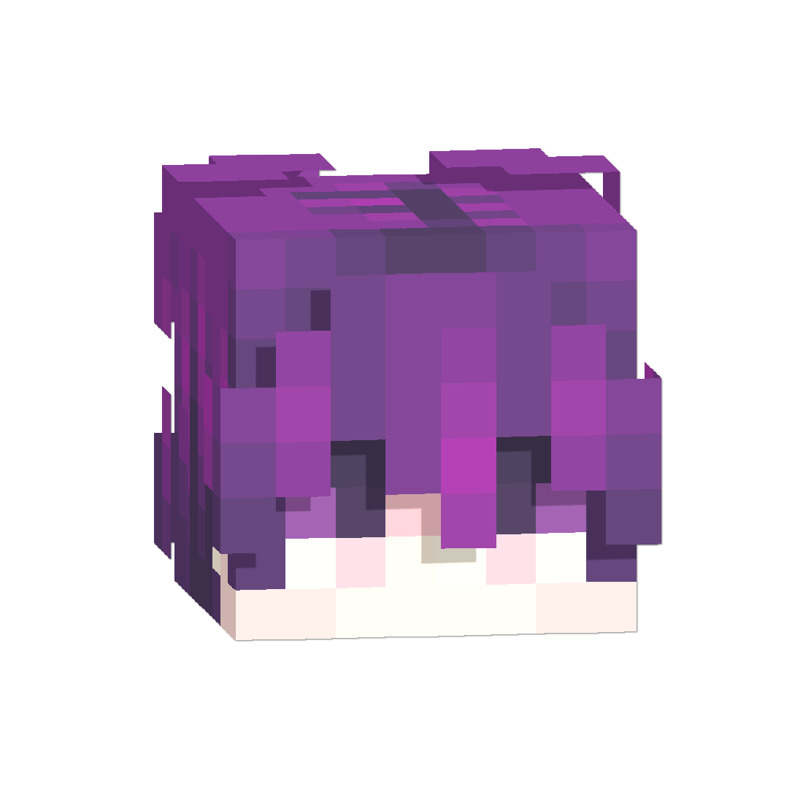<figcaption>
Голова игрока
</figcaption></figure>

**Администрация проекта выражает благодарность игроку&#x20;**<mark style="color:$primary;">**rex2207**</mark>**&#x20;за..**

Большое количество времени, проведённого на проекте, воплощение собственных постpоек, а так же за активное участие в жизни сервера!

<h2 align="center"><mark style="color:orange;"><strong>Rory_Williams</strong></mark></h2>

<figure>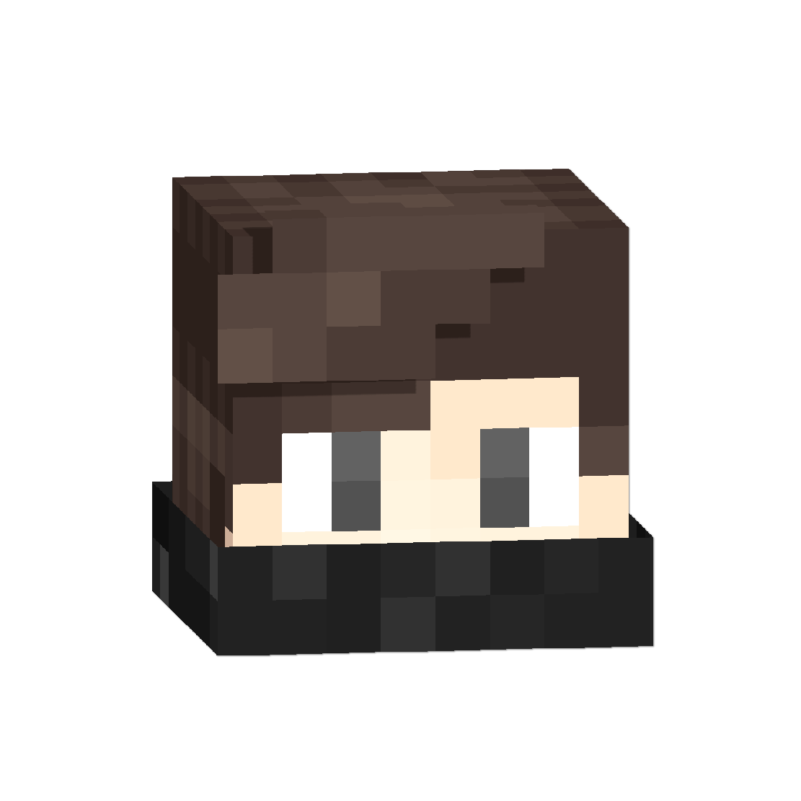<figcaption>
Голова игрока
</figcaption></figure>

**Администрация выражает благодарность игроку&#x20;**<mark style="color:$primary;">**Rory\_Williams**</mark>**&#x20;за..**

Большое количество времени, проведённого на проекте, организацию ивентов, а так же за активное участие в жизни сервера!

<h2 align="center"><mark style="color:orange;"><strong>Aviator</strong></mark></h2>

<figure><figcaption>
Голова игрока
</figcaption></figure>

**Администрация выражает благодарность игроку&#x20;**<mark style="color:$primary;">**Aviator**</mark>**&#x20;за..**

Организацию ивентов и воплощение собственных построек, а так же за активное участие в жизни сервера!

<h2 align="center"><mark style="color:orange;"><strong>Schmierrohrlinge</strong></mark></h2>

<figure>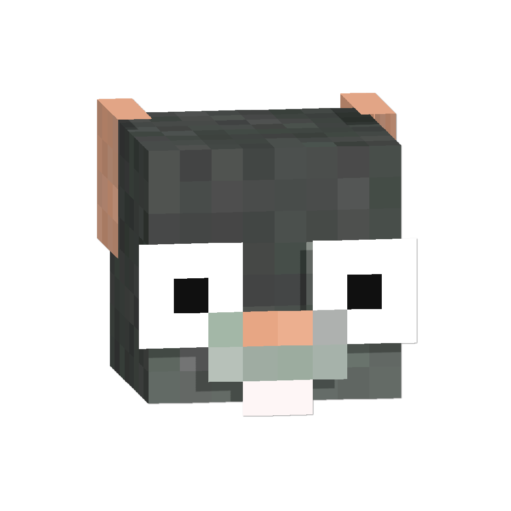<figcaption>
Голова игрока
</figcaption></figure>

**Администрация выражает благодарность игроку&#x20;**<mark style="color:$primary;">**Schmierrohrlinge**</mark>**&#x20;за..**

Большое количество времени, проведённого на проекте, воплощение собственных постpоек, установление алмазных рекордов, а так же за активное участие в жизни сервера!

<h2 align="center"><mark style="color:orange;"><strong>VinPix</strong></mark></h2>

<figure>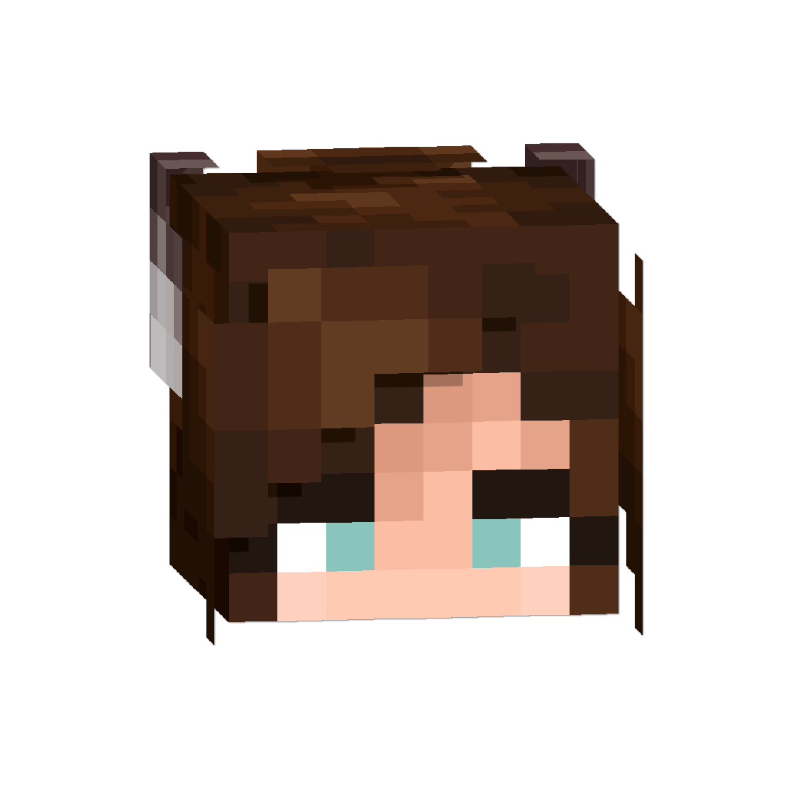<figcaption>
Голова игрока
</figcaption></figure>

**Администрация выражает благодарность игроку&#x20;**<mark style="color:$primary;">**VinPix**</mark>**&#x20;за..**

Большое количество времени, проведённого на проекте, воплощение собственных постpоек, а так же за активное участие в жизни сервера!

<h2 align="center"><mark style="color:orange;"><strong>Cultyapa</strong></mark></h2>

<figure>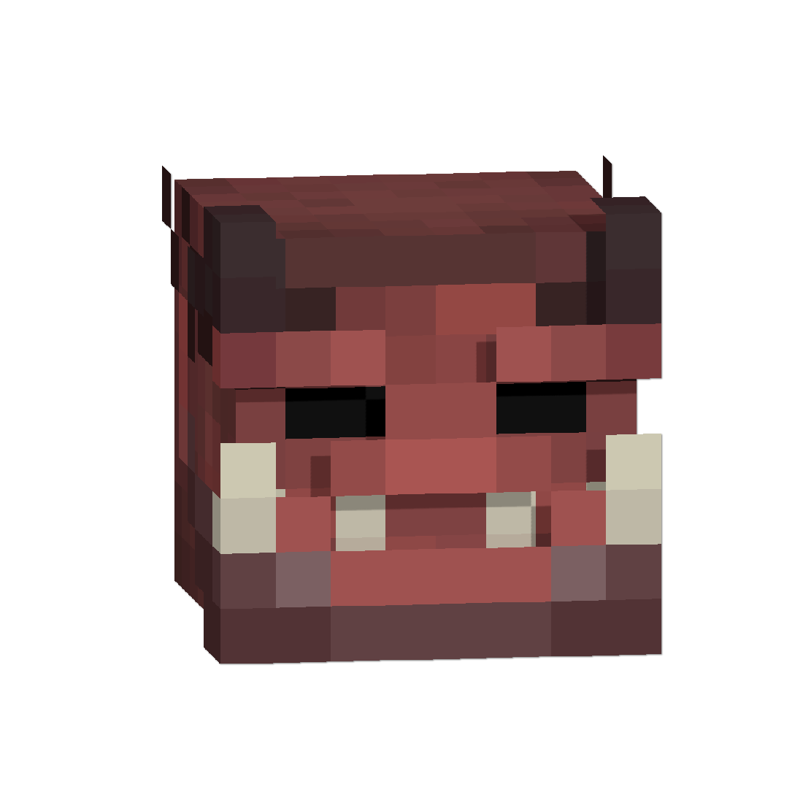<figcaption>
Голова игрока
</figcaption></figure>

**Администрация выражает благодарность игроку&#x20;**<mark style="color:$primary;">**Cultyapa**</mark>**&#x20;за..**

Большое количество времени, проведённого на проекте, организацию ивентов, воплощение собственных постpоек, а так же за активное участие в жизни сервера!

<h2 align="center"><mark style="color:orange;"><strong>Infernum</strong></mark></h2>

<figure>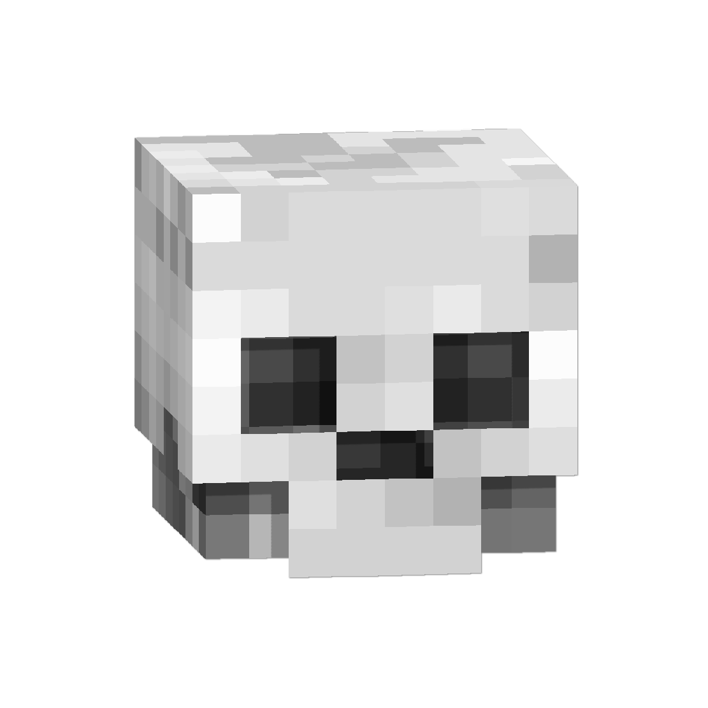<figcaption>
Голова игрока
</figcaption></figure>

**Администрация выражает благодарность игроку&#x20;**<mark style="color:$primary;">**Infernum**</mark>**&#x20;за..**

Большое количество времени, проведённого на проекте, организацию ивентов, воплощение собственных постpоек, а так же за активное участие в жизни сервера!

