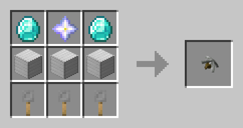

# Крюк-хвататель

<figure><figcaption>
<em>Крафт предмета</em>
</figcaption></figure>


Крюк может красть как игроков, так и мобов. \
Для этого используйте <mark style="color:$tint;">**ПКМ**</mark> по мобу или игроку, чтобы забрать его. \
Чтобы поставить игрока или моба на землю, используйте <mark style="color:$tint;">**Shift**</mark>**.**

