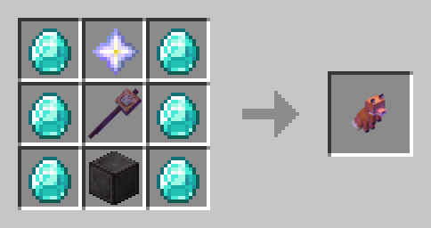

# Лисохваталка

<figure><figcaption>
<em>Крафт предмета</em>
</figcaption></figure>


При использовании Shift и ПКМ можно забирать и ставить блоки. Взятый блок остаётся в памяти хваталки до его установки!

