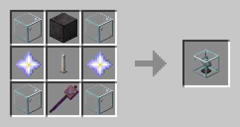

# Ядро перерождения

<figure><figcaption>
<em>Крафт предмета</em>
</figcaption></figure>


Для того чтобы стать [<mark style="color:$primary;">**гибридом**</mark>](../osobennosti/rasy.md) нужно поместить в ядро кровь недостающей для синтеза расы, используя ПКМ с ядром в руке. После человек, который хочет перевоплотиться в гибрида, должен использовать ядро с кровью на себе, нажав ПКМ с ним в руке. Сам игрок также обязан иметь отличную от первого игрока расу для синтеза.

Чтобы вылить кровь из ядра, нужно поместить его в верстак или окно крафта в инвентаре!

