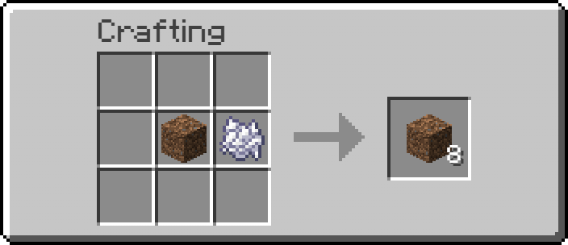
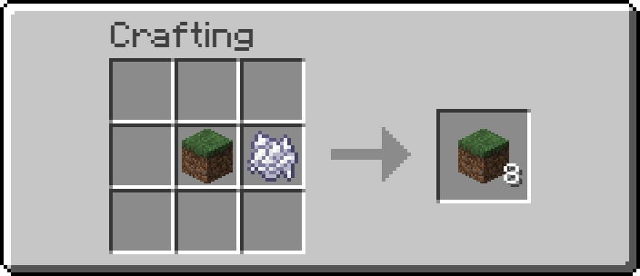
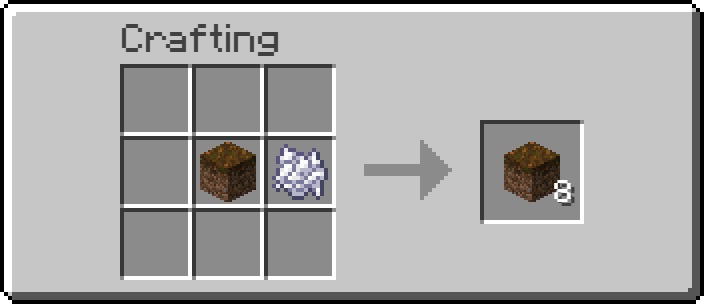
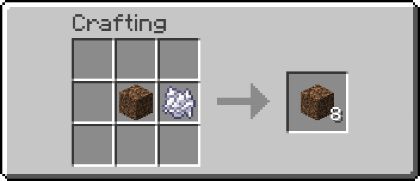

# Земля

<figure><figcaption>
<em>Крафт земли</em>
</figcaption></figure>

<figure><figcaption>
<em>Крафт дёрна</em>
</figcaption></figure>

<figure><figcaption>
<em>Крафт подзола</em>
</figcaption></figure>

<figure><figcaption>
Крафт каменистой земли
</figcaption></figure>

<figure><figcaption>
Крафт корнистой земли
</figcaption></figure>
