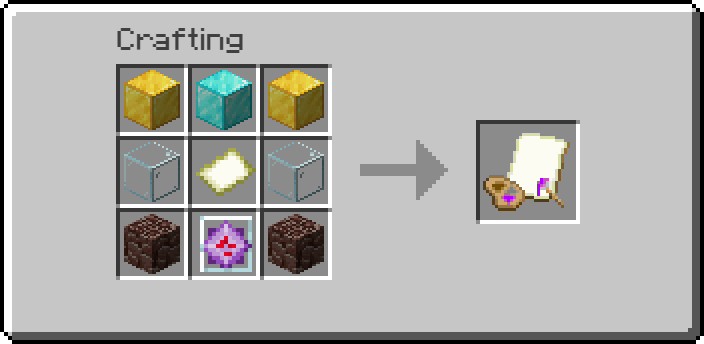
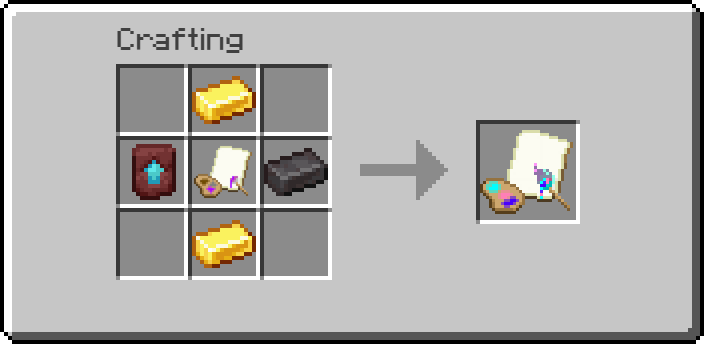
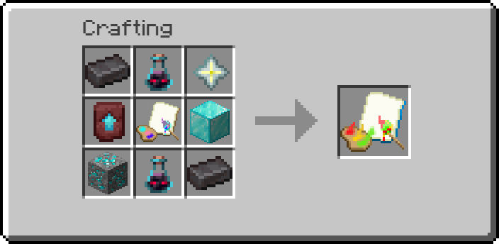

# Арты и как их делать!

<mark style="color:orange;">**С 08.05.2025**</mark> <mark style="color:orange;"></mark><mark style="color:orange;">—</mark> <mark style="color:orange;">**На сервере был улучшен плагин для создания карт! Теперь рисовать карты стало проще, а все проблемы со старым плагином устранены.**</mark>

<mark style="color:orange;">**Ниже вы найдете инструкцию по использованию, а также рецепты крафтов всех магических карт!**</mark> 


**Чтобы использовать команду /art — создайте магическую карту, они бывают 3 уровней.**


<figure><figcaption>
Крафт магической карты 1 уровня — позволяет создавать любые арты,
 с максимальным размером до 3x3
</figcaption></figure>

<figure><figcaption>
Крафт магической карты 2 уровня — позволяет создавать любые арты,  с максимальным размером до 5x5 <strong>(обратите внимание, в центре магическая карта 1 уровня)</strong>
</figcaption></figure>

<figure><figcaption>
Крафт магической карты 3 уровня — позволяет создавать любые арты,  с максимальным размером до 9x9 <strong>(обратите внимание, в центре магическая карта 2 уровня)</strong>
</figcaption></figure>

## <mark style="color:red;">ОБЯЗАТЕЛЬНО УБЕДИТЕСЬ, ЧТО ССЫЛКА ВЕДЁТ НА ИЗОБРАЖЕНИЕ, ТАКЖЕ РАЗРЕШЕНИЕ ИЗОБРАЖЕНИЯ ДОЛЖНО БЫТЬ КРАТНО 128 ПИКСЕЛЯМ,</mark> _<mark style="color:orange;">к примеру 384x256 = 3x2 изображение.</mark>_


**Чтобы создать свой арт, пропишите команду `/art [ссылка на изображение] XxY`, где X и Y размер готового арта, пример —**

`/art https://cdn.discordapp.com/attachments/957121903112372266/1369909594545061919/1.png?ex=681d933b&is=681c41bb&hm=c8bbf6f813bf1bd7553528b565d5cd412649d32d084fe043ff5ce9243ba52c8b& 2x3`


<figure><figcaption>
В итоге получаем это и таймер на следующую картину! 
</figcaption></figure>


**ОБРАТИТЕ ВНИМАНИЕ, ЧЕМ БОЛЬШЕ АРТ — ТЕМ БОЛЬШЕ ТАЙМЕР!**&#x20;



**ДАННАЯ КОМАНДА ДОСТУПНА&#x20;**<mark style="color:red;">**ТОЛЬКО**</mark>**&#x20;ИГРОКАМ С РОЛЬЮ** [**ЯГОДА**](../vasha-podderzhka/rol-yagoda.md)**!**&#x20;

