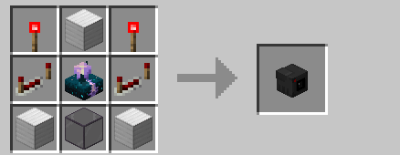
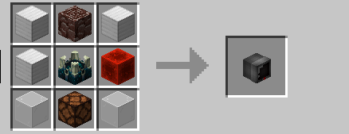

# Камеры

Создавать как камеры, так и мониторы могут только игроки с ролью [<mark style="color:orange;">**«Ягода»**</mark>](../vasha-podderzhka/rol-yagoda.md)\
Также существует лимит на использование камер: 10 на игрока. Ограничение касается игроков и с ролью, и без.

#### Крафт

<figure><figcaption>
<em>Камера</em>
</figcaption></figure>

<figure><figcaption>
<em>Монитор</em>
</figcaption></figure>

#### Работа с камерами

Когда оба предмета созданы, то игрок может поставить монитор и, держа камеру в руке, нажать по нему правую кнопку мыши. Тем самым он привяжет камеру к монитору.

После эту камеру можно поставить. Когда одна или несколько камер поставлены, можно нажать ПКМ по монитору, выбрать одну из камер и подключится к ней. Игрок переместится в вид камеры, и будет смотреть от её лица.

#### Команды при работе с камерами

 <mark style="color:orange;">**/camera next**</mark> — переключение на следющую камеру (если такая есть)
\
<mark style="color:orange;">**/camera prev**</mark> — переключение на прошлую камеру (если такая есть)
 

Чтобы выйти из режима просмотра камер, нажмите левый Shift.
