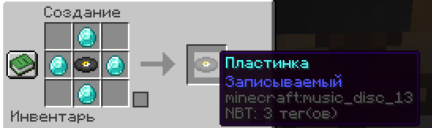

# Кастомная музыка

На сервере стоит аддон позволяющий добавлять на пластинки собственную музыку. Для использования необходим мод PlasmoVoice, [руководство по его установке.](../../tekh.-chast/ustanovki/ustanovka-plasmo-voice.md)

Чтобы сделать музыкальную пластинку, на которую можно записать свою музыку, нужно создать «записываемую» пластинку.


Обращаем ваше внимание что для игроков с ролью [«Ягода🧡»](../vasha-podderzhka/rol-yagoda.md) данное действие <mark style="color:orange;">не требуется</mark>, можно взять любую пластинку в руку и прописать команду.


<figure><figcaption></figcaption></figure>

После этого напишите в чат команду:\
\
<mark style="color:orange;">**/disc burn**</mark> **<ссылка на ютуб-видео с музыкой или ссылка на трек в soundcloud> <название для пластинки>**


Новое правило, добавленное из-за бага плагина!

Люди, которые создадут ошибку в музыке и она будет идти бесконечно, тем самым создавая шум и помехи другим лицам, получат мгновенный бан на проекте! (Оправдание о случайности НЕ ПРИНИМАЮТСЯ!)

Также запрещены песни непотребного содержания содержания, особенно на спавне!\
Запрещено включать на спавне песни, продолжительность которых более 5 минут.


Так же на сервере есть возможность увеличить растояние на которое слышно музыку проигрывателя, строя пирамиду как у маяка из драгоценных блоков под самим проигрываетелем. Растояние будет увеличенно до 64, 128, 160, 180 блоков, за каждый слой пирамидки соотвественно.      &#x20;

<figure><figcaption></figcaption></figure>
