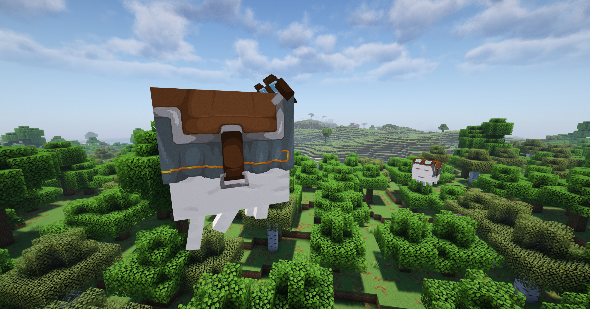
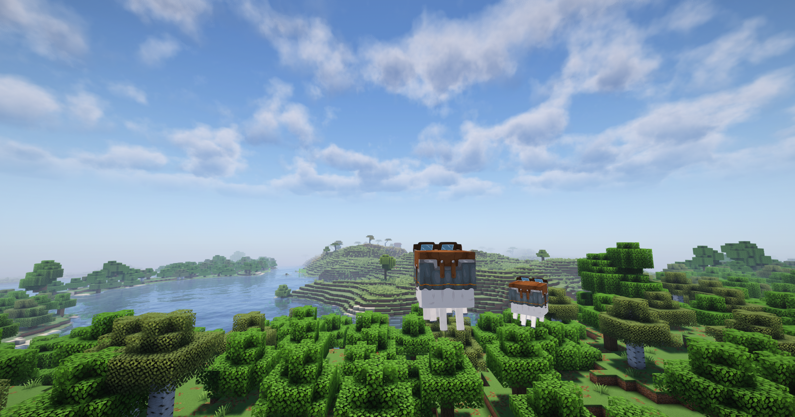

# Мутации счастливых гастов

На сервере есть возможность менять некоторые параметры счастливого гаста, тем самым создав себе идеального помощника или друга!

Всего можно изменить 2 характеристики: <mark style="color:orange;">скорость</mark> и <mark style="color:orange;">размер</mark> гаста.

Скорость возможно изменить в пределе от 0.2 до 2. Размер возможно изменить в пределе от 0.2 до 2. Чтобы изменить какой-нибудь из параметров, нужно взять бирку и написать на ней <mark style="color:orange;">название + значение.</mark>

<figure><figcaption>
<em>Переименование бирки через наковальню</em>
</figcaption></figure>

Например: «скорость 2» или «размер 1.7» или «СкОрОсТь 999». При этом максимальное значение останется равно 2 и «СкОрОсТь 999» округлится до масимального возможного значения.

Подписать бирку можно как с заглавной, так и со строчной буквы. Вы так же можете использовать запятую вместо точки, например: «размер 0,5».


Текущее имя гаста пропадет, но при дальнейшем переименовании атрибут не сбросится!


<figure><figcaption>
<em>Гасты разных размеров</em>
</figcaption></figure>

<figure><figcaption>
<em>Смотрят на ясный солнечный день</em>
</figcaption></figure>
