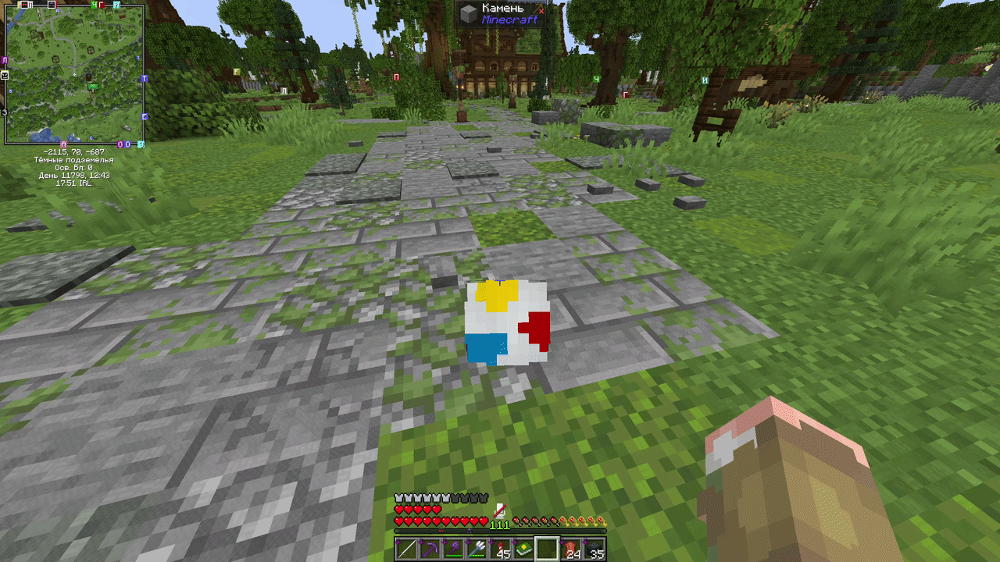
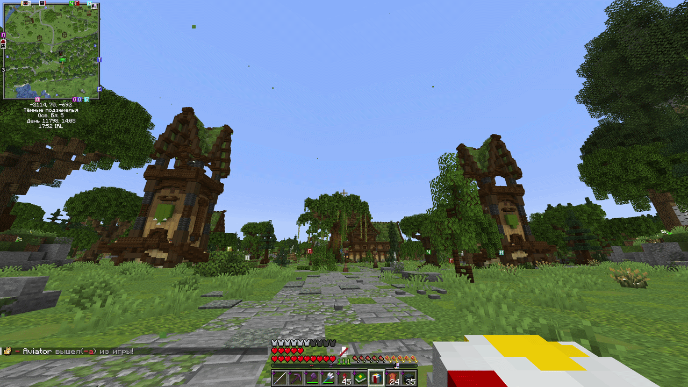
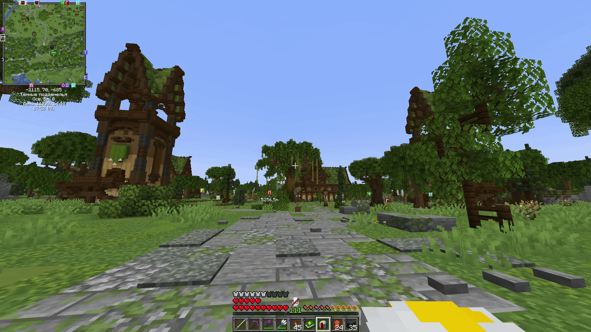
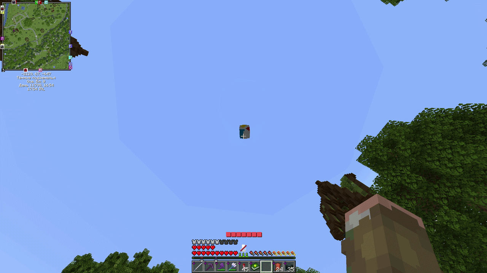

# Мячик

Для того чтобы получить мячик, необходимо по живому иглобрюху нажать <mark style="color:orange;">ПКМ</mark>, держа в руке кожу в размере 8 штук.

<figure><figcaption>
Превращаем иглобрюха в спортивный инвентарь
</figcaption></figure>

Лежачий мячик можно подобрать, нажав рядом с ним <mark style="color:orange;">**Shift**</mark>.

<figure><figcaption></figcaption></figure>

Для того чтобы кинуть мячик нужно держа его в руках нажать <mark style="color:orange;">Л</mark><mark style="color:orange;">КМ</mark>.

<figure><figcaption></figcaption></figure>

Для более мощного броска надо зажать <mark style="color:orange;">**Shift**</mark>, выбрав тем самым нужное усилие, после чего бросить мячик на <mark style="color:orange;">Л</mark><mark style="color:orange;">КМ</mark>.

<figure><figcaption></figcaption></figure>

В полете и на земле мячик можно отбивать нажимая <mark style="color:orange;">Л</mark><mark style="color:orange;">КМ</mark> по нему.

<figure><figcaption></figcaption></figure>

Для игроков с ролью Ягода доступна команда <mark style="color:$primary;">**/ballskin**</mark> при помощи которой можно выбрать внешний вид вашему мячику. Мячик так же можно просто поставить нажав <mark style="color:orange;">ПКМ</mark> рядом.

<figure><figcaption></figcaption></figure>

Мячик вне инвентаря игрока и в состоянии бездействия существует 150 секунд, после чего выпадет как предмет.
