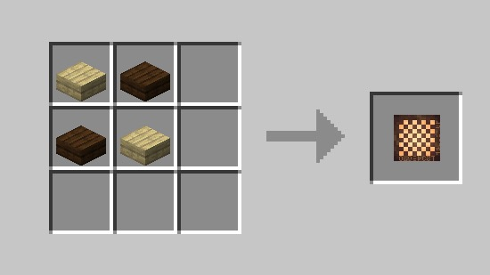
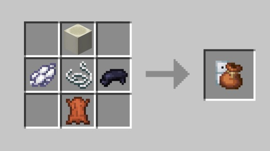
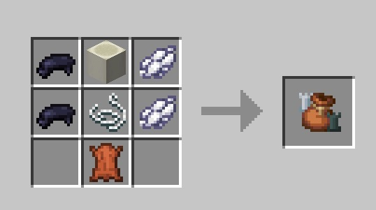
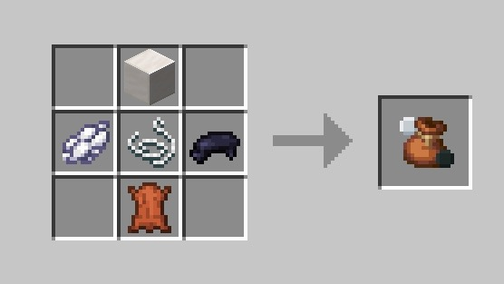
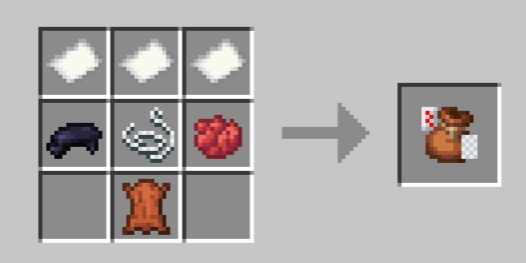
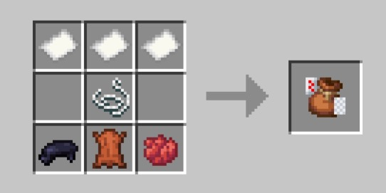
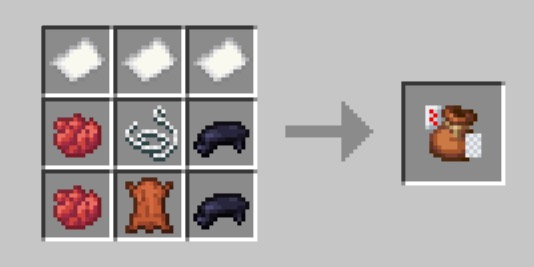
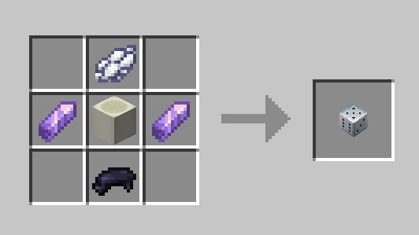

# Настольные игры

Одна из уникальных особенностей сервера — это уникальный плагин на настольные игры. \
Он добавляет шашки, шахматы, домино.


Большая благодарность <mark style="color:orange;">miniking1000</mark> за помощь и работу над плагином.



Ссылка и инструкция по установке: 🖌️ [Установка ресурс-паков](../../tekh.-chast/ustanovki/ustanovka-resurs-pakov.md)


## Использование

При использовании выдает случайную карту. Для того чтобы использовать мешочек, нажмите <mark style="color:orange;">ПКМ</mark> с мешочком в руке. В инвентаре окажется одна случайная карта.&#x20;

Чтобы <mark style="color:orange;">положить карту</mark> возьмите её в руку и нажмите <mark style="color:orange;">ПКМ</mark> по блоку перед собой. Если вы зажмёте <mark style="color:orange;">shift</mark> и <mark style="color:orange;">ПКМ</mark>, то карта на полу будет рубашкой вверх.&#x20;

Чтобы <mark style="color:orange;">забрать карту</mark> себе в инвентарь снова нажмите <mark style="color:orange;">ПКМ</mark> по карте.&#x20;

Для того чтобы <mark style="color:orange;">убрать карты в мешочек</mark> возьмите его в левую руку, а карту в правую и нажмите <mark style="color:orange;">ПКМ</mark> на пустой блок перед вами. Карта переместится в мешочек.

Так же работает с другими фигурами: [<mark style="color:orange;">домино</mark>](nastolnye-igry.md#meshochek-s-domino)<mark style="color:orange;">,</mark> [<mark style="color:orange;">шашками</mark>](nastolnye-igry.md#meshochek-s-shashkami) <mark style="color:orange;">и</mark> [<mark style="color:orange;">шахматами</mark>](nastolnye-igry.md#meshochek-s-shakhmatami)<mark style="color:orange;">.</mark>

## Рецепты

### Шахматная доска

Размещается на поверхность 2х2 покрытую коврами. \
Можно собрать нажав по боковой или нижней угловой границе доски.

<figure><figcaption></figcaption></figure>

### Мешочек с домино

Выдает одну случайную домино.\
Количество домино в мешочке: 28/28

<figure><figcaption></figcaption></figure>

### Мешочек с шахматами

Шахматные фигуры можно ставить только на доску.\
Количество фигур в мешочке: 32/32

<figure><figcaption></figcaption></figure>

### Мешочек с шашками

Шашки можно ставить только на доску. \
Количество шашек в мешочке: 24/24

<figure><figcaption></figcaption></figure>

### Мешочек с картами

Количество карт в мешочке: 36/36

<figure><figcaption></figcaption></figure>

Количество карт в мешочке: 52/52

<figure><figcaption></figcaption></figure>

Количество карт в мешочке: 54/54

<figure><figcaption></figcaption></figure>

### Игральная кость

Просто кость. Если бросите её на 1, вы не превратитесь в лавового слизня, ведь это не ролевая по Dungeons & Dragons.

<figure><figcaption></figcaption></figure>

### Нарды&#x20;

Доска для нард

<figure><figcaption></figcaption></figure>

Мешочек с нардами&#x20;

<figure><figcaption></figcaption></figure>

### Русская рулетка

Испытайте свою удачу в столь опасной, но не менее азартной игре.

<figure><figcaption></figcaption></figure>
