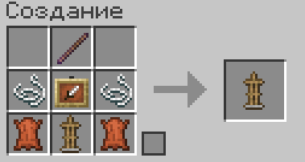
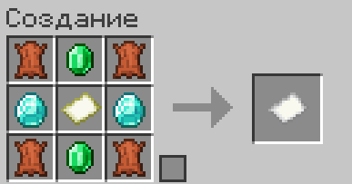
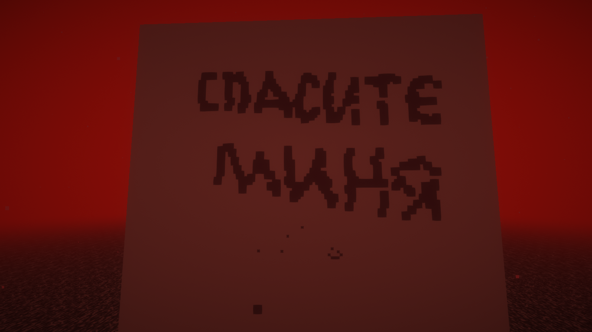
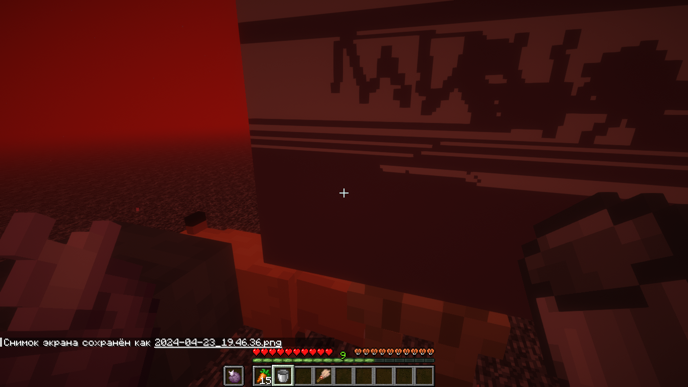

# Рисование

### На сервер добавлен плагин, позволяющий создавать <mark style="color:orange;">картины</mark>!

Чтобы начать творить, сначала нужно создать **мольберт** и установить его в удобном месте.&#x20;

<figure><figcaption>
В крафте используется <a href="/broken/pages/8uSOCiKJ45UcUWDYyDwk">палка отладки</a>.
</figcaption></figure>

Теперь нам нужен **холст.**&#x20;

<figure><figcaption>
Холст
</figcaption></figure>

Перед тем, как начать не забудьте взять с собой **кисточку**, используйте стандартную археологическую кисть, она универсальна и рисует лучше всего.

Установите холст на ваш мольберт и присаживайтесь перед ним. Теперь мир искусства полностью открыт для вас и вашей фантазии.

<figure><figcaption>
<em>Возьмите <strong>холст</strong> в руку...</em>
</figcaption></figure> <figure><figcaption>
<em>... и установите на <strong>мольберт.</strong></em>
</figcaption></figure>

Для рисования возьмите в основную руку специально переименованную кисточку, а во второстепенную краситель (любой предмет, имеющий свой цвет в мап-артах). Наведите курсор на место, которое вы хотите покрасить и нажмите ЛКМ.

**Как переименовать кисточку?**\
Используя наковальню, вам нужно назвать кисточку следующим образом:\
\
**Кисть** <mark style="color:orange;">**<Число, определяющее размер кисточки>**</mark>\
\
Например, на фото ниже текст я рисовал кисточкой с названием «Кисть 3», а точки снизу поставил с помощью «Кисть 1».

<figure><figcaption>
<em>Пример размера кисти</em>
</figcaption></figure>

**Заливка**\
Для удобства мы добавили дополнительный инструмент рисования - заливку. Для использования также возьмите краситель во второстепенную руку, а в основную, вместо кисти, возьмите пустое ведро и нажмите по нужному месту заливки.

<figure><figcaption>
<em>Пример заливки</em>
</figcaption></figure>

Глубоко надеемся, что вы не станете создавать работы, нарушающие наши [правила](../pravila-servera/). Если всё же такое случится, то **очень** постарайтесь не выставлять подобное на всеобщее обозрение, иначе...

Теперь, когда Вы закончили написание картины, Вам нужно сохранить её с помощью следующей команды:

/art save <mark style="color:orange;">**<Название картины>**</mark>&#x20;

### 🖼️ Мод автоматического рисования «Drawler» 🖼️


Мод создан и поддерживается нашим игроком <mark style="color:orange;">miniking1000.</mark>\
Пожалуйста, не забудьте поблагодарить его при использовании мода. Все ошибки и предложения направляйте непосредственно ему.


#### Руководства от создателя мода всегда самые подробные и понятные. Именно поэтому <mark style="color:orange;">miniking1000</mark> подготовил для вас видеогайд по полному использованию мода. После его просмотра у вас точно не останется никаких вопросов.



#### Ссылка на [«Drawler»](https://modrinth.com/mod/drawler)


Просим вас соблюдать [авторские права](https://github.com/miniking1000/drawler/blob/master/LICENSE) на мод и обратить особое внимание на пункт 2.


#### **Удачи в ваших начинаниях!**
