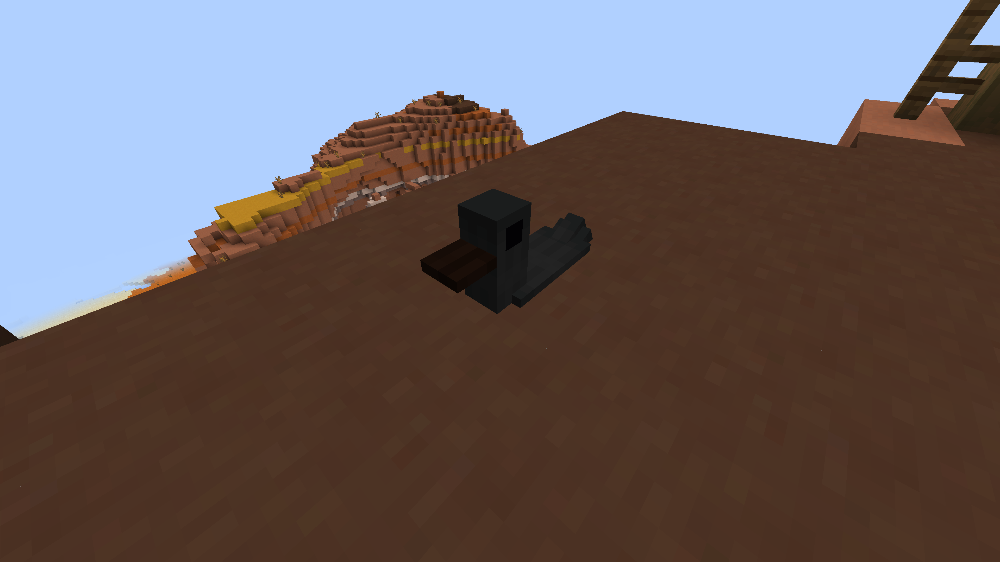
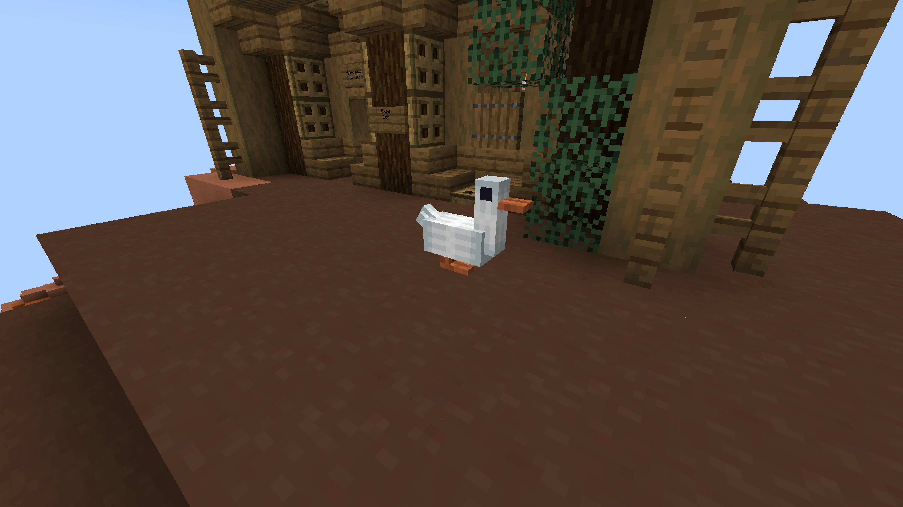

# Создание моделей

На наш сервер был добавлен уникальный и самописный плагин на модели, которые видят все игроки, даже не устанавливая ресурспак, коротко сказать, это фишка самой игры, а именно сущностей displayblock.


Видео от Увки, для того, кому лень читать.


## 1 этап - создание/выбор модели

Для начала найдите модель на этом сайте - [https://block-display.com/](https://block-display.com/) или же создайте модель на этом сайте - [https://block-display.com/bdengine/](https://block-display.com/bdengine/). Выбирайте модель с умом, так как на сервере действуют ограничения в 65 блоков и размерности не больше и меньше 7. Так же помните о том, что некоторые блоки и предметы, Вы никак не получите в выживании, пример: бедрок, растения в горшке и т.д.

Я выбрал модель утки, и нажав последовательно кнопки "Get the command" и "For Command Block" получил команду для спавна модели на сервере, на этом первый этап завершён.&#x20;

<figure><figcaption>
Уточка
</figcaption></figure>

## 2 этап - подготовка команды

Теперь переходим на этот сайт - [https://gist.github.com/](https://gist.github.com/) он поможет нам укоротить команду для вставки в книгу, вставляем команду в окошко и нажимаем кнопку "Create public gist", далее копируем команду и переходим в игру. Обязательно добавьте в конце /raw - пример [https://gist.githubusercontent.com/foxya27/957763a76510efb9b294e877b3da00cc/raw](https://gist.githubusercontent.com/foxya27/957763a76510efb9b294e877b3da00cc/raw)


Обратите внимание, что команда должна начинатся с "/"


<figure><figcaption>
Пример команды, та самая уточка
</figcaption></figure>

## 3 этап - размещение модели на сервере

Теперь мы берём книгу и перо, вставляем туда команду и подписываем книгу, название книги - название модели, будьте внимательны и запомните его, иначе, Вы не сможете редактировать и удалять модель.

<figure><figcaption>
Ссылка в книжку
</figcaption></figure> <figure><figcaption>
Подписать, лучше на английском
</figcaption></figure>


Далее берём книгу во вторую руку и прописываем команду - **/model**


<figure><figcaption>
Список необходимых ресурсов
</figcaption></figure> <figure><figcaption>
Вот так я их собрал
</figcaption></figure>

Нам высвечивается материалы, которые нам осталось собрать, чтобы построить модель, собираем их и прописываем команду /model ещё раз, так же держа книгу во второй руке.

У нас появилась модель УРА!, но ей видимо плохо и она застряла в текстурах, давайте это исправим!


Чтобы редактировать положение модели пропишите команду /model pos <название модели> \<x> \<y> \<z>


<figure><figcaption>
Вот так выглядит Фокся по утрам
</figcaption></figure>

Следуя инструкции выше, я прописал команду - /model pos Уточка 882 122 558

<figure><figcaption>
Оно живое!
</figcaption></figure>

## Вот и всё, мы разместили модель на сервере, и её видят все!


Так же модель можно поворачивать, с помощью команды - /model spin <название модели> \<yaw> \<pitch>, где yaw это вращение вокруг оси y, а pitch - вокруг x (но уже в системе повернутой на yaw).


## Этап дополнительный - удаление


Чтобы удалить модель, пропишите команду - /model del <название модели> \
Обратите внимание, что Вы должны стоять рядом с моделью.


Теперь я захотел удалить уточку, для этого я пропишу команду /model del Уточка


**!!! ОБРАТИТЕ ВНИМАНИЕ !!!**&#x20;

Ресурсы, потраченные на модель - **НЕВОЗВРАЩАЕМЫ!**

