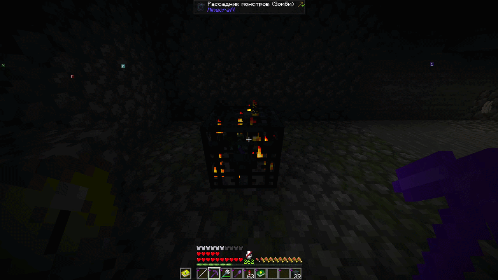
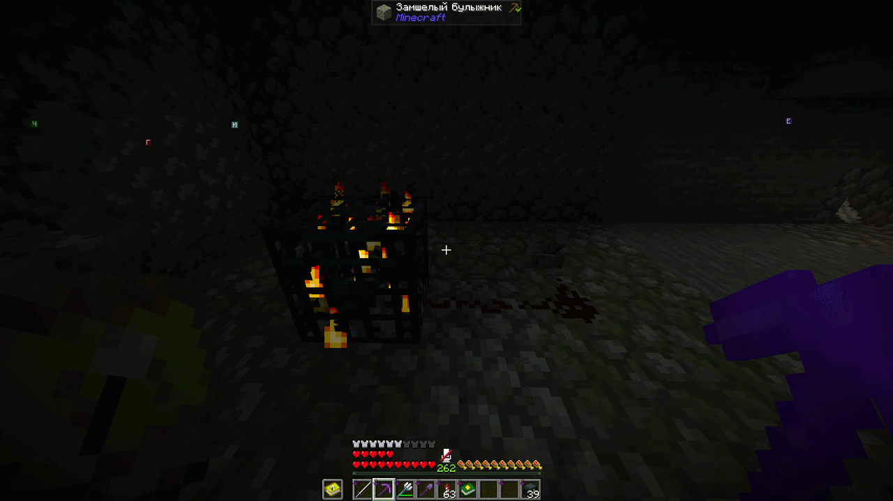
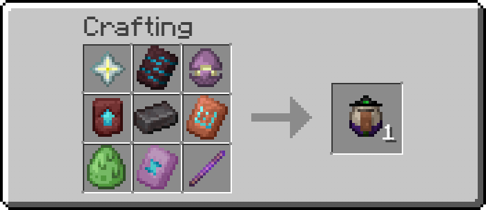

# Спавнеры

<figure><figcaption>
Процесс добычи спавнера 
</figcaption></figure>

Так же доступна возможность отключить работу спавнера, подав на него редстоун сигнал.

<figure><figcaption>
Пример отключения работы спавнера
</figcaption></figure>

Был добавлен крафт яиц призыва для изменения монстров которых порождает спавнер.

<figure><figcaption>
Яйцо призыва кадавра
</figcaption></figure>

<figure><figcaption>
Яйцо призыва утопленика
</figcaption></figure>

<figure><figcaption>
Яйцо призыва слизня
</figcaption></figure>

<figure><figcaption>
Яйцо призыва шалкера
</figcaption></figure>

<figure><figcaption>
Яйцо призыва стража
</figcaption></figure>

<figure><figcaption>
Яйцо призыва вихря
</figcaption></figure>

<figure><figcaption>
Яйцо призыва хранителя
</figcaption></figure>

<figure><figcaption>
Яйцо призыва заклинателя
</figcaption></figure>

<figure><figcaption>
Яйцо призыва ведьмы
</figcaption></figure>
