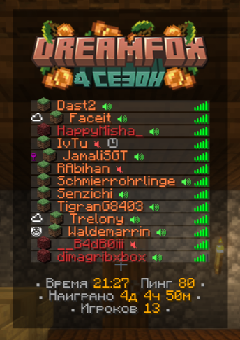

# TAB сервера

ТАБом называется игровое меню, отображающееся по нажатию кнопки Tab в многопользовательском режиме. По стандарту в нём отображается список игроков и уровень их соединения. Однако на нашем сервере ТАБ изменён. Давайте ответим на часто задаваемые вопросы по его поводу.


Для правильной работы таба следует скачать серверный ресурс-пак. Об установке ресурс-паков говорится [тут](../../tekh.-chast/ustanovki/ustanovka-resurs-pakov.md).


1. **Что означают красные и зелёные динамики справа ников?**_Динамики означают наличие/отсутствие мода PlasmoVoice, позволяющего общаться голосом прямо в игре. Руководство по установке_ [_прямо здесь_](../../tekh.-chast/ustanovki/ustanovka-plasmo-voice.md)_._ 
2. **Почему у людей разные цвета ников и разные значки слева от них?**\
   \
   _&#x426;вет ника и значок рядом означает место нахождения игрока._ \
   _Если игрок в обычном мире, значок будет блоком дёрна, а ник окрасится в <mark style="color:orange;">оранжевый</mark>._\
   _Если игрок в нижнем мире, значок будет блоком незерака, а ник окрасится в <mark style="color:red;">красный</mark>._\
   _Если игрок в крае, значок будет блоком эндерняка, а ник окрасится в <mark style="color:purple;">фиолетовый</mark>._
3. **Что означает крайний значок слева?**\
   \
   Это косметический элемент. Они выдаются за определённые достижения. Если вы выполнили условие получения значка, то сразу перезайдите в мир, и вы получите свою награду.\
   Команда для просмотра и установки значков - <mark style="color:orange;">/значки</mark>
4. **Что означает значок часов справа от ника?**\
   \
   Этот значок обозначает состояние игрока afk. Оно возникает при длительном бездействии или с помощью команды /afk

<figure><figcaption>
<em>Пример для наглядности</em>
</figcaption></figure>
