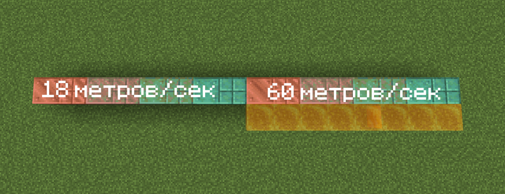

# Вагонетки

На сервере была обновлена система вагонеток!

* Они ускоряются только на блоках на скриншоте ниже

<figure><figcaption>
<em>Мёд символизирует вощёность блоков выше</em>
</figcaption></figure>

* Добавлена возможность пересаживаться на другие пути с помощью правого клика по рельсам, сидя в вагонетке.
* Песок душ замедляет скорость в 2 раза.
