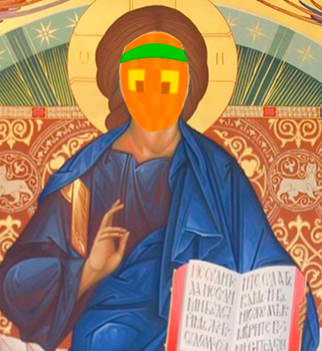

# Правила сервера


**При регистрации на нашем проекте вы автоматически соглашаетесь с данным сводом правил.**&#x20;



**При выявлении каких-либо нарушений команда проекта имеет право выдать вам временную блокировку на сервере, с указанием или без указания причины в текстовом канале #❌・бан-лист.**


• Перманентные блокировки будут отображаться в текстовом канале ⁠❌・бан-лист, вместе со всеми остальными.&#x20;

• При вызове на проверку — Вы обязаны зайти в голосовой канал в течение указанного времени, которое скажет администратор, вызвавший Вас.&#x20;

• Отказ от проверки не освобождает от ответственности.&#x20;

• В большинстве случаев возвращение вещей в результате ошибок/отката/вайпа/ или какого-то другого форсмажорного обстоятельства — не предусмотрено.&#x20;

• Игрок может получить блокировку за нарушение, не входящее в свод правил.&#x20;

• Администрация проекта в праве заблокировать игрока без разъяснения причин или доказательного обвинения.&#x20;

• Если Вы пошутили, Вы несёте за это полную ответственность.


### Администрация состоит из двух человек (@Uwka, @\_Foxya\_), запрещено выдавать себя за администрацию проекта!&#x20;



Чтобы попасть на наш проект, оставьте заявку в Discord в разделе «Заявки».


## **📃Пункт I. Правила игрового мира.**&#x20;

> **• 1.1** - Запрещена порча/видоизменение структур общественного характера.&#x20;
>
> **• 1.2** - Запрещена порча и стройка вблизи территорий других игроков или порча их территорий без их согласия.&#x20;
>
> **• 1.3** - Запрещены любые действия мешающие другим игрокам, особенно на их территории. Если Вам мешает участник проекта — сообщите об этом ему или администрации проекта.&#x20;
>
> **• 1.4** - Запрещено убийство игроков без обоюдного согласия с их стороны.&#x20;
>
> **• 1.5** - Запрещено разрушение бедрока, без уведомления администрации проекта.&#x20;
>
> **• 1.6** - Запрещены постройки, нарушающие работу сервера, к примеру, различные механизмы, лаг-машины/супрессоры/чанклоадеры/фермы на огромных порталах в Ад.&#x20;
>
> **• 1.7** - Запрещена кража/любой вид мошенничества, в том числе копирование построек игроков и копирование шаблонов отделки для брони.&#x20;
>
> **• 1.8** - Запрещена продажа внутриигровых предметов или услуг за реальные деньги.&#x20;
>
> **• 1.9** - Запрещено использование багов и уязвимостей игры (несообщение о баге, является так же нарушением), а также программы, облегчающие игру на сервере. Так же запрещено копать незерит в лаве.&#x20;
>
> **• 1.10** - Запрещена попытка обхода/взлом аккаунтов, также передача пароля от аккаунта другим игрокам/махинации с аккаунтами других игроков.&#x20;
>
> **• 1.11** - Запрещены мероприятия (различные ивенты, войны), не согласованные с командой проекта и игроками.&#x20;
>
> **• 1.12** - Запрещено создание ловушек и других механизмов/локаций, которые могут навредить другим игрокам, при условии, что там нет предупреждающих обозначений.&#x20;
>
> **• 1.13** - Запрещено нарушение/разрушение/манипуляции с экономикой проекта.&#x20;
>
> **• 1.14** - Запрещено употребление нецензурной брани, в том числе, завуалированного мата в глобальном чате. Это касается и всех Discord каналов проекта. (Разрешено только в локальном чате и в гс)&#x20;
>
> **• 1.15** - Запрещено строить политические/религиозные знаки/метки.&#x20;
>
> **• 1.16** - Запрещен расизм, нацизм, религиозные обсуждения/оскорбление, а также разжигание межнациональной розни и пропаганда наркотических средств, суицида.&#x20;
>
> **• 1.17** - Запрещены постройки, использование неподобающих скинов/плащей/символик, которые не соответствуют нравственным устоям и содержат в себе **18+** контент.
>
> **• 1.18** - Запрещено хранение и распространение ресурсов/предметов, которые получены нечестным путем.&#x20;
>
> **• 1.19** - Запрещён ввод в заблуждение участников проекта и администрации по техническим и игровым аспектам.&#x20;
>
> **• 1.20** - Вы несете ответственность за безопасность своего аккаунта и обязуетесь соблюдать все надлежащие меры по обеспечению его безопасности. Взлом аккаунта не является оправданием, если игрок обвиняется в нарушении правил.&#x20;
>
> **• 1.21** - Запрещено содействовать с нарушителем, то есть ресурсы, добытые нарушителем — запрещено иметь/передавать/пользоваться.&#x20;
>
> **• 1.22** - Запрещено строить на территории спавна без предварительного разговора с администрацией или главой спавна.&#x20;
>
> **• 1.23** - Запрещено использование неподобающих эмоций на сервере, особенно содержания **18+**, если это, конечно, не РП-ситуация.&#x20;
>
> **• 1.24** - Запрещено использование программ, которые включают различные звуки, например "SoundPad", на сервере. Только если это не РП-ситуация, согласованная с администрацией.&#x20;
>
> **• 1.25** - Запрещено сталкерить/следить/преследовать игроков.&#x20;
>
> **• 1.26** - Запрещён приват аванпостов и портала Края для личного пользования.&#x20;

## **📃**Пункт II. Правила поведения в чате и Discord-сервере.

> **• 2.1** - Запрещены какие-либо конфликты/ссоры во всех чатах проекта.&#x20;
>
> **• 2.2** - Запрещено писать **КАПСОМ** и спамить.&#x20;
>
> **• 2.3** - Запрещена реклама сторонних проектов и упоминание их.&#x20;
>
> **• 2.4** - Запрещено попрошайничество/вымогательство ресурсов у игроков.&#x20;
>
> **• 2.5** - Запрещено умышленное коверканье/искажение слов и языка, который Вы используете.&#x20;
>
> **• 2.6** - Запрещено упоминание родственников и других близких людей игроков.&#x20;
>
> **• 2.7** - Запрещено упоминание/искажение/оскорбление политики/религии/нации/флагов/стран в разговоре/тексте.&#x20;
>
> **• 2.8** - Запрещено оскорбление/осуждение проекта в голосовых и текстовых чатах.&#x20;
>
> **• 2.9** - Запрещено разглашение личной информации участника без его согласия, а также личных чатов и каналов на сервере.&#x20;
>
> **• 2.10** - Запрещена публикация фото/видео и другого контента, неприемлемого содержания.&#x20;
>
> **• 2.11** - Запрещено обсуждение **18+** контента в любых чатах сервера, если это не RP ситуация.&#x20;
>
> **• 2.12** - Запрещена навязчивая реклама магазинов и других структур, старайтесь рекламировать раз в 5 минут.&#x20;
>
> **• 2.13** - Запрещено оскорбление игроков. Так же запрещена травля и буллинг игроков.&#x20;
>
> **• 2.14** - В канале ⁠🎥・видео разрешена только тематика **Minecraft** без рекламы стороннего контента.&#x20;
>
> **• 2.15** - Запрещено менять себе ник в Discord сервере проекта.&#x20;
>
> **• 2.16** - Запрещено оскорбление проекта и игроков в статус-баре игрока на сервере Discord.&#x20;
>
> **• 2.17** - Запрещено вставлять полит. высказывания, оскорбления, флаги, и т.д в статус-бар Discord профиля и иметь подобные аватарки.&#x20;
>
> **• 2.18** - Запрещено создание мульти-аккаунтов, как и в игре, так и в Discord'e.&#x20;
>
> **• 2.19** - Запрещено "душнить", или "не будь занудой", "не придирайся к мелочам", не затягивай разговор и не погружай собеседника в скучную для него тему.&#x20;
>
> **• 2.20** - Запрещены любые манипуляции с правилами и поиск лазеек, направленные на причинение вреда или создание помех другим игрокам.\
> \
> **Чтобы обозначить свою территорию/страну/город/локацию, прошу Вас поставить указывающие знаки/таблички/символы по всем сторонам на видном месте. Также, Вы можете опубликовать информацию/координаты и интересные факты о Вашей постройке в специальном текстовом канале ⁠⁠🌲・территории.**

* &#x20;**Изначальный вариант правил - \_Foxya\_ (2021 год), редакторы Xenone\_Xe (2023 год), ToxaEagle123 (2024 год).**

<figure><figcaption>
<strong>Да, спасёт Вас Оранж</strong>
</figcaption></figure>

