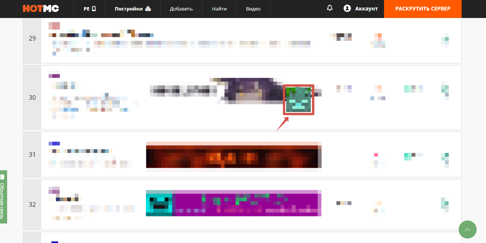

# Ваша поддержка


**Команда проекта благодарит каждого игрока, посетившего наш сервер!** \
Если вы хотите поддержать проект, отличным способом будет проголосовать за сервер на мониторинге.



Дополнительные награды и [**Роль «Ягода»**](rol-yagoda.md) можно получить навсегда при материальной поддержке от 600 рублей!


### Финансовая поддержка сервера ➜ [<mark style="color:orange;">**yoomoney**</mark>](https://yoomoney.ru/fundraise/14CTJNQ1VCD.240803) ❤

### Наш основной мониторинг — [**HOTMC.ru**](https://hotmc.ru/minecraft-server-224603) 

На этом мониторинге вы можете [**голосовать**](https://hotmc.ru/vote-224603) за сервер, просто указав свой ник. Голоса игроков помогают серверу подниматься выше в рейтинге.

Также можно участвовать в мини-игре по поиску голов мобов. Раз в день вы можете найти голову, которая появляется при переходе по специальным ссылкам. В мини-игре представлены как обычные головы мобов, так и очень редкие. Например, один из наших игроков более года искал голову эндер-дракона и получил за это [**уникальную роль**](../osobennosti/roli.md#unikalnye-roli)**.**

**Мини-гайд по поиску голов:**

1.  Зайдите на нашу страницу [**HOTMC**](https://hotmc.ru/minecraft-server-224603) и пролистайте вниз до раздела «коллекция мобов». Под ним найдите зелёную кнопку <mark style="color:orange;">**«найти моба»**</mark> и нажмите на неё.\
    \
    Обратите внимание: перед этим необходимо зарегистрироваться или войти в аккаунт! 

    <figure><figcaption>
 
</figcaption></figure>
2. После нажатия кнопки появятся три ссылки на страницы <mark style="color:orange;">**HOT**</mark>**MC**. Переходите по каждой из них и внимательно пролистывайте вниз, всматриваясь в страницу. Ищите пульсирующую голову моба — она будет спрятана на одной из представленных страниц. 

<figure><figcaption></figcaption></figure>

3. Как только вы найдете голову моба, просто нажмите на нее. Вы справились! \
   Теперь можно закрыть все открытые вкладки. Повторить поиск головы можно будет на следующий день.

### Полезный мониторинг, позволяющий отслеживать общее количество часов, проведенных на сервере — [**mineserv.top**](https://mineserv.top/dreamfox/players?page=1\&timeframe=all_time) 


Мы будем благодарны, если вы оставите честный отзыв о нашем проекте на мониторингах. Ваша обратная связь помогает нам сделать сервер лучше. А положительные отзывы дают нам понять, что проект движется в правильном направлении!


### Менее актуальные мониторинги, на которых есть наш проект:

<table data-view="cards"><thead><tr><th></th><th></th><th></th></tr></thead><tbody><tr><td><a href="https://minecraftrating.ru/server/dreamfox/"><strong>Minecraftrating</strong>.<strong>ru</strong></a></td><td><a href="https://mcservers.ru/server-776"><strong>MCServers</strong></a></td><td></td></tr><tr><td><a href="https://tmonitoring.com/server/dreamfox-vanilla-server-maynkraft-120/"><strong>Tmonitoring</strong></a></td><td><a href="https://m2top.ru/server/5826/"><strong>M2TOP</strong></a></td><td></td></tr><tr><td><a href="https://misterlauncher.org/server/dreamfox/"><strong>MisterLauncher</strong></a></td><td></td><td></td></tr></tbody></table>
