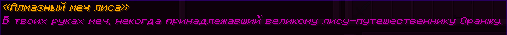
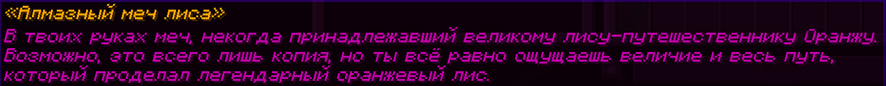
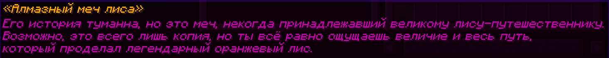
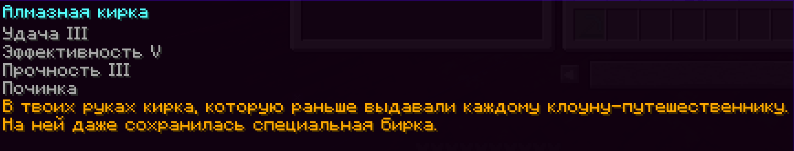

# Роль «Ягода» 🧡

Команда проекта искренне благодарит всех, кто поддерживает сервер донатами. Мы хотим выразить свою признательность не только словами, но и интересными, уникальными функциями в игре.


<mark style="color:orange;">**Роль**</mark> можно получить навсегда при материальной поддержке от 600 рублей!



**Роль «Ягода» на 1 месяц**  — 200 рублей пожертвования на сервер  \
**Роль «Ягода» на** **3 месяца**  — 300 рублей пожертвования на сервер  \
**Роль «Ягода» навсегда**  — 650 рублей пожертвования на сервер  \
**Покупка любой команды или возможности роли навсегда** — 150 рублей  \
**Разбан** (обсуждается с администрацией до оплаты) — 999 рублей \
**«Быстрая проходка»** — 299 рублей \
**Сделать модель в ресурс-пак персонально для вас от игрока ElizarovS** (доп. информация в канале ⁠&#x1F4DD;_&#x41E;бращения_ в Discord) — от 100 рублей \
**Персональная моделька для вашего персонажа в моде CPM от игрока Uwka** (доп. информация в канале ⁠&#x1F4DD;_&#x41E;бращения_ в Discord) — от 450 рублей 



Также может быть <mark style="color:orange;">**временно**</mark> получено за организацию ивентов и в качестве награды на них. Администрация самостоятельно решает, за какой ивент и на какой срок выдавать эту роль.


### **Игроки с ролью «Ягода🧡» получают возможность:**

* Возможность подключения к серверу, даже если все слоты заняты!
* [Форматировать текст](#user-content-fn-1)[^1] в чате и на наковальне
* Создавать лор на предметах и задавать цвет для описаний
* Доступ к <mark style="color:blue;">/co i</mark> и <mark style="color:blue;">/co near</mark>
* Настраивать <mark style="color:orange;">**личное время и погоду**</mark> для создания скриншотов
* Могут создавать [**модельки**](../osobennosti/sozdanie-modelei.md) без использования ресурсов
* Приручать до трёх лисиц с помощью сырой курятины
* Создавать [**арт-мапы**](../osobennosti/arty-i-kak-ikh-delat.md) по команде
* Могут использовать камнерез через команду <mark style="color:blue;">/stonecutter</mark>
* Могут [**записывать музыку**](../osobennosti/kastomnaya-muzyka.md) на пластинки без использования алмазов
* Уникальную роль в Discord'e!

### 📝 **Доступные команды:**

**/co&#x20;**<mark style="color:orange;">**i**</mark> — включает режим просмотра изменений блока.

**/co&#x20;**<mark style="color:orange;">**near**</mark> — показывает изменения блоков в радиусе от вас.

**/stonecutter** — использование камнереза без самого блока.

**/ptime** <mark style="color:orange;">\[время]</mark> — установка личного времени, <mark style="color:orange;">/</mark>**ptime** <mark style="color:orange;">reset</mark> — сбросить.

**/pweather** <mark style="color:orange;">\[цикл погоды]</mark> — установка личной погоды, <mark style="color:orange;">/</mark>**pweather** <mark style="color:orange;">reset</mark> — сбросить.Запрещенно абузить полет на трезубце через смену погоды на дождь. (В наказание снятие роли + бан на 14 дней)

**/lore** — справка по команде.

**/lore&#x20;**<mark style="color:orange;">**add**</mark>**&#x20;\[текст]** —  добавляет текст к описанию удерживаемого предмета, сразу после его названия.

**/lore&#x20;**<mark style="color:orange;">**set**</mark> **\[номер строки] \[текст]**  — устанавливает текст на указанную строку в описание удерживаемого предмета, заменяет старый текст.

**/lore&#x20;**<mark style="color:orange;">**clear**</mark> — удаляет описание удерживаемого предмета.

**/playtime** <mark style="color:orange;">**\[ник]**</mark> — показывает наигранное время игрока

**/broadcast** — делает объявление в чате без указания ника

**/beezooka** — стрельба взрывными пчелками(чисто эффект)

**/kittycanon** — тоже самое что и **beezooka**, но котиками

**/art** — [<mark style="color:orange;">**подробнее читайте тут**</mark>](../osobennosti/arty-i-kak-ikh-delat.md). 

### Пример использования команды <mark style="color:orange;">/lore:</mark>

<figure><figcaption>
<em>Добавляем описание /lore <mark style="color:orange;">add</mark></em>
</figcaption></figure>

<figure><figcaption>
<em>Добавляем ещё несколько строк, используя команду /lore <mark style="color:orange;">add</mark></em>
</figcaption></figure>

<figure><figcaption>
<em>Заменяем первое предложение на новое /lore <mark style="color:orange;">set</mark> 1 [текст]</em>
</figcaption></figure>

### Форматирование текста при добавлении описания предмету:

Перед добавлением описания предмету через команду <mark style="color:blue;">/lore</mark> необходимо вставить знак [& (shift+7)](https://minecraft.fandom.com/ru/wiki/%D0%A4%D0%BE%D1%80%D0%BC%D0%B0%D1%82%D0%B8%D1%80%D0%BE%D0%B2%D0%B0%D0%BD%D0%B8%D0%B5_%D1%82%D0%B5%D0%BA%D1%81%D1%82%D0%B0#%D0%A6%D0%B2%D0%B5%D1%82%D0%BE%D0%B2%D0%BE%D0%B5_%D1%84%D0%BE%D1%80%D0%BC%D0%B0%D1%82%D0%B8%D1%80%D0%BE%D0%B2%D0%B0%D0%BD%D0%B8%D0%B5)

<figure><figcaption>
<em>/lore add &#x26;6</em>
</figcaption></figure>

### Форматирование текста в чате:

Аналогично любому другому форматированию, перед текстом необходимо поставить знак [& (shift+7)](https://minecraft.fandom.com/ru/wiki/%D0%A4%D0%BE%D1%80%D0%BC%D0%B0%D1%82%D0%B8%D1%80%D0%BE%D0%B2%D0%B0%D0%BD%D0%B8%D0%B5_%D1%82%D0%B5%D0%BA%D1%81%D1%82%D0%B0#%D0%A6%D0%B2%D0%B5%D1%82%D0%BE%D0%B2%D0%BE%D0%B5_%D1%84%D0%BE%D1%80%D0%BC%D0%B0%D1%82%D0%B8%D1%80%D0%BE%D0%B2%D0%B0%D0%BD%D0%B8%D0%B5)

<figure><figcaption>
<em>&#x26;6&#x26;l</em> <em><mark style="color:orange;"><strong>[текст]</strong></mark></em>
</figcaption></figure>

<figure><figcaption>
<em>&#x26;6&#x26;m  </em><del><em><mark style="color:orange;">[текст]</mark></em></del>
</figcaption></figure>

<figure><figcaption>
<em>Цветовое форматирование</em>
</figcaption></figure> <figure><figcaption>
<em>Текстовое форматирование</em>
</figcaption></figure>


Функции гармонично вписываются в игровой мир и не дают игрокам никаких преимуществ. Решение о введении этой роли было принято в результате голосования в [<mark style="color:orange;">**Discord-канале**</mark>](https://discord.com/channels/956981761802375228/1133769424764162099/1249981605020303451) проекта.



Если у вас есть идеи о том, какие новые функции можно добавить в эту роль, вы можете поделиться ими в разделе 📝«Обращения» нашего [<mark style="color:orange;">**Discord-канала**</mark>](https://discord.com/channels/956981761802375228/1133769424764162099/1249981605020303451).


[^1]: Пример: [&4](https://minecraft.fandom.com/ru/wiki/%D0%A4%D0%BE%D1%80%D0%BC%D0%B0%D1%82%D0%B8%D1%80%D0%BE%D0%B2%D0%B0%D0%BD%D0%B8%D0%B5_%D1%82%D0%B5%D0%BA%D1%81%D1%82%D0%B0#%D0%A6%D0%B2%D0%B5%D1%82%D0%BE%D0%B2%D0%BE%D0%B5_%D1%84%D0%BE%D1%80%D0%BC%D0%B0%D1%82%D0%B8%D1%80%D0%BE%D0%B2%D0%B0%D0%BD%D0%B8%D0%B5)Привет = <mark style="color:red;">Привет</mark>.
