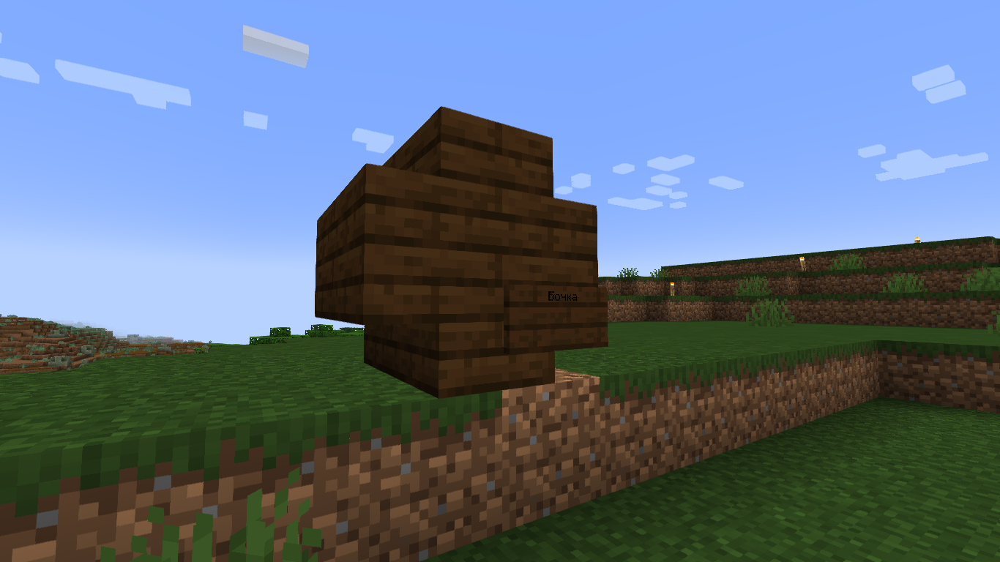
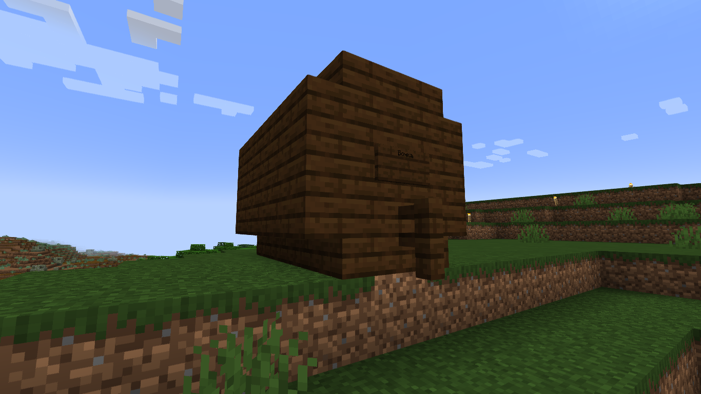
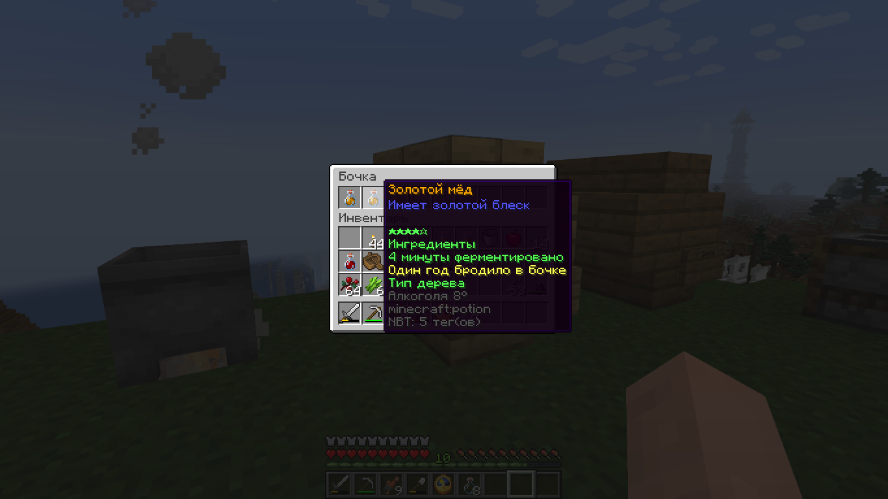

# Обучение

Brewery - плагин, позволяющий создавать различные настойки в майнкрафт, в основном алкогольные, но есть и иные. Изготовление напитков состоит из нескольких процессов.

_**Варка**_

> Варка - обязательный процесс. Для варки нам понадобится поставить котёл на источник тепла(костёр, огонь, лава, магма), взять в руку ингредиент, который хотите положить в котёл, и кликнуть ПКМ по нему. За клик добавляется только один ингредиент, количество ингредиентов важно для качества напитка. Также для качества важно время варки, чтобы посмотреть его, возьмите в руку часы и кликните ПКМ по котлу. Как только напиток проварится нужное время, возьмите в руку пустые бутылки и с помощью ПКМ наберите напиток.

_**Выдержка**_

> Выдержка - этот процесс требуют большинство напитков, но некоторые напитки не выдерживаются. Выдерживаются напитки в бочках. Можно использовать обычные бочки, в них помещается 6 бутылок. Также можно сделать особенные бочки - средние и большие. Для создания средней нужно 8 ступенек в форме бочки, как на скрине ниже, и поставить табличку в правую нижнюю часть. На табличке нужно написать "бочка" или "barrel". Можно писать большими и маленькими буквами, это не учитывается. Для создания большой бочки нужно из 18 досок, 16 ступенек и 1 забора выложить форму, как на скрине ниже и аналогично поставить табличку в середину или выше. Полость внутри большой бочки не важна, можно оставить пустой или заставить блоками. Строить среднюю и большую бочку следует из дерева одного типа, некоторым напиткам важен тип дерева. Теперь, когда у нас есть бочка, нам нужно положить туда напиток на определённый срок. Напитки выдерживаются "годами". Год в бревери длится примерно 20 минут. Года выдержки также влияют на качество напитка.

<figure><figcaption>
<em>Средняя бочка</em>
</figcaption></figure> <figure><figcaption>
<em>Большая бочка</em>
</figcaption></figure>

_**Дистилляция**_

> Дистилляция - этот процесс требуют большинство напитков, но некоторые напитки не дистиллируются. Дистиллируются напитки на варочной стойке. Для этого нужно положить в слот ингредиента светопыль, а в слот зелий нужный вам напиток. Так начнётся дистилляция. Светопыль не тратится. Огненный порошок не требуется. После определённого нужного количества циклов дистилляции доставайте напиток. Количество циклов влияет на качество.

_**Качество**_

> Качество есть у всех напитков, как и рецепт. Чем строже вы следуете рецепту, тем более качественным будет напиток. У напитков есть сложность, некоторые лёгкие напитки позволяют отойти от оригинальной рецептуры - переварить немного, недодержать в бочке и т.д., а другие сложные напитки требуют полного соблюдения рецепта. Проверить качество можно во время выдержки или дистилляции. Пример показан на скриншоте ниже. Те параметры, что показаны зелёным приемлемы для наилучшего качества. Однако показанный Золотой мёд стоит только один год, чего недостаточно, поэтому параметр показан жёлтым. Аналогично параметр может отражаться оранжевым или красным. Хотя всё же качество имеет больше эстетический характер.

<figure><figcaption>
<em>Пример качества</em>
</figcaption></figure>

_**Закупорка**_

> Теперь, когда наш напиток готов, его по желанию можно закупорить. Закупорка сохраняет напиток в текущем состоянии и скрывает параметры готовки. Закупоренный напиток нельзя никак изменить. Для закупорки нужен "Стол для закупорки бражки" он создаётся как верстак с двумя бутылочками сверху и выглядит как коптильня. При взаимодействии ПКМ по нему откроет окно с 9 слотами. Положите напитки в эти слоты и после определённого звука все они закупорятся.

<figure><figcaption>
<em>Закупоренный напиток</em>
</figcaption></figure> <figure><figcaption>
<em>Обычный напиток</em>
</figcaption></figure>

<figure><figcaption>
<em>Создание стола закупорки бражки</em>
</figcaption></figure>

_**Употребление**_

> Многие напитки алкогольные. Если их выпить, то у игрока поднимется уровень опьянения. При повышении этого уровня у игрока начнётся тошнота, сообщения в чат от игрока с опьянением искажаются, передвижение затрудняется. При максимальном уровне опьянения персонажа стошнит. Снять опьянение можно, поев хлеба, выпив молока или другие особенные напитки такие как: соки, настойка Банановые Острова и другие. Некоторые напитки дают различные эффекты.

Теперь мы научились основам варки, выдержки, дистилляции, закупорки напитков, разобрались в особенностях их употребления. В следующем блоке мы рассмотрим рецепты большинства напитков. 
