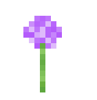
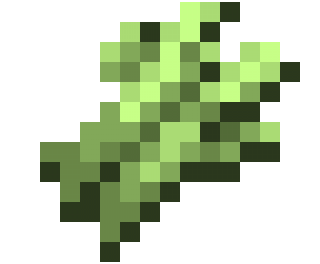
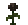
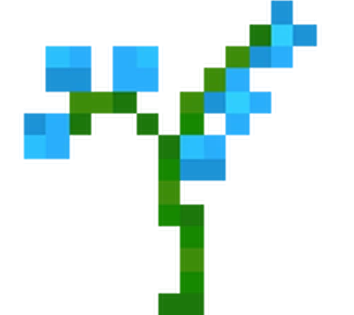
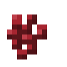

# Рецепты

Здесь ты найдёшь все общедоступные рецепты напитков и в последствии сможешь их приготовить! Так же доступна [онлайн таблица](https://docs.google.com/spreadsheets/d/1UxgZ3P86Gek6Y9c296ES_atbhT2seIaq6BW9-cP5bFY/edit?gid=1170537346#gid=1170537346) со всеми актуальными рецептами на сервере.

Не забудь прочитать [<mark style="color:$primary;">**обучение по плагину Brewery**</mark>](obuchenie.md) прежде чем приступать к варке.

<h3 align="center"> <strong>Алкогольные коктейли</strong> </h3>

<table data-full-width="true"><thead><tr><th align="center">Напиток</th><th align="center">Рецепт</th><th align="center">Варка</th><th align="center">Дистилляция</th><th align="center">Выдержка</th><th width="100" align="center">Бочка</th></tr></thead><tbody><tr><td align="center"><mark style="color:$warning;"><strong>Апероль</strong></mark> <mark style="color:$warning;"><strong>«Шприц»</strong></mark></td><td align="center"><strong>х1</strong>  <strong>х1</strong>  <strong>х1</strong>  <strong>х1</strong>  <strong>х2</strong> </td><td align="center"><strong>11 минут</strong></td><td align="center"><strong>2 раза</strong></td><td align="center"><strong>-</strong></td><td align="center"><strong>-</strong></td></tr><tr><td align="center"><mark style="color:$warning;"><strong>Венесуэльская ангостура</strong></mark></td><td align="center"><strong>х5</strong>  <strong>х3</strong>  <strong>х2</strong>  <strong>x4</strong> </td><td align="center"><strong>12 минут</strong></td><td align="center"><strong>1 раз</strong></td><td align="center"><strong>2 года</strong></td><td align="center"><strong>Любая</strong></td></tr><tr><td align="center"><mark style="color:blue;"><strong>Голубая лагуна</strong></mark></td><td align="center"><strong>х1</strong>  <strong>x1</strong>  <strong>х2</strong>  <strong>х2</strong>  <strong>х2</strong>  <strong>х2</strong> </td><td align="center"><strong>5 минут</strong></td><td align="center"><strong>4 раза</strong></td><td align="center"><strong>-</strong></td><td align="center"><strong>-</strong></td></tr><tr><td align="center"><mark style="color:$warning;"><strong>Космополитен</strong></mark></td><td align="center"><strong>х1</strong>  <strong>х1</strong>  <strong>х1</strong>  <strong>х1</strong>  <strong>х1</strong>  <strong>х2</strong>  <strong>х2</strong> </td><td align="center"><strong>8 минут</strong></td><td align="center"><strong>3 раза</strong></td><td align="center"><strong>-</strong></td><td align="center"><strong>-</strong></td></tr><tr><td align="center"><mark style="color:$warning;"><strong>Олд Фешн</strong></mark></td><td align="center"><strong>х1</strong>  <strong>х1</strong>  <strong>х1</strong>  <strong>х1</strong>  <strong>х1</strong>  <strong>х1</strong>  <strong>х1</strong>  <strong>х1</strong>  <strong>х1</strong>  <strong>х1</strong> </td><td align="center"><strong>20 минут</strong></td><td align="center"><strong>2 раза</strong></td><td align="center"><strong>-</strong></td><td align="center"><strong>-</strong></td></tr><tr><td align="center"><mark style="color:$warning;"><strong>Шмель</strong></mark></td><td align="center"><strong>х1</strong>  <strong>х1</strong>  <strong>х1</strong>  <strong>х1</strong>  <strong>х1</strong> </td><td align="center"><strong>7 минут</strong></td><td align="center"><strong>2 раза</strong></td><td align="center"><strong>-</strong></td><td align="center"><strong>-</strong></td></tr><tr><td align="center"><mark style="color:$warning;"><strong>Адвокат</strong></mark></td><td align="center"><strong>х5</strong>  <strong>х2</strong>  <strong>х1</strong> </td><td align="center"><strong>2 минуты</strong></td><td align="center"><strong>-</strong></td><td align="center"><strong>3 года</strong></td><td align="center"><strong>Любая</strong></td></tr><tr><td align="center"><mark style="color:$warning;"><strong>Эль де отрыжка</strong></mark></td><td align="center"><strong>х10</strong>  <strong>х10</strong> </td><td align="center"><strong>5 минут</strong></td><td align="center"><strong>2 раза</strong></td><td align="center"><strong>-</strong></td><td align="center"><strong>-</strong></td></tr></tbody></table>

<h3 align="center"> Безалкогольные напитки </h3>

<table data-full-width="true"><thead><tr><th align="center">Напиток</th><th align="center">Рецепт</th><th align="center">Варка</th><th align="center">Дистилляция</th><th align="center">Выдержка</th><th align="center">Бочка</th></tr></thead><tbody><tr><td align="center"><mark style="color:orange;"><strong>Апельсиновый сок</strong></mark></td><td align="center"><strong>х4</strong>  <strong>х4</strong> </td><td align="center"><strong>4 минуты</strong></td><td align="center"><strong>3 раза</strong></td><td align="center"><strong>-</strong></td><td align="center"><strong>-</strong></td></tr><tr><td align="center"><mark style="color:$primary;"><strong>Берёзовый сок</strong></mark></td><td align="center"><strong>х4</strong>  <strong>х10</strong> </td><td align="center"><strong>3 минуты</strong></td><td align="center"><strong>2 раза</strong></td><td align="center"><strong>-</strong></td><td align="center"><strong>-</strong></td></tr><tr><td align="center"><mark style="color:orange;"><strong>Морковный сок</strong></mark></td><td align="center"><strong>х10</strong>  <strong>х10</strong> </td><td align="center"><strong>5 минут</strong></td><td align="center"><strong>3 раза</strong></td><td align="center"><strong>-</strong></td><td align="center"><strong>-</strong></td></tr><tr><td align="center"><mark style="color:$warning;"><strong>Тыквенный сок</strong></mark></td><td align="center"><strong>x6</strong>  <strong>x4</strong>  <strong>x3</strong> </td><td align="center"><strong>5 минут</strong></td><td align="center"><strong>-</strong></td><td align="center"><strong>-</strong></td><td align="center"><strong>-</strong></td></tr><tr><td align="center"><mark style="color:$primary;"><strong>Клубничный милкшейк</strong></mark></td><td align="center"><strong>х1</strong>  <strong>х1</strong>  <strong>х3</strong>  <strong>х1</strong> </td><td align="center"><strong>3 минуты</strong></td><td align="center"><strong>-</strong></td><td align="center">-</td><td align="center">-</td></tr><tr><td align="center"><mark style="color:$primary;"><strong>Шоколадный милкшейк</strong></mark></td><td align="center"><strong>х1</strong>  <strong>х1</strong>  <strong>х3</strong>  <strong>х1</strong> </td><td align="center"><strong>3 минуты</strong></td><td align="center"><strong>-</strong></td><td align="center"><strong>-</strong></td><td align="center"><strong>-</strong></td></tr><tr><td align="center"><mark style="color:$primary;"><strong>Картофельный суп</strong></mark></td><td align="center"><strong>х5</strong>  <strong>х3</strong> </td><td align="center"><strong>3 минуты</strong></td><td align="center"><strong>-</strong></td><td align="center"><strong>-</strong></td><td align="center"><strong>-</strong></td></tr><tr><td align="center"><mark style="color:$primary;"><strong>Квас</strong></mark></td><td align="center"><strong>х2</strong>  <strong>х3</strong> </td><td align="center"><strong>3 минуты</strong></td><td align="center"><strong>-</strong></td><td align="center"><strong>-</strong></td><td align="center"><strong>-</strong></td></tr><tr><td align="center"><mark style="color:$primary;"><strong>Крепкий кофе</strong></mark></td><td align="center"><strong>х12</strong>  <strong>х2</strong> </td><td align="center"><strong>2 минуты</strong></td><td align="center"><strong>-</strong></td><td align="center"><strong>-</strong></td><td align="center"><strong>-</strong></td></tr><tr><td align="center"><mark style="color:$primary;"><strong>Латте</strong></mark></td><td align="center"><strong>х2</strong>  <strong>х2</strong>  <strong>х3</strong> </td><td align="center"><strong>3 минуты</strong></td><td align="center"><strong>-</strong></td><td align="center"><strong>-</strong></td><td align="center"><strong>-</strong></td></tr><tr><td align="center"><mark style="color:$primary;"><strong>Сгущёное молоко</strong></mark></td><td align="center"><strong>х30</strong>  <strong>х4</strong>  <strong>х3</strong> </td><td align="center"><strong>15 минут</strong></td><td align="center"><strong>-</strong></td><td align="center"><strong>-</strong></td><td align="center"><strong>-</strong></td></tr><tr><td align="center"><mark style="color:yellow;"><strong>Светящаяся роса</strong></mark></td><td align="center"><strong>х1</strong>  <strong>х2</strong>  <strong>х5</strong>  <strong>х3</strong>   <strong>х4</strong> </td><td align="center"><strong>12 минут</strong></td><td align="center"><strong>5 раз</strong></td><td align="center"><strong>2 года</strong></td><td align="center"><strong>Тропическая</strong></td></tr><tr><td align="center"><mark style="color:$primary;"><strong>Целительный Лун Цзин</strong></mark></td><td align="center"><strong>х2</strong>  <strong>x2</strong>  <strong>х3</strong>  <strong>х7</strong> </td><td align="center"><strong>9 минут</strong></td><td align="center"><strong>-</strong></td><td align="center"><strong>-</strong></td><td align="center"><strong>-</strong></td></tr><tr><td align="center"><mark style="color:$primary;"><strong>Чай</strong></mark></td><td align="center"><strong>х5</strong> </td><td align="center"><strong>5 минут</strong></td><td align="center"><strong>-</strong></td><td align="center"><strong>-</strong></td><td align="center"><strong>-</strong></td></tr><tr><td align="center"><mark style="color:$primary;"><strong>Лисий чай</strong></mark></td><td align="center"><strong>x1</strong>  <strong>х1</strong>  <strong>х2</strong> </td><td align="center"><strong>5 минут</strong></td><td align="center"><strong>-</strong></td><td align="center"><strong>-</strong></td><td align="center"><strong>-</strong></td></tr><tr><td align="center"><mark style="color:$primary;"><strong>Элексир «Быстрые ручки»</strong></mark></td><td align="center"><strong>x10</strong> <strong>х1</strong> </td><td align="center"><strong>5 минут</strong></td><td align="center"><strong>5 раз</strong></td><td align="center"><strong>-</strong></td><td align="center"><strong>-</strong></td></tr><tr><td align="center"><mark style="color:$success;"><strong>Sprite с огурцом</strong></mark></td><td align="center"><strong>х33</strong>  <strong>х4</strong>  <strong>х6</strong> </td><td align="center"><strong>5 минут</strong></td><td align="center"><strong>1 раз</strong></td><td align="center"><strong>-</strong></td><td align="center"><strong>-</strong></td></tr></tbody></table>

<h3 align="center"> Вино и винные напитки </h3>

<table data-full-width="true"><thead><tr><th align="center">Напиток</th><th align="center">Рецепт</th><th align="center">Варка</th><th align="center">Дистилляция</th><th align="center">Выдержка</th><th align="center">Бочка</th></tr></thead><tbody><tr><td align="center"><mark style="color:red;"><strong>Вино Ann</strong></mark></td><td align="center"><strong>х5</strong>  <strong>х4</strong>  <strong>x2</strong> </td><td align="center"><strong>5 минут</strong></td><td align="center"><strong>5 раз</strong></td><td align="center"><strong>5 лет</strong></td><td align="center"><strong>Искажённая</strong></td></tr><tr><td align="center"><mark style="color:red;"><strong>Вино Венеры</strong></mark></td><td align="center"><strong>х10</strong>  <strong>х4</strong>  <strong>x2</strong>  <strong>х1</strong> </td><td align="center"><strong>7 минут</strong></td><td align="center"><strong>3 раза</strong></td><td align="center"><strong>-</strong></td><td align="center"><strong>-</strong></td></tr><tr><td align="center"><mark style="color:yellow;"><strong>Вино из одуванчиков</strong></mark></td><td align="center"><strong>х3</strong>  <strong>х2</strong>  <strong>х4</strong> </td><td align="center"><strong>7 минут</strong></td><td align="center"><strong>-</strong></td><td align="center"><strong>17 лет</strong></td><td align="center"><strong>Берёзовая</strong></td></tr><tr><td align="center"><mark style="color:orange;"><strong>Вино из светящихся ягод</strong></mark></td><td align="center"><strong>х5</strong> </td><td align="center"><strong>5 минут</strong></td><td align="center"><strong>-</strong></td><td align="center"><strong>20 лет</strong></td><td align="center"><strong>Еловая</strong></td></tr><tr><td align="center"><mark style="color:red;"><strong>Красное вино</strong></mark></td><td align="center"><strong>х5</strong> </td><td align="center"><strong>5 минут</strong></td><td align="center"><strong>-</strong></td><td align="center"><strong>20 лет</strong></td><td align="center"><strong>Любая</strong></td></tr><tr><td align="center"><mark style="color:red;"><strong>Мангровое вино</strong></mark></td><td align="center"><strong>х5</strong>  <strong>х4</strong>  <strong>х3</strong> </td><td align="center"><strong>4 минуты</strong></td><td align="center"><strong>5 раз</strong></td><td align="center"><strong>25 лет</strong></td><td align="center"><strong>Мангровая</strong></td></tr></tbody></table>

<h3 align="center"> Виски </h3>

<table data-full-width="true"><thead><tr><th align="center">Напиток</th><th align="center">Рецепт</th><th align="center">Варка</th><th align="center">Дистилляция</th><th align="center">Выдержка</th><th align="center">Бочка</th></tr></thead><tbody><tr><td align="center"><mark style="color:$danger;"><strong>Виски</strong></mark></td><td align="center"><strong>х10</strong>  <strong>х4</strong> </td><td align="center"><strong>5 минут</strong></td><td align="center"><strong>2 раза</strong></td><td align="center"><strong>10 лет</strong></td><td align="center"><strong>Тропическая</strong></td></tr><tr><td align="center"><mark style="color:$danger;"><strong>Шотландский виски</strong></mark></td><td align="center"><strong>х10</strong> </td><td align="center"><strong>10 минут</strong></td><td align="center"><strong>2 раза</strong></td><td align="center"><strong>18 лет</strong></td><td align="center"><strong>Еловая</strong></td></tr></tbody></table>

<h3 align="center"> Водка </h3>

<table data-full-width="true"><thead><tr><th align="center">Напиток</th><th align="center">Рецепт</th><th align="center">Варка</th><th align="center">Дистилляция</th><th align="center">Выдержка</th><th align="center">Бочка</th></tr></thead><tbody><tr><td align="center"><mark style="color:$info;"><strong>Гремучая водка</strong></mark></td><td align="center"><strong>х10</strong>  <strong>х10</strong> </td><td align="center"><strong>10 минут</strong></td><td align="center"><strong>2 раза</strong></td><td align="center"><strong>-</strong></td><td align="center"><strong>-</strong></td></tr><tr><td align="center"><mark style="color:yellow;"><strong>Мерцающая золотая водка</strong></mark></td><td align="center"><strong>х10</strong>  <strong>х2</strong> </td><td align="center"><strong>18 минут</strong></td><td align="center"><strong>3 раза</strong></td><td align="center"><strong>-</strong></td><td align="center"><strong>-</strong></td></tr><tr><td align="center"><mark style="color:$info;"><strong>Русская водка</strong></mark></td><td align="center"><strong>х10</strong> </td><td align="center"><strong>15 минут</strong></td><td align="center"><strong>3 раза</strong></td><td align="center"><strong>-</strong></td><td align="center"><strong>-</strong></td></tr><tr><td align="center"><mark style="color:$info;"><strong>Светящаяся грибная водка</strong></mark></td><td align="center"><strong>х10</strong>  <strong>x3</strong>  <strong>x3</strong> </td><td align="center"><strong>18 минут</strong></td><td align="center"><strong>5 раз</strong></td><td align="center"><strong>-</strong></td><td align="center"><strong>-</strong></td></tr><tr><td align="center"><mark style="color:red;"><strong>Свекольная водка</strong></mark></td><td align="center"><strong>х4</strong>  <strong>х10</strong>  <strong>х5</strong> </td><td align="center"><strong>3 минуты</strong></td><td align="center"><strong>5 раз</strong></td><td align="center"><strong>2 года</strong></td><td align="center"><strong>Тропическая</strong></td></tr></tbody></table>

<h3 align="center"> Медовуха и настойки </h3>

<table data-full-width="true"><thead><tr><th align="center">Напиток</th><th align="center">Рецепт</th><th align="center">Варка</th><th align="center">Дистилляция</th><th align="center">Выдержка</th><th align="center">Бочка</th></tr></thead><tbody><tr><td align="center"><mark style="color:yellow;"><strong>Золотой мёд</strong></mark></td><td align="center"><strong>х6</strong> </td><td align="center"><strong>3 минуты</strong></td><td align="center"><strong>-</strong></td><td align="center"><strong>4 года</strong></td><td align="center"><strong>Дубовая</strong></td></tr><tr><td align="center"><mark style="color:yellow;"><strong>Сладкая золотая яблочная медовуха</strong></mark></td><td align="center"><strong>х6</strong>  <strong>х2</strong> </td><td align="center"><strong>4 минуты</strong></td><td align="center"><strong>-</strong></td><td align="center"><strong>4 года</strong></td><td align="center"><strong>Дубовая</strong></td></tr><tr><td align="center"><mark style="color:red;"><strong>Адская настойка 666</strong></mark></td><td align="center"><strong>х10</strong>  <strong>х5</strong> </td><td align="center"><strong>5 минут</strong></td><td align="center"><strong>-</strong></td><td align="center"><strong>-</strong></td><td align="center"><strong>-</strong></td></tr><tr><td align="center"><mark style="color:yellow;"><strong>Идеальная настойка из лучших ягод собранных со снежных вершин</strong></mark></td><td align="center"><strong>х1</strong>  <strong>х10</strong> </td><td align="center"><strong>10 минут</strong></td><td align="center"><strong>2 раза</strong></td><td align="center"><strong>11 лет</strong></td><td align="center"><strong>Еловая</strong></td></tr><tr><td align="center"><mark style="color:yellow;"><strong>Настойка «банановые острова»</strong></mark></td><td align="center"><strong>х5</strong>  <strong>х5</strong>  <strong>х2</strong> </td><td align="center"><strong>5 минут</strong></td><td align="center"><strong>5 раз</strong></td><td align="center"><strong>4 года</strong></td><td align="center"><strong>Берёзовая</strong></td></tr><tr><td align="center"><mark style="color:yellow;"><strong>Философская настойка</strong></mark></td><td align="center"><strong>x10</strong>  <strong>х8</strong>  <strong>x1</strong>  <strong>x1</strong> </td><td align="center"><strong>15 минут</strong></td><td align="center"><strong>5 раз</strong></td><td align="center"><strong>-</strong></td><td align="center"><strong>-</strong></td></tr></tbody></table>

<h3 align="center"> Пиво и пивные напитки </h3>

<table data-full-width="true"><thead><tr><th align="center">Напиток</th><th align="center">Рецепт</th><th align="center">Варка</th><th align="center">Дистилляия</th><th align="center">Выдержка</th><th align="center">Бочка</th></tr></thead><tbody><tr><td align="center"><mark style="color:$success;"><strong>Бамбуковое пиво</strong></mark></td><td align="center"><strong>х11</strong>  <strong>x20</strong> </td><td align="center"><strong>5 минут</strong></td><td align="center"><strong>-</strong></td><td align="center"><strong>3 года</strong></td><td align="center"><strong>Тропическая</strong></td></tr><tr><td align="center"><mark style="color:$warning;"><strong>Отличное пиво</strong></mark></td><td align="center"><strong>х6</strong> </td><td align="center"><strong>8 минут</strong></td><td align="center"><strong>-</strong></td><td align="center"><strong>3 года</strong></td><td align="center"><strong>Любая</strong></td></tr><tr><td align="center"><mark style="color:$warning;"><strong>Отличное пшеничное пиво</strong></mark></td><td align="center"><strong>х3</strong> </td><td align="center"><strong>8 минут</strong></td><td align="center"><strong>-</strong></td><td align="center"><strong>2 года</strong></td><td align="center"><strong>Берёзовая</strong></td></tr><tr><td align="center"><mark style="color:$warning;"><strong>Отличное темное пиво</strong></mark></td><td align="center"><strong>х6</strong> </td><td align="center"><strong>8 минут</strong></td><td align="center"><strong>-</strong></td><td align="center"><strong>8 лет</strong></td><td align="center"><strong>Тёмно-дубовая</strong></td></tr><tr><td align="center"><mark style="color:$warning;"><strong>Слепое пиво</strong></mark></td><td align="center"><strong>х10</strong>  <strong>х10</strong> </td><td align="center"><strong>5 минут</strong></td><td align="center"><strong>2 раза</strong></td><td align="center"><strong>-</strong></td><td align="center"><strong>-</strong></td></tr><tr><td align="center"><mark style="color:$warning;"><strong>Отличный яблочный сидр</strong></mark></td><td align="center"><strong>х14</strong> </td><td align="center"><strong>7 минут</strong></td><td align="center"><strong>-</strong></td><td align="center"><strong>3 года</strong></td><td align="center"><strong>Любая</strong></td></tr></tbody></table>

<h3 align="center"> Разное: от сакэ до луны </h3>

<table data-full-width="true"><thead><tr><th align="center">Напиток</th><th align="center">Рецепт</th><th align="center">Варка</th><th align="center">Дистилляция</th><th align="center">Выдержка</th><th align="center">Бочка</th></tr></thead><tbody><tr><td align="center"><mark style="color:red;"><strong>Динамитная</strong></mark> <mark style="color:red;"><strong>кола</strong></mark></td><td align="center"><strong>х10</strong>  <strong>х10</strong> </td><td align="center"><strong>5 минут</strong></td><td align="center"><strong>2 раза</strong></td><td align="center"><strong>-</strong></td><td align="center"><strong>-</strong></td></tr><tr><td align="center"><mark style="color:$info;"><strong>Безумное зелье</strong></mark></td><td align="center"><strong>х6</strong>  <strong>х3</strong>  <strong>х5</strong>  <strong>х10</strong> </td><td align="center"><strong>30 минут</strong></td><td align="center"><strong>10 раз</strong></td><td align="center"><strong>-</strong></td><td align="center"><strong>-</strong></td></tr><tr><td align="center"><mark style="color:$info;"><strong>Джин-тоник</strong></mark></td><td align="center"><strong>х5</strong>  <strong>х20</strong>  <strong>х4</strong> </td><td align="center"><strong>2 минуты</strong></td><td align="center"><strong>3 раза</strong></td><td align="center"><strong>-</strong></td><td align="center"><strong>-</strong></td></tr><tr><td align="center"><mark style="color:$info;"><strong>Дедов самогон</strong></mark></td><td align="center"><strong>х40</strong>  <strong>х7</strong>  <strong>х19</strong>  <strong>х7</strong>  <strong>х1</strong> </td><td align="center"><strong>13 минут</strong></td><td align="center"><strong>3 раза</strong></td><td align="center"><strong>-</strong></td><td align="center"><strong>-</strong></td></tr><tr><td align="center"><mark style="color:$info;"><strong>Сапогон</strong></mark></td><td align="center"><strong>х5</strong>  <strong>x1</strong> </td><td align="center"><strong>8 минут</strong></td><td align="center"><strong>7 раз</strong></td><td align="center"><strong>-</strong></td><td align="center"><strong>-</strong></td></tr><tr><td align="center"><mark style="color:$info;"><strong>Саловуха</strong></mark></td><td align="center"><strong>х17</strong>  <strong>х8</strong>  <strong>х3</strong> </td><td align="center"><strong>17 минут</strong></td><td align="center"><strong>3 раза</strong></td><td align="center"><strong>-</strong></td><td align="center"><strong>-</strong></td></tr><tr><td align="center"><mark style="color:yellow;"><strong>Золотой ром</strong></mark></td><td align="center"><strong>х18</strong> </td><td align="center"><strong>6 минут</strong></td><td align="center"><strong>2 раза</strong></td><td align="center"><strong>14 лет</strong></td><td align="center"><strong>Дубовая</strong></td></tr><tr><td align="center"><mark style="color:$info;"><strong>Кальвадос</strong></mark></td><td align="center"><strong>х12</strong> </td><td align="center"><strong>16 минут</strong></td><td align="center"><strong>3 раза</strong></td><td align="center"><strong>6 лет</strong></td><td align="center"><strong>Акациевая</strong></td></tr><tr><td align="center"><mark style="color:$info;"><strong>Крепкий абсент</strong></mark></td><td align="center"><strong>х15</strong> </td><td align="center"><strong>3 минуты</strong></td><td align="center"><strong>6 раз</strong></td><td align="center"><strong>-</strong></td><td align="center"><strong>-</strong></td></tr><tr><td align="center"><mark style="color:$info;"><strong>Ликёр Kahlua</strong></mark></td><td align="center"><strong>х20</strong>  <strong>х15</strong>  <strong>х14</strong> </td><td align="center"><strong>5 минут</strong></td><td align="center"><strong>1 раз</strong></td><td align="center"><strong>-</strong></td><td align="center"><strong>-</strong></td></tr><tr><td align="center"><mark style="color:yellow;"><strong>Одуванчиковый прилив</strong></mark></td><td align="center"><strong>х5</strong>  <strong>х4</strong>  <strong>х6</strong> </td><td align="center"><strong>6 минут</strong></td><td align="center"><strong>-</strong></td><td align="center"><strong>3 года</strong></td><td align="center"><strong>Дубовая</strong></td></tr><tr><td align="center"><mark style="color:$info;"><strong>Сакэ</strong></mark></td><td align="center"><strong>х15</strong> </td><td align="center"><strong>10 минут</strong></td><td align="center"><strong>3 раза</strong></td><td align="center"><strong>-</strong></td><td align="center"><strong>-</strong></td></tr><tr><td align="center"><mark style="color:$info;"><strong>Саке Гиндзё</strong></mark></td><td align="center"><strong>х15</strong>  <strong>х1</strong> </td><td align="center"><strong>9 минут</strong></td><td align="center"><strong>1 раз</strong></td><td align="center"><strong>-</strong></td><td align="center"><strong>-</strong></td></tr><tr><td align="center"><mark style="color:$info;"><strong>Смол</strong></mark></td><td align="center"><strong>х5</strong>  <strong>х16</strong>  <strong>х16</strong> </td><td align="center"><strong>5 минут</strong></td><td align="center"><strong>3 раза</strong></td><td align="center"><strong>10 лет</strong></td><td align="center"><strong>Вырезанная медная</strong></td></tr><tr><td align="center"><mark style="color:$info;"><strong>Старый Том Джин</strong></mark></td><td align="center"><strong>х9</strong>  <strong>х6</strong>  <strong>х1</strong> </td><td align="center"><strong>6 минут</strong></td><td align="center"><strong>2 раза</strong></td><td align="center"><strong>-</strong></td><td align="center"><strong>-</strong></td></tr><tr><td align="center"><mark style="color:red;"><strong>Спящий великан</strong></mark></td><td align="center"><strong>х5</strong>  <strong>х16</strong>  <strong>х16</strong> </td><td align="center"><strong>30 минут</strong></td><td align="center"><strong>3 раза</strong></td><td align="center"><strong>40 лет</strong></td><td align="center"><strong>Вырезанная медная</strong></td></tr><tr><td align="center"><mark style="color:green;"><strong>Ярко-зелёный абсент</strong></mark></td><td align="center"><strong>х2</strong>  <strong>х17</strong> </td><td align="center"><strong>5 минут</strong></td><td align="center"><strong>6 раз</strong></td><td align="center"><strong>-</strong></td><td align="center"><strong>-</strong></td></tr><tr><td align="center"><mark style="color:$success;"><strong>Текила анехо</strong></mark></td><td align="center"><strong>х8</strong> </td><td align="center"><strong>15 минут</strong></td><td align="center"><strong>2 раза</strong></td><td align="center"><strong>12 лет</strong></td><td align="center"><strong>Берёзовая</strong></td></tr><tr><td align="center"><mark style="color:$info;"><strong>Хлебное месиво</strong></mark></td><td align="center"><strong>х10</strong>  <strong>х15</strong> </td><td align="center"><strong>10 минут</strong></td><td align="center"><strong>5 раз</strong></td><td align="center"><strong>-</strong></td><td align="center"><strong>-</strong></td></tr><tr><td align="center"><mark style="color:$info;"><strong>Чича</strong></mark></td><td align="center"><strong>х20</strong>  <strong>х5</strong>  <strong>х4</strong> </td><td align="center"><strong>7 минут</strong></td><td align="center"><strong>-</strong></td><td align="center"><strong>2 года</strong></td><td align="center"><strong>Любая</strong></td></tr><tr><td align="center"><mark style="color:$info;"><strong>Singani</strong></mark></td><td align="center"><strong>х2</strong>  <strong>х32</strong>  <strong>х4</strong> </td><td align="center"><strong>7 минут</strong></td><td align="center"><strong>5 раз</strong></td><td align="center"><strong>4 года</strong></td><td align="center"><strong>Акациевая</strong></td></tr><tr><td align="center"><mark style="color:purple;"><strong>The World</strong></mark></td><td align="center"><strong>х3</strong>  <strong>х3</strong>  <strong>х3</strong> </td><td align="center"><strong>60 минут</strong></td><td align="center"><strong>3 раза</strong></td><td align="center"><strong>60 лет</strong></td><td align="center"><strong>Вырезанная медная</strong></td></tr></tbody></table>
