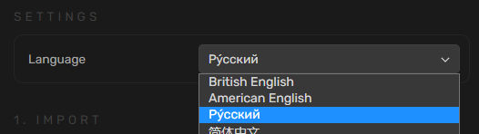
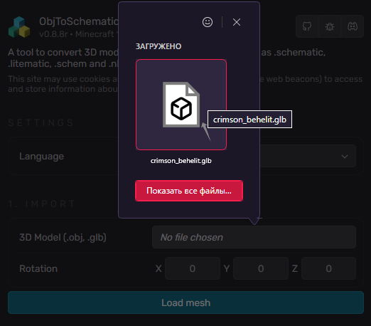
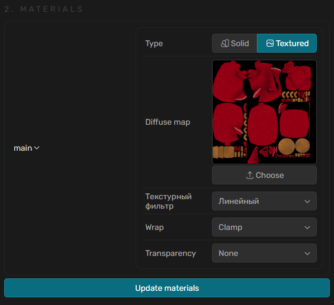
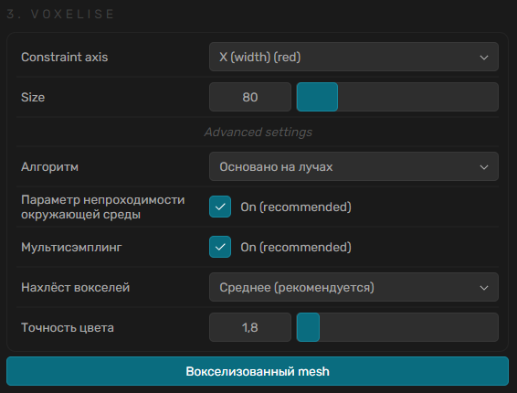
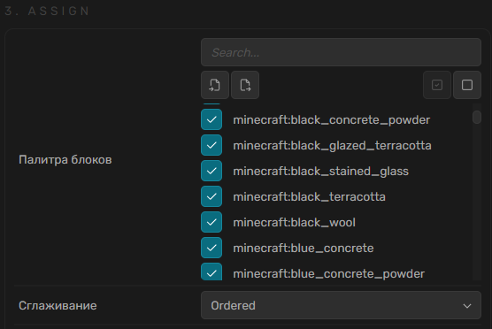
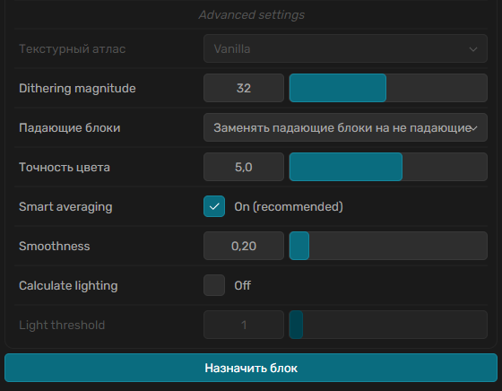
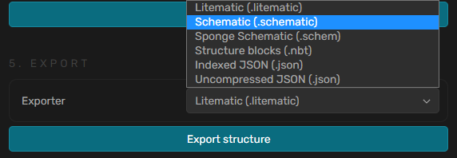

# Оbjtoschematic

Инструмент для конвертации 3D моделей в такие форматы Майнкрафт, как .schematic, .litematic, .schem and .nbt.

Ссылка на сайт - [https://objtoschematic.com](https://objtoschematic.com)

Страница делится на 2 части - для настройки и для просмотра.

### Часть для просмотра

Изначально здесь отображается три координатные оси. Сверху есть некоторые настройки. Для вращения используется ЛКМ, для передвижения ПКМ. Также сверху Zoom и другие настройки просмотра.

### **Часть для настройки**

Здесь выбирается язык, загружается язык, настраивается структура. В конце выбирается формат и получается файл.

* **Для начала можно переключить язык на Русский.**

<figure><figcaption></figcaption></figure>

* **Далее нужно загрузить нашу 3D модель.** Делается это в первом пункте Import, в строчке 3D model нажмите на светлосервый квадратик. Принимаются файлы .obj и .glb. После выбора модели можем настроить вращение по трём осям. Когда всё готово нажимаем "Load mesh" или "Загрузить mesh", и наша модель появится в части для просмотра.

<figure><figcaption></figcaption></figure>

* Далее идёт второй пункт Materials. Тут можно дополнительно настроить вид модели. Тут можно изменить цвет и прочее. Можно ничего не менять.

<figure><figcaption></figcaption></figure>

* **Далее нужно вокселизировать нашу 3D модель.** Делается это в третьем пункте Voxelise. Настройте размер в строке Size, можете воспользоваться прочими настройками или оставить как есть. Когда всё готово нажимаем "Voxelise mesh" или "Вокселизованный mesh", и наша модель превратится в вариант состоящий из кубов.

<figure><figcaption></figcaption></figure>

* **Последним шагом нужно настроить вид и палитру блоков.** Делается это в четвёртом пункте Assign, на сайте опечатка, он обозначен третьим. Настройте доступные блоки, можете воспользоваться прочими настройками для падающих блоков, точности цвета и гладкости. Когда всё готово нажимаем "Assign blocks" или "Назначить блоки", и нам станет доступно извлечение постройки в виде файла.

<figure><figcaption></figcaption></figure>

<figure><figcaption></figcaption></figure>

* **Осталось извлечь нашу постройку.** Сделать это можно в виде файла для различных программ помогающих в стройке. Файл сохраниться у Вас на устройстве

<figure><figcaption></figcaption></figure>
