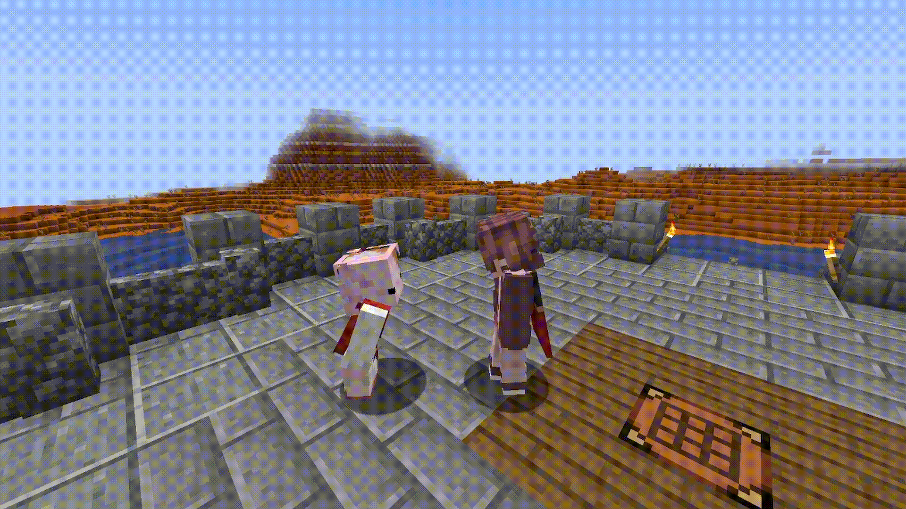

# Установка Headpat


Подробную инструкцию по установке модов, способу загрузки и рекомендованным сайтам для скачивания можно найти в [руководстве по Plasmo Voice.](ustanovka-plasmo-voice.md)


Вы когда-нибудь оказывались в ситуации, когда вам хотелось взять чью-то голову и долго-долго гладить своей рукой? Что ж, теперь вы можете это сделать! Этот мод позволяет гладить других игроков по голове, удерживая [<mark style="color:orange;">правую кнопку мыши</mark>](#user-content-fn-1)[^1]<mark style="color:orange;">.</mark>

### Мод [Headpat a Friend!](https://modrinth.com/plugin/headpat/versions)

<figure><figcaption>
Как поглаживания выглядят со стороны
</figcaption></figure>

Как это выглядит от первого лица

### Установка мода

Переносим загруженный мод в папку <mark style="color:orange;">`mods`</mark>. Быстрее всего перейти в неё можно, нажав на иконку "папки" в вашем лаунчере (не во всех лаунчерах она может быть). \
\
Либо используйте самый универсальный способ: в поисковой строке Windows (Win+S) введите <mark style="color:orange;">`%appdata%`</mark> — это откроет путь к месту, где есть папка <mark style="color:orange;">`.minecraft`</mark>, именно в ней хранится ваша игра и папка <mark style="color:orange;">`mods`</mark>.

<figure><figcaption></figcaption></figure>

<figure><figcaption></figcaption></figure>

<figure><figcaption></figcaption></figure>


Для более детальной и удобной настройки модов рекомендуем использовать мод [_modmenu_](https://modrinth.com/mod/modmenu/versions)_._


[^1]: Ты же знаешь, что это такое, верно?
