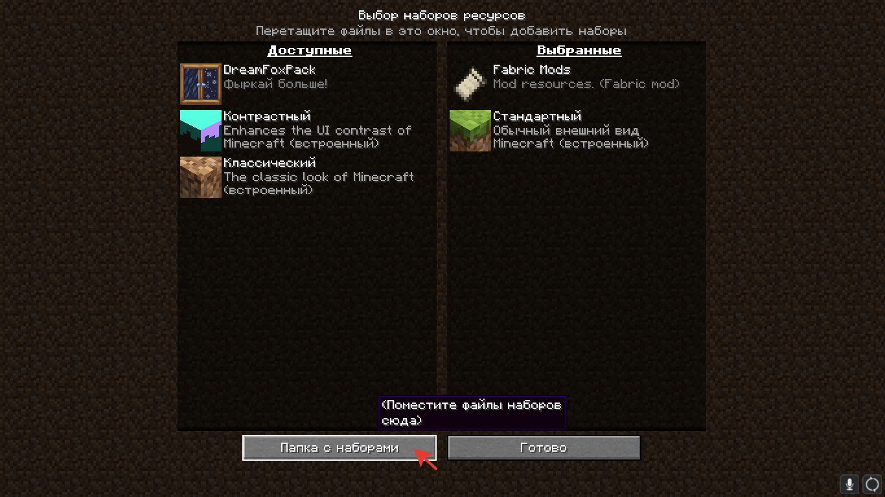
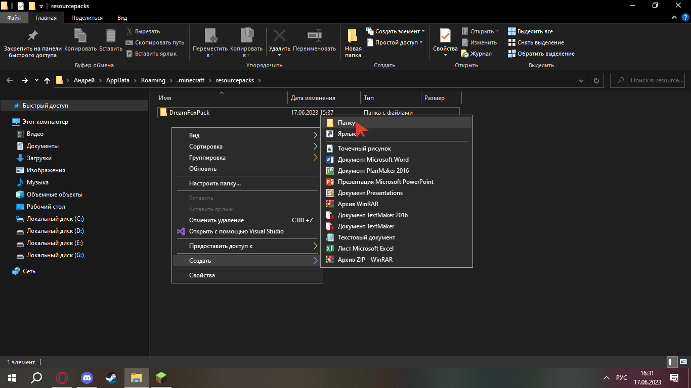
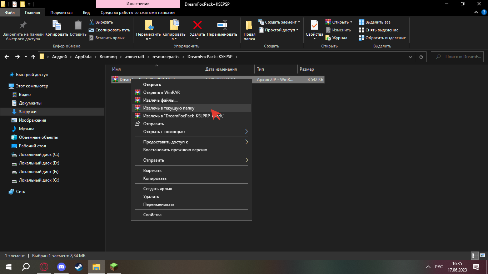
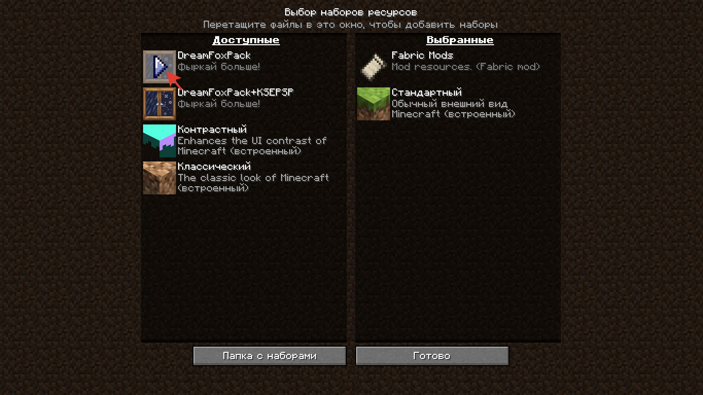

# Установка ресурс-паков


Ресурс-паки помогают разнообразить ваш геймплей. Наш ресурс-пак нужен для правильного отображения таба, также он добавляет некоторые косметические функции.&#x20;


Пошаговое руководство по установке ресурс-паков:

1. Скачать ресурс-пак по ссылке ниже:\
   [DFPACK.zip](https://download.mc-packs.net/pack/ee8ec70cce142e56ec14eb0e483661ae60bb143f.zip)
2. В майнкрафте в настройках найти раздел «наборы ресурсов», находим снизу плашку «папка с наборами», нажимаем. Открывается специальная папка.

<figure><figcaption></figcaption></figure>

3. В открытой папке создайте другую. Для этого нажмите ПКМ на пустом месте, наведитесь на «создать» и выберите папку. Можете назвать её как хотите.

<figure><figcaption></figcaption></figure>

4. Теперь нужно распаковать скачанный ZIP-файл ресурс-пака в созданную папку. Для этого можно перенести ZIP-файл в папку, нажать ПКМ по ZIP, выбрать «извлечь в текущую папку».

<figure><figcaption></figcaption></figure>

5. Осталось вернуться в майнкрафт. В том же разделе «наборы ресурсов» находим нужный ресурс-пак и переносим его на правую сторону нажатием по иконке. Для лучшей работы можно поднять текстур-пак в самый верх списка.

<figure><figcaption></figcaption></figure>


После всех выполненных этапов можете наслаждаться красивым оформлением и косметическими предметами!

