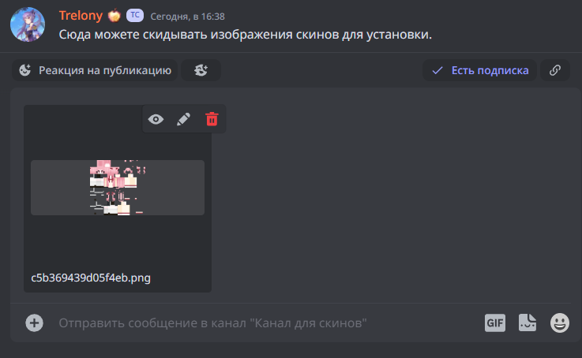
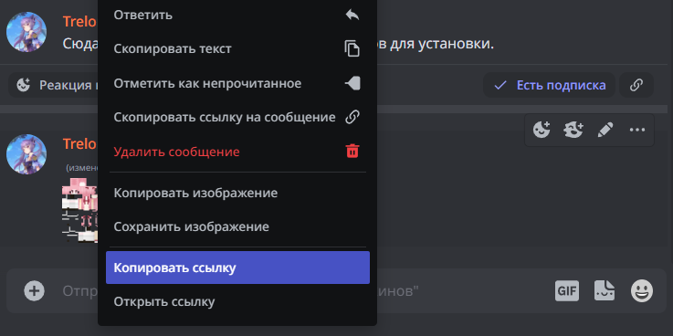

# Установка скина


На нашем проекте существует несколько способов изменить скин помимо использования лаунчера.


## 📝 **Доступные команды:**

### 👉 Основные

**/skin&#x20;**<mark style="color:orange;">**help**</mark> — справка по команде.

**/skin&#x20;**<mark style="color:orange;">**\[ник игрока с лицензионным minecraft**</mark>**]** — позволяет установить скин, который используется данным игроком. Пример: <mark style="color:orange;">/skin Trelony</mark> теперь вы, эм... Trelony.

<figure><figcaption></figcaption></figure>

**/skin&#x20;**<mark style="color:orange;">**clear**</mark>  — очищает ранее установленный скин и возвращает вам прежний вид.

**/skin&#x20;**<mark style="color:orange;">**favourite**</mark> — добавляет текущий установленный скин в список избранных.

<figure><figcaption></figcaption></figure>

**/skin&#x20;**<mark style="color:orange;">**favourites**</mark> — просмотреть список избранных скинов.

<figure><figcaption></figcaption></figure>

**/skin&#x20;**<mark style="color:orange;">**history**</mark> — список ранее установленных скинов и дата их установки.

**/skin&#x20;**<mark style="color:orange;">**set**</mark> <mark style="color:orange;">**\["скопированная ссылка"]**</mark> — позволяет установить скин по ссылке. Ссылку на скин можно получить на стороннем ресурсе или отправив изображение скина в канал «Канал для скинов» в нашем дискорд канале.


Обратите внимание, ссылка на скин должна быть в кавычках: /skin set <mark style="color:orange;">**"**</mark>ссылка на скин<mark style="color:orange;">".</mark>\
Быстрая кнопка для создания "кавычек": Tab


<figure><figcaption></figcaption></figure>

Чтобы получить ссылку на скин, нужно нажать ПКМ по изображению и выбрать "Копировать ссылку".

<figure><figcaption></figcaption></figure>

### &#x20;👉 Дополнительные

**/skin&#x20;**<mark style="color:orange;">**random**</mark> — устанавливает случайный скин. Возможно, вы наконец-то станете лисой.

**/skin&#x20;**<mark style="color:orange;">**search**</mark> <mark style="color:orange;">**\[ник игрока]**</mark> — поиск нужного вам скина, с подсказкой и ссылкой на его местонахождение.

**/skin&#x20;**<mark style="color:orange;">**undo**</mark> — возвращает ранее установленный скин, выполняя шаг назад. Не восстанавливает ваш родной скин.

**/skin&#x20;**<mark style="color:orange;">**update**</mark> — обновляет скин. Используйте эту команду, если скин не обновился после установки и вы всё ещё не стали прекрасной лисой.

**/skin&#x20;**<mark style="color:orange;">**url \[url]**</mark> — аналогично команде <mark style="color:orange;">/skin set</mark> **\["скопированная ссылка"].** Правило заключения ссылки в "кавычки" также действует и здесь.


Поздравляем! Вы установили свой новый скин и теперь вы прекрасны как никогда ранее.

